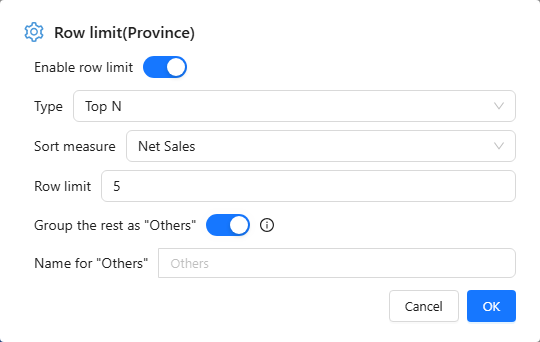

# Row Limit: Top and Bottom N

**Row limit** keeps the members with the highest or lowest values of a measure, for example the top 5 provinces by Net Sales. On a dimension it can also add one **Others** item for everything else, so totals and shares stay complete.

## Set a row limit

1. Select the component and open **Data**.
2. Hover the dimension (for example *Province*) and choose **⋮ → Row limit**. You can also set it on a measure; the **Sort measure** then defaults to that measure.
3. Turn on **Enable row limit**.
4. Choose **Type** (**Top N** or **Bottom N**), the **Sort measure** and the **Row limit**, for example 5.
5. To keep the rest, turn on **Group the rest as "Others"** and, if you like, change **Name for "Others"** (up to 50 characters).
6. Click **OK**.

A field with a row limit shows a check mark next to **Row limit** in its menu, and a sliders icon on the field chip.

## How "Others" behaves

- It is one extra item, always shown last and in grey, whatever the sort.
- Its value is re-aggregated with the measure's own aggregation, so an average or a ratio is correct for the group, not a sum of averages.
- Totals and percentage shares include it, so shares add up to 100%.
- With several fields on the axis, the limited field must be the last one; each outer group then gets its own Others. Otherwise no Others item is added.
- It cannot filter other charts, drill or jump; right-click offers only **Copy value**. Reference-line statistics leave it out.
- It is not available on Funnel, Sankey, maps, Calendar chart, filter components, or on a measure's row limit.

"Others" needs the 10.00 query engine on the server; with an older server the option is ignored and only the top N appear.

## Check the result

The ranking follows the current filters, links and drill level, so it can change when readers filter. For a table that must show the whole list but highlight the top items, use [conditional formatting](/documentation/Visualization/Conditional-Colors/) instead.

Related: [Sorting](/documentation/Analysis/Sorting/) · [Quick Calculated Measures](/documentation/Analysis/Quick-Calculated-Measures/)
