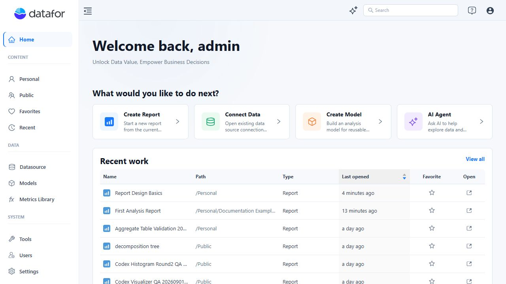
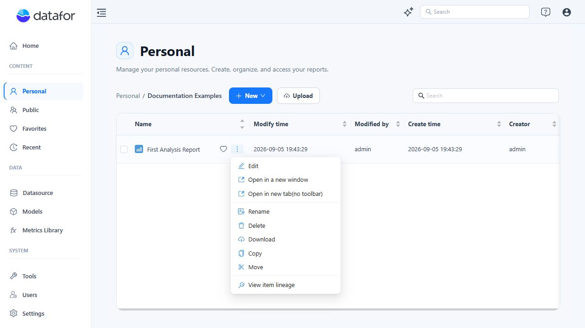
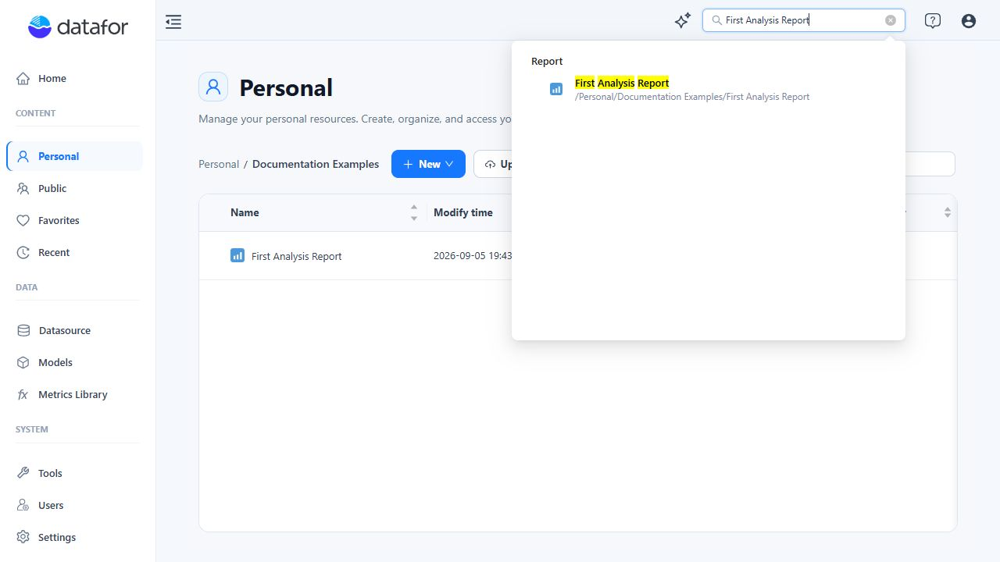

# Quick Tour of the Console

The console is your starting point for finding reports, creating analyses, and managing the resources behind them. If you only need to read a report, start with **Public**, **Favorites**, or **Recent**. You do not need to configure a data source or build a model first.

This tour uses the English interface. The screenshots show an administrator account; your menus and available actions depend on your permissions and the features enabled in your deployment.

## Start from Home

Select **Home** in the left sidebar to return to the starting page. If your account opens a custom home page after sign-in, use this menu to reach the console home page.

The four shortcuts under **What would you like to do next?** provide entry points for common tasks:

| Shortcut | Use it to |
| --- | --- |
| **Create Report** | Open the report designer and build an analysis using an available model. |
| **Connect Data** | Open data source management to connect data for analysis. |
| **Create Model** | Start building a reusable analysis model over your data. |
| **AI Agent** | Open the AI assistant to explore a model with natural-language questions. Access requires AI Agent to be configured and enabled for your account. |

**Recent work** lists recently opened resources with their paths, types, and last-opened times. Use a row's **Open** icon to resume work or its star to add it to your favorites. Select **View all** to open the full **Recent** list.

Scroll down for **Report templates** and **Learn & resources**. Templates provide sample report layouts to explore. The learning cards link to **Getting Started**, **New Features**, and the **Help Center**.

The sidebar groups the rest of the console into **Content**, **Data**, and **System**. Use the menu-fold button at the top left of the workspace to collapse the sidebar when you need more room.

## Find and organize reports

### Choose the right content view

- **Personal** is your own working area for reports and folders. Use it to organize drafts before placing content in a shared location.
- **Public** is the shared content area. The folders and reports you can use are controlled by resource permissions. “Public” does not mean anonymous access or permission for every user to edit.
- **Favorites** is a shortcut list for resources you have marked as favorites. Favoriting a report does not copy it, move it, or grant access to another person.
- **Recent** helps you return to resources you opened earlier. It is an activity list, not a separate storage location or a backup.

Always check the folder path when saving or moving a report. A report's location and its access permissions are separate concerns; do not use the name **Personal** or **Public** as a substitute for checking permissions when handling sensitive content.

### Work inside a folder

1. Open **Personal** or **Public**, then click a folder name to enter it.
2. Use the breadcrumb path above the list to return to a parent folder.
3. Select **New > Folder** to organize content, or **New > Report** to start a report. These actions require the relevant creation permissions.
4. Click a report name to open it. To change its design, use **Edit** from its row's **Actions** menu.

Hover over a resource row to reveal the favorite control and the three-dot **Actions** button. Depending on the resource and your permissions, the menu can include **Edit**, **Rename**, **Download**, **Copy**, **Move**, **Delete**, and **View item lineage**. Lineage helps you inspect resource dependencies before making changes.

The list shows **Modify time**, **Modified by**, **Create time**, and **Creator**, helping you distinguish similar reports. Use the search field above the list to narrow the contents of the current folder; enter your search and press **Enter**. Clear the search to show the list again.

## Search across the console

Use the **Search** field in the top bar when you do not know which folder contains a resource:

1. Enter a resource name or part of its name.
2. Press **Enter** and wait for the results.
3. Check the result category and path, then select the resource you need.

Results are grouped by resource type, such as reports, folders, and models. The path helps distinguish resources with the same name. This search finds saved resources; it does not search the rows inside a report or database table. Use report filters or the AI assistant for questions about the data itself.

If a resource is missing, try a shorter name, check its location with the owner, and confirm that your account has access. An empty search result does not by itself mean the resource was deleted.

## Understand the Data section

These three areas serve different purposes:

| Area | What belongs here | When to use it |
| --- | --- | --- |
| **Datasource** | Database connections and file-based data sources. | Connect data or manage an existing connection. |
| **Models** | Analysis models that organize tables, relationships, dimensions, and measures. | Prepare reusable fields and calculations for reports and AI-assisted analysis. |
| **Metrics Library** | Business definitions of metrics, including their meaning, ownership, and calculation rules. | Agree on what a metric means and connect its definition to implementations in models. |

A data source supplies the data; a model makes that data usable for analysis; the Metrics Library documents the business meaning of metrics. A metric definition alone is not a queryable data source. If an appropriate model already exists, reuse it when creating a report.

See [Analysis Model Overview](/documentation/Model/Analysis-Model-Overview/) and [Metrics Library](/documentation/Metrics-Library/Metrics-Library/) for the details.

## Know which System area you need

The **System** group contains both authoring utilities and administrative functions. It is not exclusively an administrator menu, and not every user sees every entry.

### Tools

**Tools** contains:

- **Parameters** for global parameters and system variables.
- **Dictionary** for mapping stored keys or codes to display values used in analysis models. See [Data Dictionary](/documentation/Tools/Data-Dictionary/).
- **GeoJSON** for managing geographic map resources. See [GeoJSON Map](/documentation/Tools/GeoJSON/).

Use **Settings**, not Tools, for system-wide configuration such as login integration or database drivers.

### Users and Settings

**Users** provides **Users**, **Roles**, and **User Type** management. **Settings** provides deployment configuration, including mail, backups, audit logs, AI Agent, appearance, JDBC drivers, the OLAP engine, authentication integrations, and map services. These are administrator functions, not prerequisites for reading a report.

If you need a missing feature, ask your administrator to check your account capabilities and deployment configuration. See [User Creation and User Types](/documentation/System/UserTypes/).

### Trash

**Trash** lists deleted resources retained for recovery, including reports, folders, and models. Check the resource type, creator, and deletion time before choosing an item. Use its **Actions** menu to select **Restore** or **Delete permanently**.

**Delete permanently** and **Delete all** remove resources from Trash; you cannot recover them through the console afterward. **Delete all** applies to the entire Trash list, not just the rows matching a search. Do not treat Trash as a backup of source databases or assume every kind of deleted data appears here.

## Help and personal preferences

The top-right icons provide access without leaving the console navigation:

- **Help icon > Documentation** opens the help site. **About** displays the installed version; include it when reporting a problem.
- **Profile icon > My account** opens your personal information, language, and home-page preferences. Use **Language** to switch the interface language. See [My Account](/documentation/Console/My-Account/).
- **Profile icon > Logout** signs you out. Save any report or model changes before leaving.

## Why your screen may look different

A reader may not see **Personal**, the **Data** section, or creation controls. **Users** and **Settings** require administrative access. Individual resource actions also depend on permissions, so being able to open a report does not necessarily let you edit, move, or delete it.

Resource access and data access are also different: permission to open a report does not define which rows or columns a user may query. Use [Access Control List](/documentation/System/Access-Control%20List/) for resource permissions and [Data Security](/documentation/Datasource/Data-Security/) for data restrictions.

## Try your next task

Build and save a report with [Create Your First Analysis Report](/documentation/Start/Create-Your-First-Analysis-Report/), or explore an existing model with the [AI Assistant](/documentation/AI-Agent/AI-Chat/).
