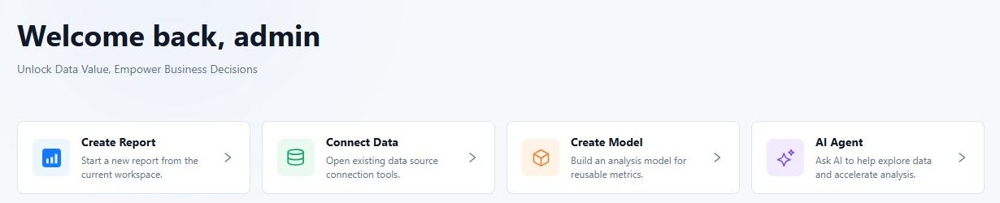

# Quick Tour of the Console

Use the console to find reports and manage the data and models behind them. Menus and actions depend on your permissions.

## Start a task

Home provides **Create Report**, **Connect Data**, and **Create Model** shortcuts. An **AI Agent** entry is also available in this deployment. Available entries depend on your account and deployment. **Recent work** helps you resume a resource; **Report templates** provides starting examples.

To build a report from an existing model, choose **Create Report** and follow [your first report](/documentation/Start/Create-Your-First-Analysis-Report/).

## Find a report

| Area | Purpose |
| --- | --- |
| **Personal** | Your working folders and reports. |
| **Public** | Shared resources available to your account. |
| **Favorites** | Resources you have marked for quick access. |
| **Recent** | Recently opened resources. |

Open a folder, then click a report name. Use **Edit** in the report to change its design. Use the breadcrumb to return to a parent folder and the search box to find a resource. Check the path when several resources have the same name.

## Understand the data areas

**Datasource** manages connections and data sources. **Models** organizes the fields, relationships, and measures used by reports. **Metrics Library** holds business definitions of metrics. Reuse an existing model when it already provides the fields you need.

**Tools**, **Users**, and **Settings** contain additional management functions for authorized users. For example, map-service configuration is under **Settings → Data → Maps**. **Trash** contains recoverable deleted resources.
