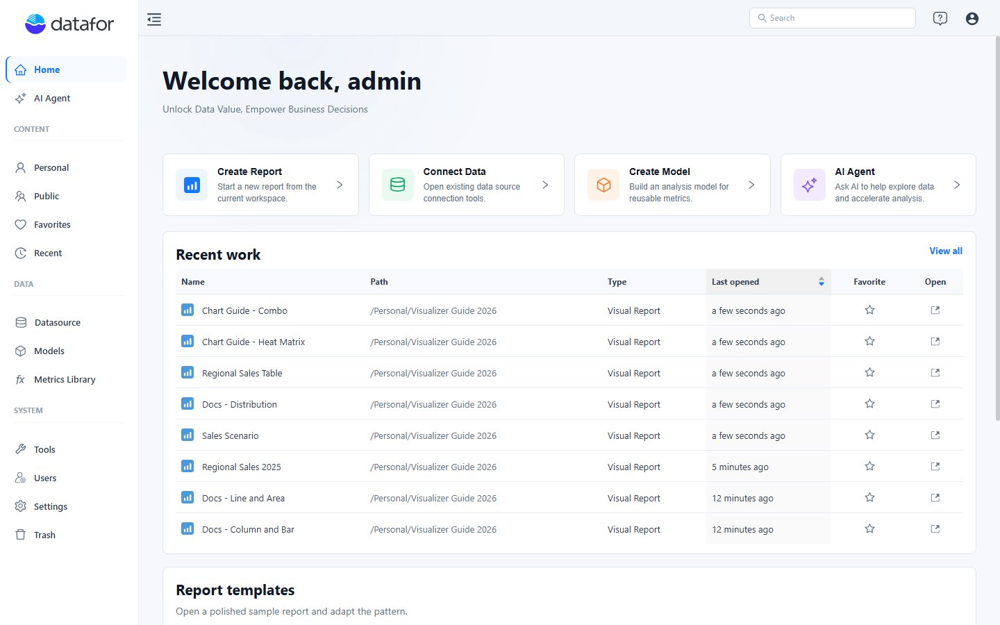

# Quick Tour of the Console

The console is where you find reports, ask the AI Agent, and manage data, models and the server. What you see depends on your permissions.

## Home

- Shortcuts: **Create Report**, **Connect Data**, **Create Model**, and **AI Agent** when AI is enabled for you.
- **Recent work**: the last 8 reports and analysis models you opened, with their path; **View all** lists more.
- **Report templates**: sample reports to start from. Administrators choose them in **Settings › General › Branding → Sample pages**.

A report created from Home is saved in **Personal** unless you choose another folder. See [Create Your First Analysis Report](/documentation/Start/Create-Your-First-Analysis-Report/).

## Left navigation

| Item | Use it to |
| --- | --- |
| **Home** | Start a task or resume recent work |
| **AI Agent** | Ask questions about your data in plain language. Shown when AI is enabled; users without AI permission see *Please contact your administrator to enable AI for this user*. See [AI Assistant](/documentation/AI-Agent/AI-Chat/). |
| **Personal**, **Public** | Your own folders and the shared folders you may open |
| **Favorites**, **Recent** | Items you starred, items you opened recently |
| **Datasource** | Database connections and uploaded files |
| **Models** | Analysis models: fields, relationships, measures |
| **Metrics Library** | Agreed definitions of business metrics. See [Metrics Library](/documentation/Metrics-Library/Metrics-Library/). |
| **Tools** | Parameters, data dictionary, GeoJSON maps and other tools |
| **Users** | Users, roles and their permissions |
| **Settings** | Server administration. See [Settings Overview](/documentation/System/Settings-Overview/). |
| **Trash** | Deleted items you can restore |

The ☰ button at the top left collapses the navigation to icons. **?** at the top right opens help, and the avatar opens [My Account](/documentation/Console/My-Account/).

## Find a report

Open a folder and click a report to view it; click **Edit** in the report to change it. Use the breadcrumb to go up and the search box at the top to find a report or model by name. When several items share a name, check the path.

Deleting a report needs the **Delete** or **Full control** permission on it; **Edit** alone is not enough. See [Permission Evaluation Overview](/documentation/System/Permission-Evaluation-Overview/).
