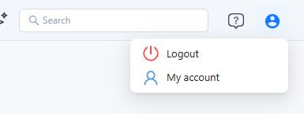
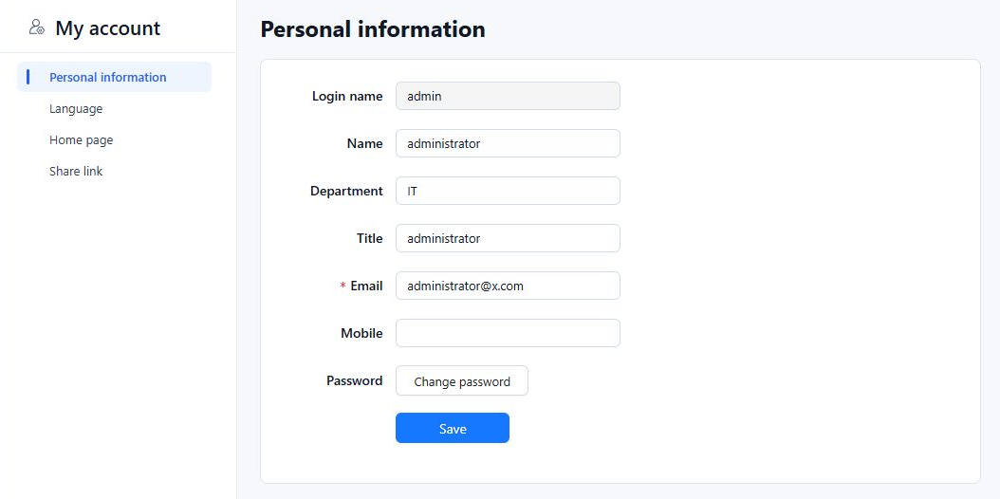
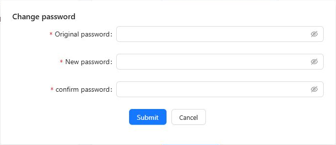
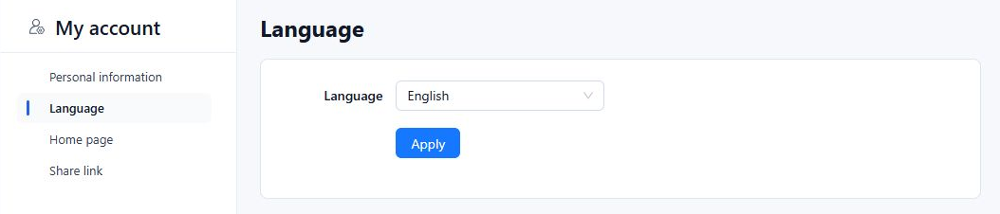
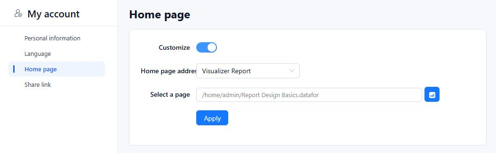

Use **My account** to manage the profile, password, interface language, and home page for the account you are signed in with.

## Open My account

Click the **profile icon** in the upper-right corner of the console, then select **My account**.

Choose a section from the account menu. Each section has its own save action:

| Setting | Action that saves it |
| --- | --- |
| Personal information | **Save** |
| Password | **Submit** in the **Change password** dialog |
| Language or Home page | **Apply** in that section |

## Update your profile

Open **Personal information**, edit your details, and click **Save**. A **Save success** message confirms that the profile was saved.

| Field | What to enter or check |
| --- | --- |
| **Login name** | Your sign-in identifier. This field is read-only. |
| **Name** | Your name. Editing it does not change your login name. |
| **Department** | Your department or team. |
| **Title** | Your job title. |
| **Email** | Your email address. The asterisk marks this as a required field. |
| **Mobile** | Your mobile phone number. |

## Change your password

1. In **Personal information**, click **Change password**.
2. Enter your current password in **Original password**.
3. Enter the replacement in **New password**, then enter it again in **confirm password**.
4. Click **Submit** to submit the password change, or **Cancel** to close the dialog without changing it.

All three password fields are required. The **Save** button on the profile form is separate from this dialog.

## Change the interface language

1. Open **Language** in the account menu.
2. Select a language, such as **English**. Choose **Follow browser settings** if you want Datafor to use the browser's language preference.
3. Click **Apply**. The console reloads to apply the preference.

This setting controls interface labels. Report names and other user-entered content can still appear in the language in which they were created.

## Choose your home page

Use **Home page** to choose the content shown when you enter the console or select **Home**. For example, you can open a report you use every day.

### Use a report

1. Open **Home page** and turn on **Customize**.
2. Set **Home page address** to **Visualizer Report**.
3. Click the blue report button beside **Select a page**.
4. Expand **Personal** or **Public** and select your report. To find it by name, enter text in the picker's search box and press **Enter**.
5. Click **Ok**. Check that **Select a page** now shows the intended report path.
6. Click **Apply**. The console reloads and opens the report as your home page.

The screenshot uses an example report named *Report Design Basics*. Select an existing report in your own workspace; you do not need a report with this name.

### Use a website

1. Turn on **Customize** and set **Home page address** to **Website**.
2. Enter the complete website address, including `https://`, in **Website**. If you switched from **Visualizer Report**, replace any report path still in the field.
3. Click **Apply** to save the setting.

### Restore the default home page

Turn off **Customize** and click **Apply**. The console reloads and returns to the default **Home** screen.

## Review share links

Open **Share link** to review report links listed for your account. The table shows the report title, expiry, permission, toolbar visibility, creation date, and **Sharing Enabled** status. Use the button in **Copy link** to copy a link.

For link creation, access options, and disabling sharing, see [Share Link](/documentation/Embedded/Share-link/).

## Handle unsaved changes

If **Unsaved changes** appears when you move to another account section, choose the action that matches your intent:

- **Keep editing**: stay on the current form.
- **Discard changes**: leave without saving the edits.
- **Save and leave**: save the edits and continue to the selected section.

For a home page or language change that does not appear to have taken effect, return to that section and check the saved selection. Selecting an option alone does not apply it; use that section's **Apply** button.
