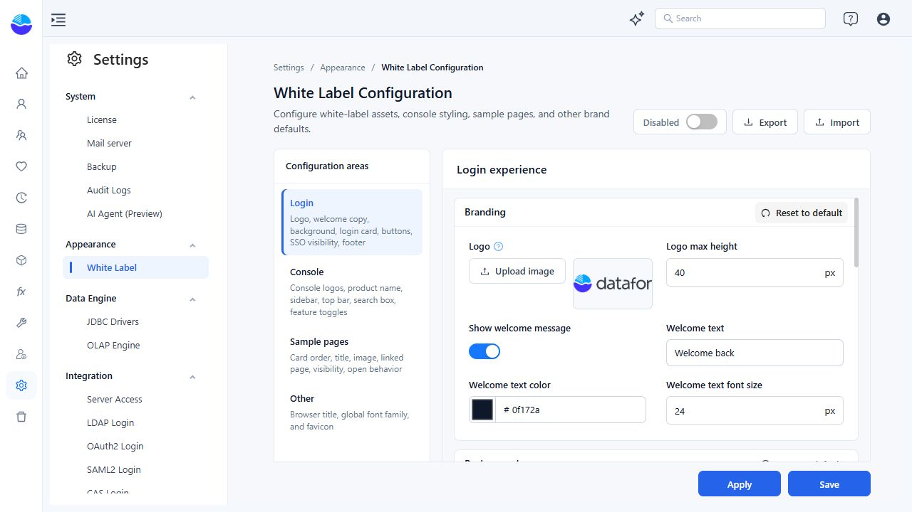
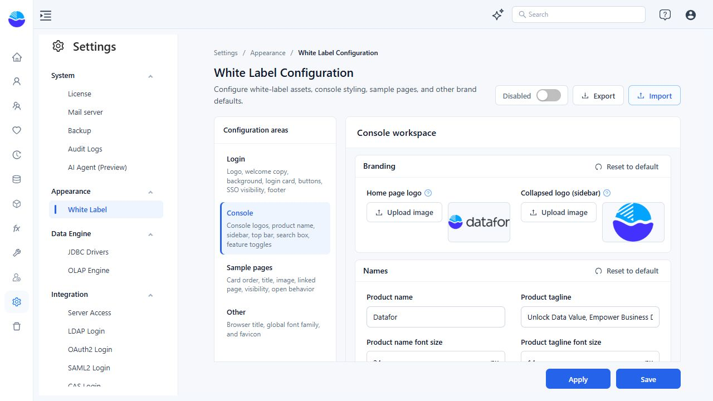
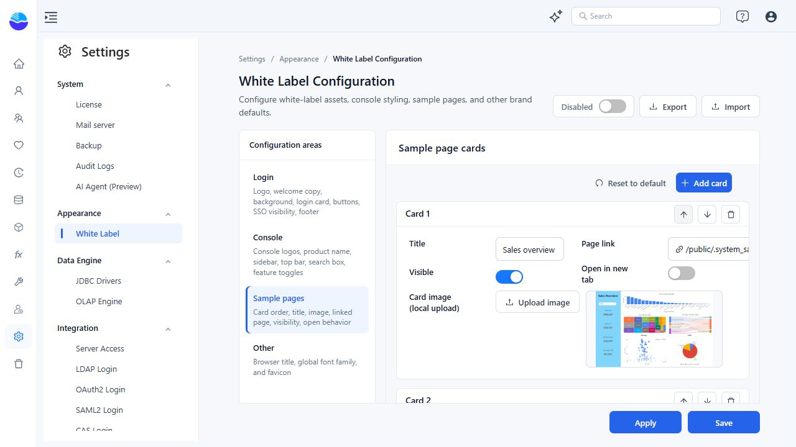
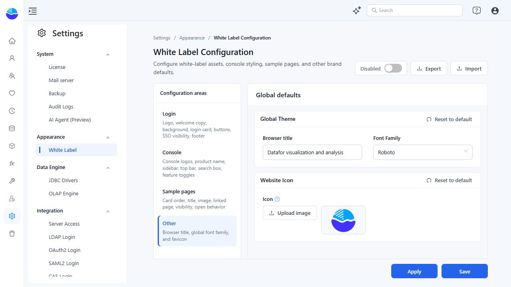

# White Label

White Label lets you give the Datafor login page and console a consistent identity: your logos, product copy, colors, navigation styling, and selected reports on Home. Use it for the application around your reports; it is not a replacement for designing individual report pages or configuring embedded authentication.

These are administrative settings, not personal preferences. Plan changes for the users of the deployment, and test them with the accounts and screen sizes your audience uses.

## Open the configuration

Sign in with an administrator account and go to **Settings > Appearance > White Label**. If the entry is unavailable, ask your administrator to check your access and the features available in your deployment.

The page has four configuration areas:

| Area | What it controls |
| --- | --- |
| **Login** | Login logo, welcome message, background, form styling, login-option visibility, and footer. |
| **Console** | Expanded and collapsed logos, Home title and tagline, sidebar, top bar, search box, and help/resource visibility. |
| **Sample pages** | The report cards in **Home > Report templates**: titles, images, destinations, order, and opening behavior. |
| **Other** | Default browser title, font family, and website icon. |

The screenshots below show the English editor with example values. The sidebar is collapsed to give the settings more room. Image previews and editable values are not proof that branding is active: check the main **Enabled / Disabled** switch and save your changes.

## Enable, save, and apply

Before editing an existing configuration, use **Export** to keep a copy of the saved settings. Export does not capture unsaved form edits.

1. Make your changes in the relevant configuration areas. Selecting an image displays a preview; it is saved with the configuration.
2. Turn the main switch on when you want to use the custom branding.
3. Choose **Save** or **Apply**, and wait for the success message.
4. Check Home and the login page, not just the settings editor.

| Control | Effect |
| --- | --- |
| Main **Enabled / Disabled** switch | Chooses whether Datafor uses the custom white-label configuration. Changing the switch alone is an unsaved edit. |
| **Save** | Saves the whole form, including changes in other configuration areas, and updates the current console's branding state without a full page reload. |
| **Apply** | Saves the whole form and reloads the current console so you can check the applied appearance. It is disabled until the form has changes. |

**Save is not a private draft or a staging step before publishing.** If white labeling is enabled, saved changes can affect the user-facing interface. Use a test deployment when preparing a new design.

To stop using custom branding without clearing its values, turn the main switch off and select **Apply**. The editor retains the configuration while the interface uses its default branding.

## Customize the login experience

Start with **Branding**: upload the login logo, set **Logo max height**, and decide whether to show a welcome message. Use **Welcome text** for a short greeting such as “Welcome to Northstar Analytics”; it is separate from the console's product name.

The remaining groups control different parts of the page:

- **Background** sets the page's image and background color. A background image fills the page and may be cropped to fit the screen, so keep essential text out of the image.
- **Card Layout** controls the login card's width, corner radius, shadow, background, and border.
- **Inputs** controls field corners, borders, focus-ring color, and font size. Keep the focused field easy to identify.
- **Buttons** controls the primary login button's normal and hover colors, text, corners, and font size.
- **Google Button** controls the Google login button's appearance and visibility. It does not configure the OAuth provider.
- **Visibility** includes **Show 'Remember me'**, **Show 'Sign up'**, **Show 'Forgot password'**, and **Show SSO area**.
- **Legal** sets the footer's **Copyright text**, **Footer Link**, text color, and font size. The link is attached to the footer text; enter the intended destination, such as your company's legal page.

Only show login options that your deployment supports. The Google button requires **Show Google button** and **Show SSO area** to be on, as well as the underlying OAuth login service to be enabled. Turning on a display switch is not sufficient. Verify registration and password recovery end to end before exposing their links. See [OAuth2 Authentication](/documentation/System/OAuth2-Authentication/) for provider configuration.

### Prepare suitable images

| Asset | Preparation guidance |
| --- | --- |
| Login logo | Use PNG. A wide logo around **4.2:1** with a transparent background is a useful starting point; adjust **Logo max height** to fit the login card. |
| Home page logo | Use a wide PNG, around **4.2:1**, for the expanded sidebar. |
| Collapsed logo | Use a square PNG, around **1:1**, with a recognizable symbol rather than small text. |
| Website icon | Use ICO at **32 × 32** or **48 × 48** pixels. Configure it under **Other**. |
| Background and card images | Use browser-compatible images such as PNG or JPEG. Check the actual crop and readability at the intended display size. |

Keep each image **5 MB or smaller**. The image picker rejects larger files. These aspect ratios are design recommendations, not mandatory pixel dimensions.

Choose logo colors to contrast with the background you actually configure. A light logo is suitable for a dark sidebar, but can disappear against the default light sidebar. Avoid excessive transparent padding, which makes the visible logo look small even when the image dimensions are large.

## Brand the console

### Logos and product copy

In **Console > Branding**, set **Home page logo** for the expanded sidebar and **Collapsed logo (sidebar)** for the compact navigation. Check both states after applying.

In **Names**, **Product name** replaces the large heading on Home, and **Product tagline** supplies the line below it. Their font-size controls affect those Home elements. For example:

- **Product name:** `Northstar Analytics`
- **Product tagline:** `One place to explore sales and operations`

This is different from **Other > Browser title**, which controls the default browser-tab title. Changing a Home heading does not rename reports.

### Navigation and feature visibility

Use **Sidebar**, **Top Bar**, and **Search Box** to coordinate backgrounds, text, icons, active states, and font sizes. Test a selected menu item, a hovered item, and the search placeholder as well as the normal state.

For manual color entry, the field already supplies `#`. Enter hexadecimal digits, for example `1677ffff`: the final `ff` makes the color fully opaque. Click outside the field to finish editing it.

The two **Feature Toggles** have specific scopes:

- **Show Start Using Module** controls the **Learn & resources** section on Home. It does not hide the Create Report shortcut or the report-template cards.
- **Show Help Menu** controls the top-bar help menu. If you hide it, provide another route to documentation and support for your users.

Hiding a visual entry point is not an access-control rule. Manage report permissions separately through [Access Control List](/documentation/System/Access-Control%20List/).

## Choose the report cards shown on Home

**Sample pages** configures the cards under **Home > Report templates**. It is separate from the learning-resource section controlled by **Show Start Using Module**.

To add a useful starting point for your audience:

1. Make the report available in **Public**, with the permissions its intended readers need.
2. Open **Sample pages** and select **Add card**. The editor supports up to **10 cards**, including hidden cards.
3. Enter a short **Title** that explains the report's purpose.
4. Choose its **Page link** from the resource picker. The picker browses accessible resources under Public; this is not a free-text external website URL field.
5. Upload a **Card image (local upload)**. This is a thumbnail, not a live report preview; replace it when the report's appearance changes.
6. Turn **Visible** on, and choose whether to **Open in new tab**. Use the up/down arrows to arrange the cards.
7. Select **Apply**, open Home, and test the card with a representative reader account.

A card links to a resource; it does not grant permission to open the report or query its data. An administrator's successful test is not sufficient evidence that readers can use it.

Turn **Visible** off to keep a card configured without showing it. The delete control removes the card configuration, not the linked report. To hide all template cards, turn their visibility off rather than deleting every card: an empty card configuration falls back to the built-in samples.

## Set browser defaults

Under **Other**:

- **Browser title** sets the default tab title. When a resource is open, its own title may take precedence.
- **Font Family** selects the console's default font family. Choose a font available to your audience and check it on their devices; do not assume it replaces every font explicitly set inside a report.
- **Website Icon > Icon** replaces the favicon. Use a simple symbol that remains recognizable at browser-tab size.

## Reuse or restore a configuration

### Export and import

Use **Export** to download the saved configuration for backup or reuse. Save intended changes before exporting them.

**Import** accepts a ZIP configuration package. Selecting the file starts the import immediately; it is not held as a form draft until you click Save. Export the destination's current configuration first, and import only a package you trust and intend to use there.

After a successful import, check the main enable switch, reload the console, and review all four areas. When moving between environments, confirm that linked reports exist at the expected paths and that users can access them. Do not assume a configuration that works in one environment is ready for another without checking it.

### Reset to default

Each **Reset to default** button resets its own group of settings. For example, resetting Login **Branding** does not reset its **Background** or the Console settings. The reset changes the form first; select **Save** or **Apply** to persist it.

Reset means “use product defaults,” not “restore my previously saved custom values.” To discard unsaved edits, reload the page and reopen White Label. To recover a previous custom design after saving changes, use your exported configuration.

## Check before rollout

- Open the login page in a separate signed-out browser session. Check the logo, background, footer link, field focus, and button hover states.
- Check Home, then expand and collapse the sidebar. Confirm that the logos and active-menu text remain readable.
- Verify the Home heading, browser title, help menu, learning resources, and report cards independently.
- Open each visible card as an intended reader, including any required report filters or data-access restrictions.
- Test a narrower window and a second browser or device for clipping, font fallback, and unreadable text.

If saved branding does not appear, first confirm that the main switch is **Enabled**, then reload the affected page. If only an image or favicon is stale, test in a fresh browser session to distinguish cached assets from an incorrect configuration. If a selected image never appears in the editor, check its format and file size.

For embedding and authentication, continue with [SDK Embedding](/documentation/SDK-Embedding/) and [SSO for Embedded Analytics](/documentation/Embedded/How-SSO-Improves-the-Embedded-Analytics-Experience/). White Label changes the surrounding experience; embedding, authentication, and permissions still need their own configuration.

