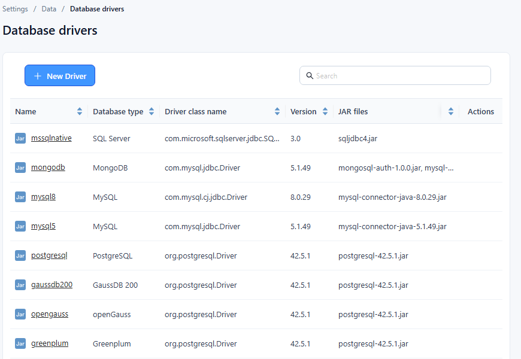

# JDBC Driver Management

Datafor keeps a list of JDBC drivers so that each database connection can use a driver version that matches its database server. Add a driver when a database needs a different driver version than the ones listed.

## 1. Open the driver list

Go to **Settings › Data › Database drivers**. The list shows:

| Column | Meaning |
| --- | --- |
| **Name** | Name of the driver entry, e.g. `mysql8`. Click it to edit the driver. |
| **Database type** | Database the driver is for, shown by its official name, e.g. **MySQL**, **PostgreSQL**, **SAP HANA**. |
| **Driver class name** | Java class of the JDBC driver, e.g. `com.mysql.cj.jdbc.Driver`. |
| **Version** | Driver version, read from the uploaded driver. |
| **JAR files** | JAR files of the driver. |
| **Actions** | **Edit** and **Delete**. |

Use the search box above the list to filter by name, database type, driver class, version or file name. Columns can be sorted.

## 2. Add a driver

1. Click **New Driver**.
2. Fill in the dialog:

   | Field | What to enter | Notes |
   | --- | --- | --- |
   | **Name** | Unique name for the driver entry. | "The driver name already exists" if it is taken. |
   | **Database type** | Database the driver is for. | Choosing a type fills in its default **Driver class name**. |
   | **Driver class name** | Java class of the driver. | Change it if your JAR uses a different class. |
   | **JAR files** | Click **choose** and select a `.jar` file. | Repeat for each JAR the driver needs. |

3. Click **OK**. "Saved" appears and the driver is added to the list.

## 3. Update a driver

1. Click the driver's **Name**, or choose **Edit** in its **Actions** menu.
2. Change the fields, remove JAR files you no longer need, or choose new ones.
3. Click **OK**.

## 4. Delete a driver

Choose **Delete** in the driver's **Actions** menu and confirm. The deletion cannot be undone.
