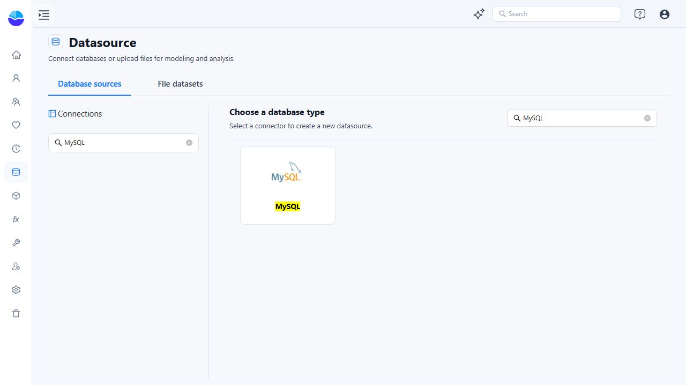
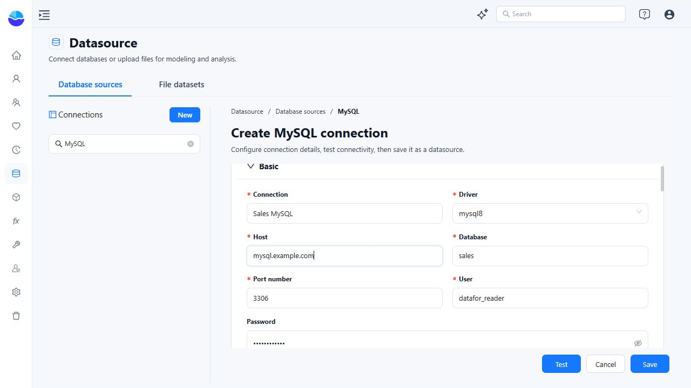
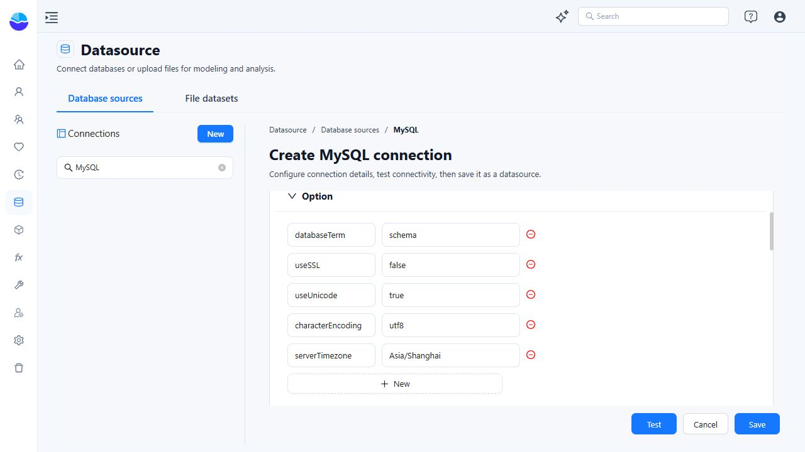
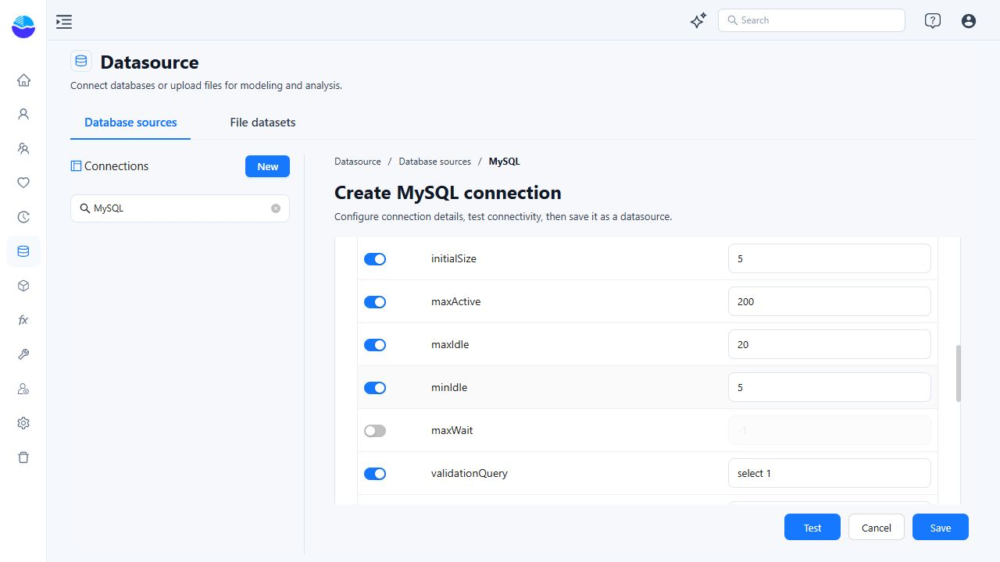

# Configuring MySQL Data Source

Create a MySQL datasource when you want to build analysis models from existing MySQL tables or views. The connection stores the database address, credentials, and JDBC settings used by Datafor. Saving it does not create the MySQL database or an analysis model.

The workflow is **choose MySQL → enter connection details → review JDBC options → Test → Save → verify table access**.

## Before you connect

Have the following ready:

- **Datafor access:** an account that can create or edit datasources. If the Datasource entry or a required action is unavailable, ask your Datafor administrator for access.
- **Database details:** the MySQL hostname, port, database name, and the version of MySQL you are connecting to.
- **A database account:** use a dedicated reporting account with `SELECT` access to the required tables and views. Ask your DBA to grant any additional metadata privileges your setup needs and allow connections from the Datafor server. The MySQL username and password are separate from your Datafor login.
- **Network and TLS configuration:** the Datafor server must be able to resolve the hostname and reach the database port. For encrypted connections, obtain the database hostname and certificate trust requirements from your DBA.
- **A compatible JDBC driver:** the installed Connector/J version must support both your MySQL version and the Java version used by Datafor. See [JDBC Driver Management](/documentation/Datasource/JDBC-Driver-Management/) if a driver needs to be added or updated.

### Which machine does Host refer to?

Datafor opens the database connection from its server, not from your web browser. A database tool working on your laptop does not prove that the Datafor server can connect.

- Use the database hostname that is reachable **from the Datafor server**.
- `localhost` and `127.0.0.1` refer to the machine running Datafor. If Datafor runs in a container, they refer to that container, not automatically to the physical host or another container.
- Enter a hostname or IP address only. Do not enter `http://`, the Datafor console URL, or a complete JDBC URL in **Host**.

## 1. Open the MySQL connection form

1. In the left navigation, select **Datasource**.
2. Open **Database sources**.
3. Under **Choose a database type**, select **MySQL**. You can search for `MySQL` and press **Enter** to locate the connector.
4. If an existing connection is open, click **New** beside **Connections** to return to the connector selector.

The form contains four collapsible sections: **Basic**, **Advanced**, **Option**, and **Pooling**. Scroll inside the form to reach the lower sections. **Test**, **Cancel**, and **Save** remain at the bottom.

## 2. Enter the Basic settings

The example below uses placeholder values. Replace them with your database details; `mysql.example.com` is not a working demonstration server.

| Field | What to enter | Example or guidance |
| --- | --- | --- |
| **Connection** | A name that identifies this datasource in Datafor. | `Sales MySQL`. Include an environment or purpose when helpful, such as `Sales MySQL - Production`. This is not the database name. |
| **Driver** | An installed JDBC driver for this MySQL server. | `mysql8` is the driver name shown in the example installation. It is a configured name, not a guarantee that every MySQL 8 or later release is compatible. Confirm the underlying Connector/J version with your administrator. |
| **Host** | The database hostname or IP reachable from Datafor. | `mysql.example.com`. For certificate hostname verification, use the hostname covered by the server certificate. |
| **Database** | The existing MySQL database containing the required tables or views. | `sales`. Do not enter a table name here. |
| **Port number** | The database listener port. | The form starts with `3306`; use your actual port if different. |
| **User** | The MySQL account used by this connection. | `datafor_reader`. Prefer a read-only reporting account over `root`. |
| **Password** | The password for that MySQL account. | Enter the database password. The field is masked; avoid revealing it in screenshots or support requests. |

## 3. Review the JDBC options

Expand **Option**. Each row contains a JDBC property name and its value. Edit an existing row, use **+ New** to add one, or use the minus icon to remove one. Enter one property per row, without a leading `?` or an `&` separator. Avoid duplicate property names.

These are the values shown by the example installation, **not universal Connector/J defaults or production recommendations**:

| Property | Value shown | What to check |
| --- | --- | --- |
| `databaseTerm` | `schema` | Controls how Connector/J exposes MySQL databases through JDBC metadata. Keep this setting unless your administrator has a specific compatibility reason to change it. Changing it can affect schema and table discovery. |
| `useSSL` | `false` | Disables TLS when used without an overriding `sslMode`. Review this before connecting to a production or remote database; see below. |
| `useUnicode` | `true` | Leave it unless the installed driver's guidance requires a different configuration. |
| `characterEncoding` | `utf8` | Controls the connection encoding, not the encoding of existing stored data. Confirm the appropriate value for your driver and database. |
| `serverTimezone` | `Asia/Shanghai` in this screenshot | The new-connection form derives its initial value from the browser's detected timezone. Check it against the database connection's time semantics; your own form may show a different zone. |

`databaseTerm` affects JDBC schema/catalog behavior, not the physical organization of MySQL data. See the [Connector/J connection properties](https://dev.mysql.com/doc/connector-j/en/connector-j-connp-props-connection.html) for driver-specific details.

### Configure TLS for production

For Connector/J versions that support `sslMode` (8.0.13 and later), use your organization's approved TLS configuration. A configuration that verifies both the certificate chain and the database hostname uses:

| Property | Value |
| --- | --- |
| `sslMode` | `VERIFY_IDENTITY` |

Replace the existing `useSSL` row with `sslMode` and its value, rather than leaving contradictory settings in the form. Before testing, have your administrator ensure that:

- MySQL accepts TLS connections.
- **Host** matches the certificate's hostname.
- The Java runtime used by Datafor trusts the issuing CA, or the connection has the required truststore configuration.

Use **+ New** for additional driver properties required by your administrator. Certificate and truststore files must be available to the Datafor server process, not just to your browser's computer.

`REQUIRED` encrypts the connection but does not verify the server's identity. A certificate error should be resolved by correcting the hostname, certificate chain, or trust configuration. See [Connector/J TLS settings](https://dev.mysql.com/doc/connector-j/en/connector-j-reference-using-ssl.html) and [server authentication](https://dev.mysql.com/doc/connector-j/en/connector-j-server-authentication.html).

### Check timezone and text handling

Choose the connection timezone with your DBA. For example, use `UTC` only when it matches the intended handling of your timestamps. Do not copy the screenshot's timezone just because the connection test passes: connectivity does not verify the meaning of date and time values. Compare a known timestamp with the value returned in a model preview. See [Connector/J date and time properties](https://dev.mysql.com/doc/connector-j/en/connector-j-connp-props-datetime-types-processing.html).

For text, use the driver's encoding settings. **Do not add `SET NAMES` to the Advanced SQL field**: Connector/J warns that it does not detect a character-set change made this way. If text is incorrect, check the stored data, connection encoding, and column charset together. See [Connector/J character sets and Unicode](https://dev.mysql.com/doc/connector-j/en/connector-j-reference-charsets.html).

## 4. Use Advanced SQL only when needed

**Advanced → SQL sentence** accepts connection-initialization SQL, with multiple statements separated by semicolons. Leave it empty for a normal connection unless your DBA requires session initialization.

This field is not the place to write a report query, create reporting tables, or load data. Use only approved, repeatable session settings. An invalid statement or a missing privilege can prevent a connection from being usable. Do not replace the server's SQL mode or disable SQL validation just to make a query run.

For a reusable query over source tables, create a [SQL View in an analysis model](/documentation/Model/Creating-SQL-Views/) instead.

## 5. Review connection pooling

**Pooling → Enable Connection Pooling** lets Datafor reuse database connections. There are two controls to distinguish:

1. The section's main switch enables pooling for this datasource.
2. Each row's **Enable** switch determines whether that parameter is explicitly included in the configuration. A grey value in a disabled row is not an active override.

The new form in the example installation shows:

| Parameter | Initial row state | Meaning |
| --- | --- | --- |
| `initialSize` | Enabled, `5` | Initial pool size. |
| `maxActive` | Enabled, `200` | Upper limit for active connections requested through this pool. Review against the database's connection budget. |
| `maxIdle` | Enabled, `20` | Maximum idle connections retained by the pool. |
| `minIdle` | Enabled, `5` | Minimum idle-connection target. |
| `maxWait` | Disabled; `-1` is displayed | Wait for an available pooled connection, in milliseconds. If explicitly enabled with `-1`, the setting requests an indefinite wait. This is not a query execution timeout. |
| `validationQuery` | Enabled, `select 1` | A lightweight query used to check whether a connection is usable. |
| `testOnBorrow` | Enabled, `true` | Validates a connection before it is borrowed from the pool. |

Start with a pool size agreed with your DBA. The prefilled `200` is not a target to reach: multiple datasources, server instances, and other applications can share the same MySQL connection limit. Raising it can increase database load without making slow queries faster.

Change idle validation, abandoned-connection cleanup, and prepared-statement pooling only when investigating a specific operational need. Keep the row switch enabled for each setting you intend to apply, then **Test** and **Save**. Database privileges, rather than a pool's read-only setting alone, should enforce read-only access.

## 6. Test, save, and verify table access

1. Click **Test**. It uses the values currently entered in the form; you do not have to save first.
2. Wait for the result. Resolve any failure before using the connection for analysis. If the message is too brief, ask your administrator to inspect the server log at the time of the test.
3. Click **Save** to persist the connection. Confirm that its name appears under **Connections**.
4. Select the saved connection to reopen it and check its settings. **Save confirms that the configuration was stored; it does not replace a successful connectivity test.**
5. Select the connection's **Actions** menu, then **New model**. In the model designer, select the datasource and schema, and verify that the expected tables are listed. Add a representative table and inspect its data preview.
6. Check a known text value, timestamp, and numeric value. A successful connection test alone does not prove that all required tables are readable or that their data is interpreted correctly.

Continue with [Creating an Analysis Model](/documentation/Model/Creating-an-Analysis-Model/) to define relationships, dimensions, and measures.

### Make the connection usable by the right people

The saved connection's **Actions** menu includes **Permissions**, **Data security**, **New model**, and **View item lineage**.

- **Permissions** controls access to the datasource object in Datafor.
- **Data security** configures row- and object-level restrictions. See [Data Security](/documentation/Datasource/Data-Security/).
- **View item lineage** helps you inspect dependencies before changing or removing a connection.

Datafor permissions do not grant privileges inside MySQL. The database account must be able to read the required objects, and Datafor users must have the appropriate access within Datafor. Verify access with a representative non-administrator account before handing the datasource over to a team.

## Troubleshooting

| Symptom | What to check next |
| --- | --- |
| **Driver is missing, or a driver-class error occurs** | Ask the administrator to check the installed JAR, driver class, and compatibility with MySQL and Java in [JDBC Driver Management](/documentation/Datasource/JDBC-Driver-Management/). Selecting a name such as `mysql8` does not install a driver. |
| **Connection refused, communications link failure, or a network timeout** | Check hostname resolution, port, MySQL listener, firewall, and network allowlist from the Datafor server. Recheck the meaning of `localhost` for container deployments. |
| **Access denied for user** | Check the database username/password, allowed client host, account status, authentication method, and database privileges with your DBA. The host MySQL sees is the Datafor server or its network egress address. |
| **Unknown database** | Verify **Database** against the existing MySQL database name. Saving a datasource does not create that database. |
| **TLS handshake, certificate, or hostname verification failure** | Check driver/Java compatibility, certificate validity and chain, trusted CA, and the hostname used in **Host**. Changing browser HTTPS settings does not fix JDBC TLS. |
| **Public Key Retrieval is not allowed** | Ask the DBA to review the account's authentication method and configure verified TLS or an approved server RSA public key. Do not enable public-key retrieval as a blanket fix. See [Connector/J security properties](https://dev.mysql.com/doc/connector-j/en/connector-j-connp-props-security.html). |
| **Test succeeds, but schemas or tables are missing** | Check the selected database/schema, MySQL read privileges, `databaseTerm`, and Datafor object-level security. Test the expected table, not only the connection. |
| **Text is garbled or timestamps are shifted** | Compare a known row with the database result. Check connection encoding, source column types/charsets, and timezone semantics. Do not add `SET NAMES` or change timezone values at random. |
| **Too many connections, or waiting for a pooled connection** | Review pool capacity across datasources and server instances, the MySQL connection limit, and long-running queries. Distinguish a pool wait from a network or query timeout. |
| **Failures start after adding Advanced SQL** | Recheck the initialization statements and their required privileges. In a test connection, remove the added statements and retest to isolate the cause. |

When requesting support, provide the datasource name, approximate test time, error text, MySQL version, JDBC driver name/version, and whether the failure occurs during **Test**, model table discovery, or query execution. Share logs through your approved support channel and remove passwords, tokens, and unrelated data.

## Update an existing connection

Select its name under **Connections**, edit the relevant fields, click **Test**, and then **Save**. After a credential rotation or a host, database, driver, TLS, or timezone change, verify an existing model and a representative report as well as the connection itself.

Use **View item lineage** to assess dependencies before a disruptive change or deletion. Do not delete a connection that existing models still need. If you only want to abandon unsaved edits, use **Cancel** and follow the unsaved-changes prompt if one appears.
