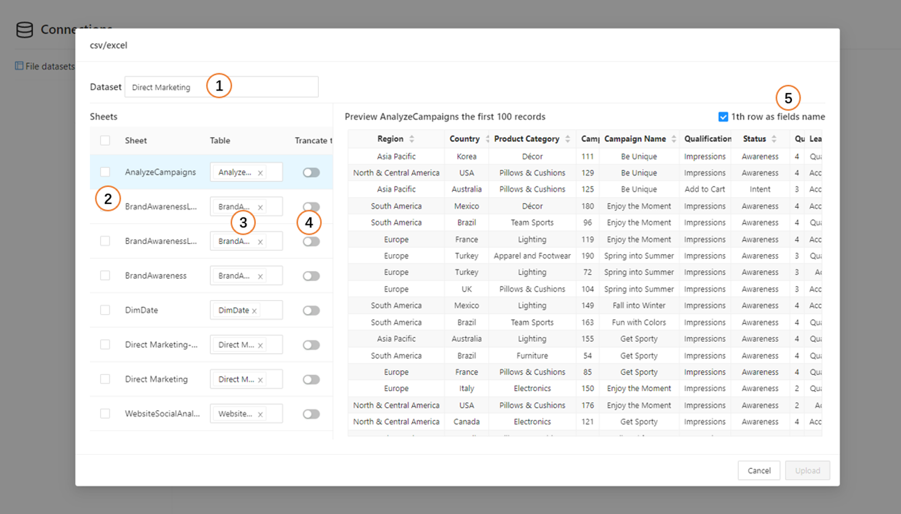

# File Dataset

A file dataset stores the rows of uploaded CSV or Excel files in tables that Datafor manages. Once uploaded, the dataset appears as a datasource that you can build Analysis Models on. Each upload is kept as a separate batch, so you can add more files later or remove one upload without touching the others.

Accepted files: `.csv`, `.xlsx`, `.xls`.

## Who can upload

- Creating a dataset requires the **Create content** capability. Users without it do not see the upload panel.
- Adding files to an existing dataset (**Import**) requires **Edit** permission on that dataset.
- **Batch delete** requires **Delete** permission on that dataset.
- Since 10.00, other users with **Read** on a dataset can build models and reports on it, but only administrators can write custom SQL on it: SQL Views, calculated columns, `where` conditions and row access conditions are refused for non-administrators with `SQL_FRAGMENT_FORBIDDEN:<connection>`, because an uploaded dataset is served by an engine inside Datafor. See [Data connections: targets and custom SQL](/documentation/System/Permission-Evaluation-Overview/#data-connections-targets-and-custom-sql).

## Create a dataset

1. Open **Data › Datasource** and select the **File datasets** tab.
2. Under **Upload a file dataset**, click **+** on the **CSV / Excel Files** card and choose a file. If the panel is not shown, click **New connection** (**+**) above the dataset list.
3. Fill in the upload dialog (see below) and click **Upload**.

The upload runs in the background. The dataset then appears in the list on the left; its **Status** turns green when the import is finished.

### Excel files

| Field | Meaning |
| --- | --- |
| **Dataset** | Name of the new dataset. It must not already exist. Fixed when you import into an existing dataset. |
| **Sheets** | Select the sheets to import. Click a sheet to preview its first 100 records. |
| **Table** | Target table for each selected sheet. Pick an existing table or type a new name and click **Add**. |
| **Trancate table** | Empty the target table before importing this sheet. Without it, rows are appended. |
| **1th row as fields name** | Use the first row as column names. |

### CSV files

| Field | Meaning |
| --- | --- |
| **Dataset** | Name of the new dataset. Fixed when you import into an existing dataset. |
| **Table** | Target table. Pick an existing table or type a new name and click **Add**. |
| **File origin** | Character encoding of the file, for example `UTF-8` (default), `GB18030`, `Big5`, `Shift_JIS`, `windows-1251` or `ISO-8859-1`. Change it if the preview shows garbled text. |
| **Delimiter** | Comma (default), pound (`#`) or Tab. |
| **1th row as fields name** | Use the first row as column names. |

The preview shows the first 100 records and updates when you change the encoding or delimiter.

### CSV files saved as "CSV UTF-8"

Excel's **CSV UTF-8** format starts the file with a byte order mark (BOM). Since 10.00 the import removes it, so the first column name is exactly the header text. Earlier releases kept an invisible character (U+FEFF) at the start of the first column name: the column looked normal in the model, but MDX, calculated fields, and other references by name did not match it. If references to the first column of a dataset imported before 10.00 fail, import the file again.

## Add files to a dataset

1. Select the dataset in the **File datasets** list.
2. Click **Import** (the upload icon) and choose a `.csv`, `.xlsx` or `.xls` file.
3. Choose the target table. When you import into an existing table, map each **Source column** to a **Target column** and clear the columns you do not want to import.
4. Click **Upload**.

## Manage uploads

Selecting a dataset lists one row per upload:

| Column | Content |
| --- | --- |
| **File name** | The uploaded file. |
| **Tables** | Number of tables the upload wrote to. Hover to see their names; click to preview the data. |
| **Records** | Number of imported rows, per table on hover. |
| **Upload time** | When the file was uploaded. |
| **Uploaded by** | The user who uploaded it. |
| **Status** | Green: finished. Red: failed; click the dot to see the error. A spinner means the import is still running. |
| **Preview** | Opens the imported data. Available when the import is finished. |

To remove uploads, select their rows and click **Batch delete**. This deletes the rows that those uploads added to each table; other uploads stay. To remove the whole dataset, open its **⋮** menu in the dataset list and select **Delete**.

## Related topics

- [Supported Databases](/documentation/Datasource/Supported-Databases/)
- [Creating an Analysis Model](/documentation/Model/Creating-an-Analysis-Model/)
- [Data Security](/documentation/Datasource/Data-Security/)
