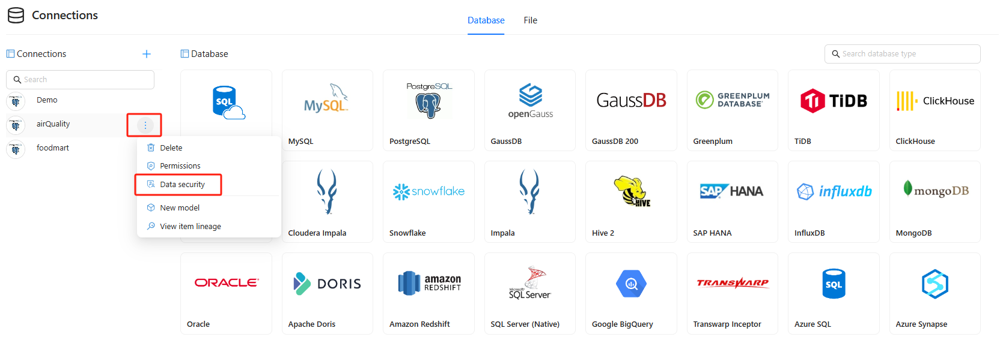
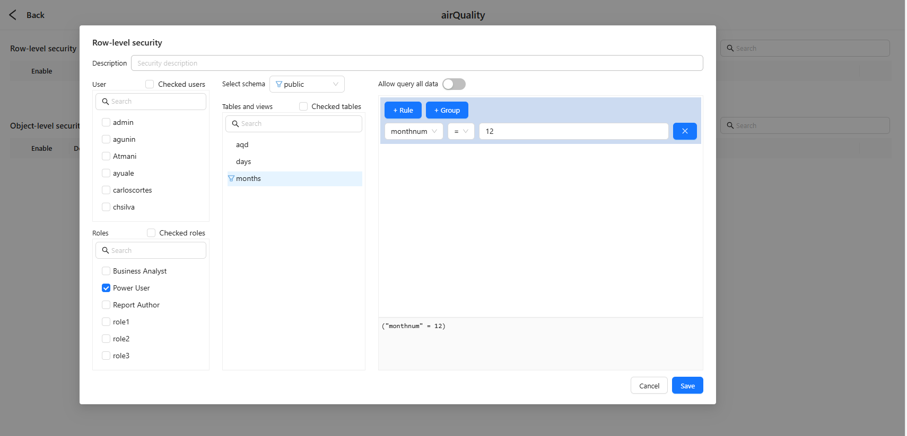
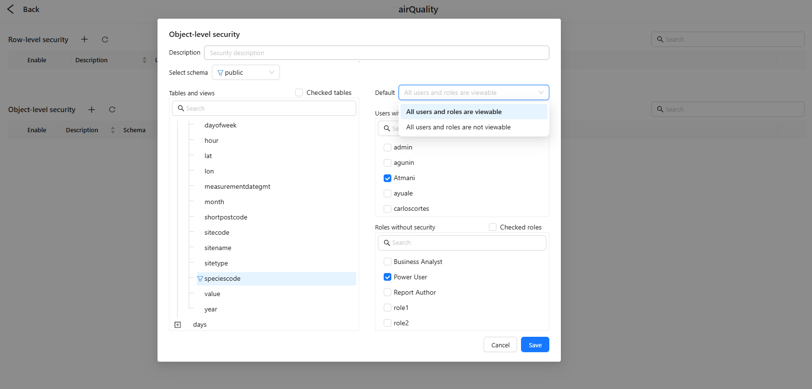
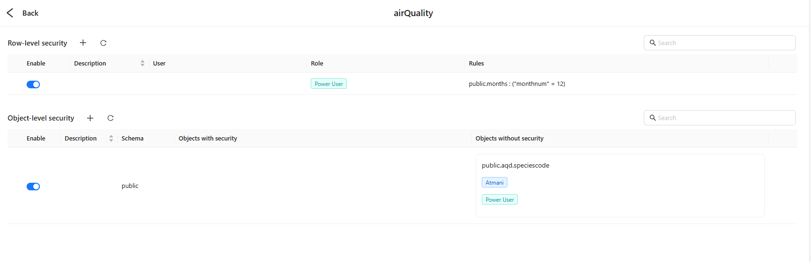

# Data Security (Row‑Level & Object‑Level)

> Apply access control at the **data‑source connection layer** so rows, tables/views, and columns are properly filtered or hidden **before** they reach reports, dashboards, ad‑hoc analysis, APIs, or the AI Agent. This guide explains how to configure **Row‑level Security (RLS)** and **Object‑level Security (OLS)** in Datafor BI.

## Audience

Data platform owners, BI administrators, security & compliance teams, and developers/operations staff who enforce access control at the source.

## Scope & Behavior

- **Where policies live:** Policies are saved **per connection**. Within a connection you can scope rules by **schema → table/view → column**.
- **When they apply:** Filters and visibility rules are injected **at query time** and affect all consumers (reports, dashboards, exploration, API/AI Agent).
- **Relation to report ACLs:**
  - **Report/Folder ACLs** control *who can open content*.
  - **Data Security (RLS/OLS)** controls *what data/objects are visible once a query runs*.
- **Permission prerequisite:** Only users with the data source’s **Control** permission can open **Data security** and manage policies.

## Access Path

1. Open **Connections**.
2. Hover the target connection (e.g., `airQuality`) and click the **⋯** menu.
3. Select **Data security** to open the security console.
4. The page has two sections:
   - **Row‑level security** — restrict **rows**.
   - **Object‑level security** — control **object visibility** (tables/views/columns).

## Core Concepts

- **Users / Roles:** Who the policy applies to. Prefer **roles** for lower maintenance.
- **Schema / Tables & Views:** Scope of the policy.
- **Rule Builder:** Combine conditions with **+ Rule** and **+ Group**; a preview of the expression appears at the bottom.
- **Group logic (AND/OR):**
  - Inside a **group**, rules can be combined with **AND** or **OR**.
  - **Between groups**, you can also combine with **AND** or **OR** for complex logic.
- **Allow query all data:** Works **only within the current policy entry** to let the selected users/roles **bypass RLS filtering** (OLS still applies). Typical use: allow a whitelist to see full data while others are restricted.
- **OLS default stance (per schema):**
  - **All users and roles are viewable** (open; add **restrictions** as exceptions), or
  - **All users and roles are not viewable** (closed; add **allow‑lists** as exceptions).

## Row‑level Security (RLS)

RLS limits the **set of rows** returned by a table or view. Common scenarios: multi‑tenant isolation, geography/organization scoping, and time‑window filtering.

### Steps

1. In **Row‑level security**, click **+** to create a policy.
2. Enter a **Description** (business intent, data owner, review cadence).
3. Select **Users** or **Roles** (roles recommended).
4. Choose the **Schema** and target **table/view**.
5. Build conditions with the **Rule Builder**: add multiple **Rules**, and use one or more **Groups** with **AND/OR** combinations.
6. If a whitelist needs full visibility, turn on **Allow query all data** for **this policy entry**.
7. Click **Save**, then ensure the policy **Enable** toggle is on in the list.

### Examples

- Equality: `monthnum = 12` (December only)
- Membership: `region IN ('WA','NSW','VIC')`
- Range: `date BETWEEN '2025-01-01' AND '2025-03-31'`
- Combined: `(region = 'WA' AND dept = 'Sales') OR (region = 'NSW' AND dept = 'Service')`

> **Expression syntax:** Exactly follows the **target database** (string/date literals and escaping are database‑specific).

### Maintenance & Best Practices

- Authorize via **roles** rather than individual accounts.
- Prefer deterministic fields (IDs/codes) in conditions.
- Aim for “**one business intent = one policy**”; document changes and review regularly.
- Validate with a **non‑admin test account**.

## Object‑level Security (OLS)

OLS controls the **visibility** of **tables, views, and columns**. Use it to hide sensitive structures (e.g., PII) or expose only a safe subset to most users.

### Capabilities & Compatibility

- Supports **table‑level and column‑level** control, and **all connectors support** OLS.

### Steps

1. In **Object‑level security**, click **+** to create a policy.
2. Select the **Schema** and set **Default** (everyone viewable / everyone not viewable).
3. In **Tables and views**, pick the target tables/views; expand to choose **columns** as needed.
4. On the right, configure **Users/Roles** as exceptions on the side opposite to the default (restricted vs. exempt).
5. Click **Save** and enable the policy.

### Examples

- **Default = viewable:** Restrict column `public.aqd.speciescode` by adding user A and role **Power User** to **with security** → they **cannot** see this column.
- **Default = not viewable:** Allow only a small business subset by adding roles to **without security** → only those roles **can** see the selected objects.

### Maintenance & Best Practices

- Start with the **smallest visible surface**: hide sensitive tables first, then open columns as needed.
- Combine with **RLS** to create a two‑layer defense (object visibility + row filtering).
- Use the list summary to audit “which objects apply to which principals”.

## How RLS & OLS Interact and Merge

- **Object precedence:** If OLS hides an object, the query is blocked or omits it—even if RLS would otherwise allow rows.
- **Multiple roles = most‑permissive union:** When a user belongs to multiple roles, the **effective permission** is the **union** of all applicable policies (if any policy grants visibility or access, it is granted).
- **RLS + Allow query all data:** Enabling it on an RLS entry lets the selected users/roles **bypass RLS**; they **still** remain subject to OLS.

## Policy List View (Summary Page)

The **Data security** page shows two lists—**RLS** and **OLS**—for quick auditing and operations.

### List Toolbar (top‑right of each list)

- **+**: Create a new policy.
- **↻ Refresh**: Reload policies and metadata.
- **Search**: Filter by description, schema, object name, user/role, or expression text.
- **Sortable headers**: Click supported columns to sort.

### RLS list columns

- **Enable**: Switch a policy on/off without deleting it.
- **Description**: Purpose/owner/notes.
- **User**: User chips targeted by the policy (empty if role‑only).
- **Role**: Role chips targeted by the policy (e.g., *Power User*).
- **Rules**: Compact preview of table‑scoped expressions, e.g., `public.months : ("monthnum" = 12)`.

> **Row action:** Click a policy row to edit; combine with search to quickly isolate policies.

### OLS list columns

- **Enable**: Toggle the object‑visibility policy.
- **Description**: Notes.
- **Schema**: Target schema (e.g., `public`).
- **Objects with security**: Objects that are **restricted** for the listed principals (commonly appears when the **default is viewable** and you add **restrictions**).
- **Objects without security**: Objects **exempt** from restrictions for the listed principals (commonly appears when the **default is not viewable** and you add **allow‑lists**).

> Both columns display **object names** (e.g., `public.aqd.speciescode`) with **chips** for affected users/roles, providing a clear audit of who is restricted or exempt on which objects.

**Row action:** Click a policy row to edit; use search to locate objects or principals quickly.

## Appendix: Common Operators & Patterns

- **Comparisons:** `=`, `<>`, `>`, `>=`, `<`, `<=`
- **Ranges:** `BETWEEN a AND b`
- **Sets:** `IN ( ... )`
- **Patterns:** `LIKE`, `ILIKE` (DB‑specific)
- **Dates/Strings:** Write literals according to your target database’s rules and timezone conventions.

## FAQ

**Q1: Which runs first, RLS or OLS?**
 A: OLS first. If an object is not visible, the query is blocked/omits it; once visible, RLS filters rows.

**Q2: How can only a few users see full data?**
 A: In the RLS entry for the whitelist users/roles, enable **Allow query all data**. Others remain restricted by default RLS/OLS.

**Q3: Do we support column‑level hiding?**
 A: Yes. OLS applies to tables and columns, and **all connectors** support it.

**Q4: Why do expressions differ by database?**
 A: Expressions strictly follow the **target database** syntax (e.g., PostgreSQL, MySQL, ClickHouse). Keep them consistent with your source engine.