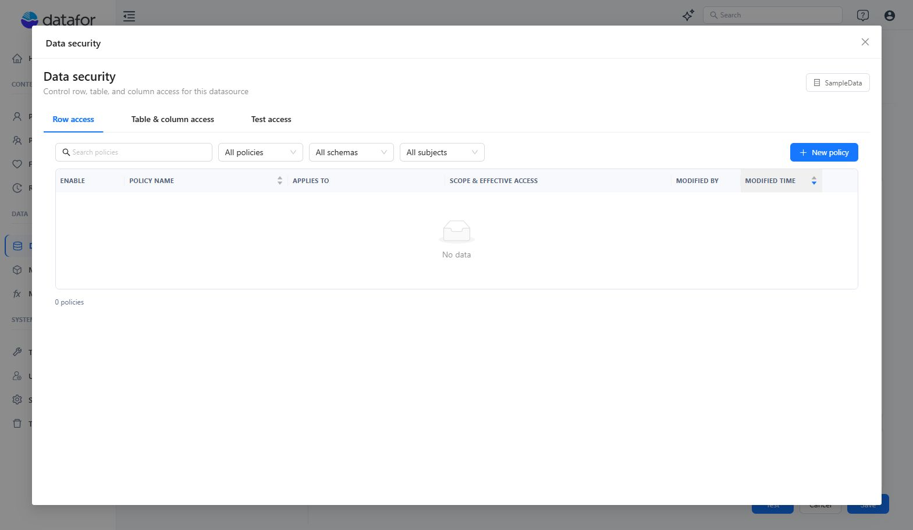
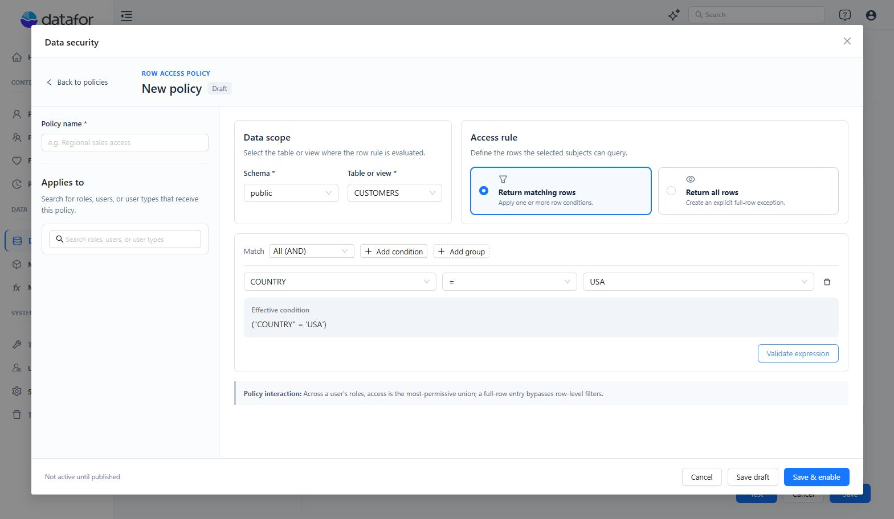
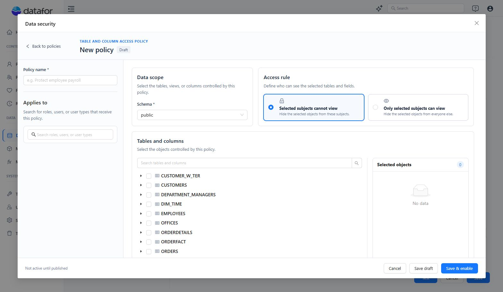
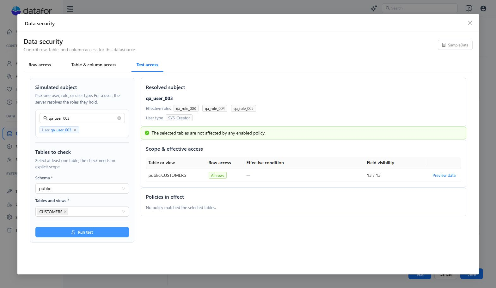

# Data Security

Data Security is configured on a database datasource and controls what an authorized subject can query.

| Requirement | Use |
| --- | --- |
| Return only permitted records | **Row access** (row-level security, or RLS) |
| Hide tables, views, or columns | **Table & column access** (object-level security, or OLS) |
| Check the combined result for a user, role, or user type | **Test access** |
| Control who can open or manage a datasource, model, or report | [Access Control List (ACL)](/documentation/System/Access-Control%20List/), not Data Security |

Policies belong to one datasource. They do not grant access to content, and an enabled policy on one datasource does not protect another datasource.

> **Default access:** If no enabled policy restricts the selected subject and object, Data Security does not add a restriction: row access is **All rows** and unexcluded fields remain visible. Build complete policy coverage instead of treating an unmatched subject as denied.

## Before you start

- You need **Full control** on the datasource to manage its policies.
- Create or identify the users, roles, or user types that the policies will target. Prefer roles for shared business rules.
- Use an ordinary user for validation. Built-in **SuperUser** and **Administrator** roles bypass Data Security.

## Open Data Security

1. Open **Datasource → Database sources**.
2. Select the datasource, open **Actions**, and choose **Data security**.
3. Use **Row access**, **Table & column access**, or **Test access**.

## Configure row access

A row policy applies to exactly one schema and one table or view.

1. On **Row access**, click **New policy**.
2. Enter a **Policy name** that identifies both the audience and scope, such as `US customers - sales team`.
3. Under **Applies to**, select one or more users, roles, or user types.
4. Select the **Schema** and **Table or view**.
5. Choose the access rule:
   - **Return matching rows**: build one or more conditions.
   - **Return all rows**: create an explicit full-row exception for the selected subjects and table.
6. For matching rows, select a field, operator, and value. Available operators depend on the field type. Use **All (AND)** or **Any (OR)** and add groups when the rule needs nested logic.
7. Review **Effective condition**, then click **Validate expression**.
8. Click **Save draft** to keep the policy inactive, or **Save & enable** to apply it.

Choose the scope before building conditions. Changing the schema or table clears the current conditions.

### How row policies combine

- Conditions inside one policy follow the selected **AND/OR** structure.
- Enabled row policies that match the same subject and physical table are combined with **OR**. The result is the most-permissive union.
- A matching **Return all rows** policy removes row filtering for that table. It does not make an object hidden by a table or column policy visible.
- With no matching enabled row policy, the subject receives **All rows**.

Before adding a full-row exception, check every role held by the target users. One permissive policy can override more restrictive row policies on the same table.

## Configure table and column access

A table and column policy applies to one schema and can contain multiple tables, views, or individual columns.

1. On **Table & column access**, click **New policy**.
2. Enter a **Policy name** and select the users, roles, or user types under **Applies to**.
3. Select the **Schema**.
4. Choose the access rule shown by the editor:
   - **Selected subjects cannot view**: hide the selected objects from the selected subjects.
   - **Only selected subjects can view**: keep the selected objects visible to the selected subjects and hide them from everyone else.
5. Select whole tables or views, or expand them and select individual columns. For the same table, whole-table and individual-column selections are mutually exclusive. Confirm the result under **Selected objects**.
6. Click **Save draft** or **Save & enable**.
7. Run **Test access** for both an intended subject and an unintended subject before relying on the policy.

Changing the schema clears the current object selection.

When several object policies apply, exclusions accumulate across policies. Do not assume that an allow rule in one policy cancels an exclusion in another; verify the final field count and hidden-field list in **Test access**.

## Test effective access

Use **Test access** after every enabled policy change. It evaluates enabled policies without changing them; unsaved changes and inactive drafts are excluded.

1. Select one **Simulated subject**. A user test also resolves that user's effective roles and user type.
2. Select a **Schema** and at least one **Table or view**.
3. Click **Run test**.
4. Review:
   - **Resolved subject**, effective roles, and user type.
   - **Row access** and the generated **Effective condition**.
   - **Field visibility**, including the visible/total count and hidden fields.
   - **Policies in effect**.
5. Use **Preview data** to inspect a sample of up to 50 rows. Preview uses the simulated effective decision but is not a full sign-in impersonation; validate the final workflow with the actual user. Preview is unavailable when the table itself is blocked.

The message **The selected tables are not affected by any enabled policy** means Data Security is not restricting that selection. It is not confirmation that the table is protected.

## Drafts and existing policies

- **Save draft** stores an inactive policy. Drafts do not affect queries.
- **Save & enable** stores and activates a new policy. Row expressions are validated before they are saved or enabled.
- The **Enable** switch on the list activates or deactivates an existing policy. Disabling keeps the policy but removes it from effective access.
- Use the policy name to edit it. Use the row action menu to delete it; deletion is permanent after confirmation.
- Search and filter by policy state, schema, or subject when auditing a large list.

## Data Security and the AI Agent

For current analysis models, when the AI Agent runs a query, Data Security is applied through the user's authenticated query and metadata context if **Apply data security** is enabled in the model settings.

- Keep **Apply data security** enabled for governed models.
- Test with the same non-administrator user who will use the Agent.
- The selected LLM profile does not grant data access and cannot relax RLS or OLS.
- If an Agent result differs from a report, confirm that both use the same model, datasource, user, and current enabled policies.

## Troubleshooting

| Symptom | Check |
| --- | --- |
| A user sees too many rows | Enabled state, subject assignment, all effective roles, table scope, and any matching **Return all rows** policy |
| A user sees no rows | Field, operator, value type, generated condition, and expression validation |
| A table or column is missing | Every enabled table and column policy; exclusions from separate policies accumulate |
| A saved policy has no effect | Confirm that it is enabled and appears under **Policies in effect** in **Test access** |
| An administrator still sees everything | Validate with a non-administrator account; administrator and SuperUser roles bypass Data Security |
| Agent access differs from the test | Check **Apply data security**, model and datasource selection, user identity, and enabled policy state |

## Related topics

- [Row-Level Security in Analytics](/documentation/Datasource/Row-Level-Security-in-Analytics/)
- [Access Control List](/documentation/System/Access-Control%20List/)
- [User Creation and User Types](/documentation/System/UserTypes/)
- [LLM Configuration](/documentation/AI-Agent/LLM-Configuration/)
