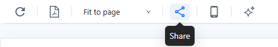
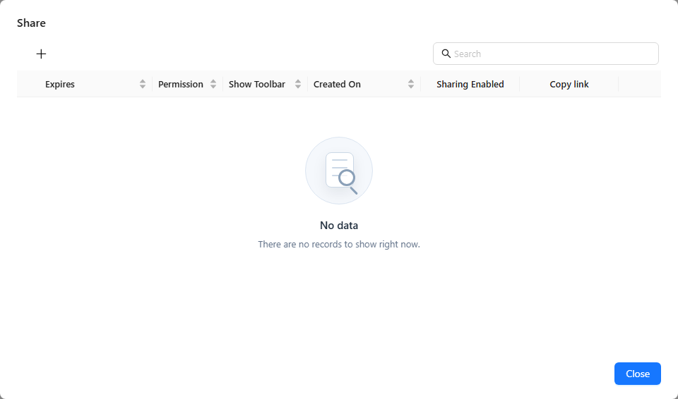
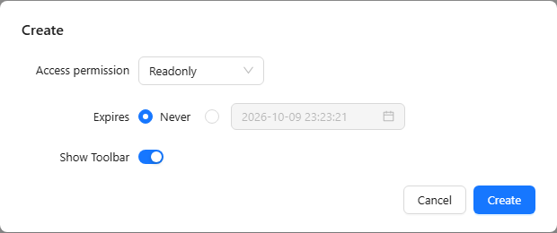

# Share Link

A share link opens a report for anyone who has the link, without a Datafor sign-in. Use it to send a report to people without a Datafor account, or to embed it in another site's `iframe`.

::: warning The link runs as you
Everything opened through a share link runs as the user who created it. Viewers see the data that **you** can see: their own row-level security and permissions do not apply, and anyone who gets the link sees the same data. An **Editable** link lets anyone with the link change the report and save the changes to the original report. Share only reports and data that every possible recipient may see, set an expiry date, and turn links off when they are no longer needed.
:::

## Use the public address

Copy links while you use Datafor at the address recipients will use, for example `https://bi.example.com/datafor/`, not `localhost` or an internal host name. A link copied while you are on `http://localhost:28080/datafor/` works only on the server itself. Also set **Site URL** in **Settings › Access & Integration › Site address** to that address (see [Site Address](/documentation/System/Site-Address/)).

A link looks like this:

```text
https://bi.example.com/datafor/plugin/datafor/api/share/open?shareid=<id>
```

## Create a share link

1. Open the report and click **Share** on the report toolbar.

   <div align="left"></div>

2. The list shows the share links you created for this report. Click **New**.

   <div align="left"></div>

3. In the **Create** dialog, set:

   | Setting | Options |
   | --- | --- |
   | **Access permission** | **Readonly**: recipients can view the report. **Editable**: recipients can also edit it and save the changes to the original report. **Editable** is offered only if you can edit the report. |
   | **Expires** | **Never**, or a date and time after which the link stops working. |
   | **Show Toolbar** | Only for **Readonly** links. On: the report opens with its toolbar. Off: it opens in embed mode, without toolbar, which suits an `iframe`. |

   <div align="left"></div>

4. Click **Create**.
5. In the row of the new link, click the link icon in the **Copy link** column to copy the URL.

You can add URL options to a copied link, such as `&locale=en-US` for the language or `&__device=mobile` for the [mobile layout](/documentation/Visualization/Mobile-Layout-View/).

## Manage share links

The list has the columns **Expires**, **Permission**, **Show Toolbar**, **Created On**, **Sharing Enabled** and **Copy link**.

- **Pause a link**: turn off **Sharing Enabled**. The link stops working until you turn it on again; the URL stays the same.
- **Change a link**: choose **Edit** in the row's action menu, change the settings, and click **Upgrade**. The URL stays the same.
- **Delete links**: choose **Delete** in the row's action menu, or select several rows and click **Delete** on the toolbar. A deleted link cannot be restored.

All your share links, for every report, are also listed in **My account › Share link** (see [My Account](/documentation/Console/My-Account/)).

## When a link does not open

| Message | Meaning |
| --- | --- |
| `shareid is not enabled` | **Sharing Enabled** is off for the link. |
| `shareid is overtime` | The link has expired. Edit it and set a new **Expires** value. |
| `shareid not found` | The link was deleted. |
| `Access denied, you do not have access to the page!` | The report could not be opened as the link's creator. Check that the creator's account still exists and can open the report. |
