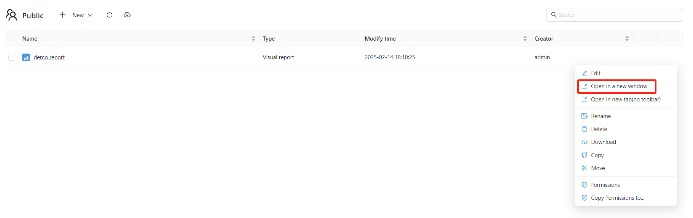
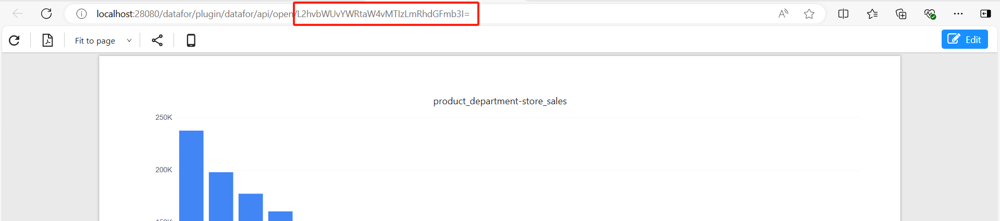
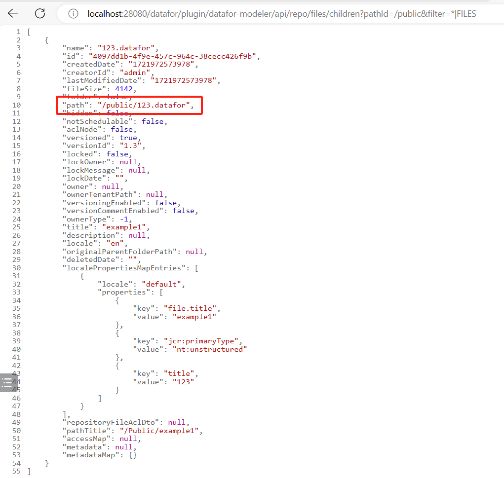

# Report URLs (open, edit, embed)

Every report can be opened directly in a browser tab or an `iframe` by URL. These URLs return the report page (HTML), not data.

## Open a blank report designer

`http://your-server:28080/datafor/plugin/datafor/api/createDo`

## Open a report

**URL format**: `<server url>/plugin/datafor/api/<mode>/<report id>?<option>&<option>`

- `<server url>`: the base address, for example `http://your-server:28080/datafor` (`28080` is the default port).
- `<mode>`:
  - **open**: view mode, with the report toolbar.
  - **edit**: edit mode (report designer). The user needs edit permission.
  - **integrate**: embed mode, without toolbar. Use it to embed the report in another page with an `iframe`.
- `<report id>`: the report's repository path, Base64 encoded, see [below](#how-to-retrieve-a-report-id).

In the console's file list, a report's action menu has **Open in a new window**, which opens the `open` URL, and **Open in new tab(no toolbar)**, which opens the `integrate` URL. Copy the URL from the new tab.

### URL options

Note: `__` is two underscore characters.

| Option | Modes | Effect |
| --- | --- | --- |
| `locale=<language>` | all | UI language, for example `locale=en-US` or `locale=zh-CN`. Without it, the user's language is used. |
| `__compact=true` | integrate | Removes the outer margins of the report page. |
| `__clean=true` | integrate | Removes the shadow around the report page. |
| `__forceAdjust=true` | integrate | Fits the report to the width of the window or `iframe`. |
| `__device=mobile` | open, integrate | Shows the report's [mobile layout](/documentation/Visualization/Mobile-Layout-View/) in any browser. |
| `__xdmTimeout=<ms>` | open, integrate | How long the report waits for the host page's first filter message (default 50 ms), see [XDM](/documentation/Embedded/Embedding-Reports-Using-XDM/). |
| `default_<filter>=<values>` | open, integrate | Opening selection of a filter component, by its title or ID, see [Filters](/documentation/Visualization/Filters/). |
| `<parameter name>=<value>` | open, integrate | Value of a report or global parameter, see [Pass Parameters Through URL](/documentation/Pass-parameters-through-URL/). |

### Examples

- Edit mode: `http://your-server:28080/datafor/plugin/datafor/api/edit/L2hvbWUvYWRtaW4vZXhhbXBsZTEuZGF0YWZvcg==`
- View mode: `http://your-server:28080/datafor/plugin/datafor/api/open/L2hvbWUvYWRtaW4vZXhhbXBsZTEuZGF0YWZvcg==`
- View mode in English: `http://your-server:28080/datafor/plugin/datafor/api/open/L2hvbWUvYWRtaW4vZXhhbXBsZTEuZGF0YWZvcg==?locale=en-US`
- Embed mode without outer margins: `http://your-server:28080/datafor/plugin/datafor/api/integrate/L2hvbWUvYWRtaW4vZXhhbXBsZTEuZGF0YWZvcg==?__compact=true`
- Embed mode without shadow, fitted to the `iframe` width: `http://your-server:28080/datafor/plugin/datafor/api/integrate/L2hvbWUvYWRtaW4vZXhhbXBsZTEuZGF0YWZvcg==?__clean=true&__forceAdjust=true`

## Who is signed in inside an iframe

A report URL opens as a Datafor user, and that user's permissions and row-level security apply. In an `iframe`, the user is signed in in one of these ways:

| Way | How | Notes |
| --- | --- | --- |
| Existing session | The user is already signed in to Datafor in the same browser. | Browsers may not send Datafor's session cookie to an `iframe` on another site (third-party cookies). |
| Share link | Use a [share link](/documentation/Embedded/Share-link/) with **Show Toolbar** off instead of the report URL. | Runs as the user who created the link, for every viewer. |
| Embed token | Your backend signs a [JWT](/documentation/System/JWT/) for the user and adds it to the URL under the configuration's **Token name** (default `token`), for example `.../api/integrate/<report id>?__compact=true&token=your-jwt-token`. | URLs end up in browser history and server logs: give tokens a short `exp`. |
| Single sign-on | With OAuth 2.0, SAML 2.0 or CAS enabled, users without a session sign in at the identity provider. | See [Signing In Users of Embedded Reports](/documentation/Embedded/How-SSO-Improves-the-Embedded-Analytics-Experience/). |

## How to Retrieve a Report ID

### Method 1: Copy from URL

1. In the file list, open the report's action menu and choose **Open in a new window**.

   <div align="left"></div>

2. The report ID is the last part of the address in the browser's address bar.

   <div align="left"></div>


### Method 2: Generate using code

1. Use the API to get the file path.

   For example:

   ```
   http://your-server:28080/datafor/plugin/datafor-modeler/api/repo/files/children?pathId=/public&filter=*|FILES
   ```

   <div align="left"></div>

2. Encode the path with Base64, replacing `+` with `-` and `/` with `_`:

   ```js
   window.btoa(unescape(encodeURIComponent("/public/123.datafor"))).replace(/\+/g, "-").replace(/\//g, "_");
   ```
