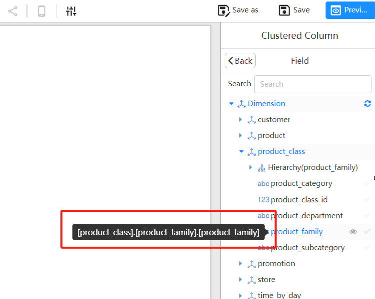
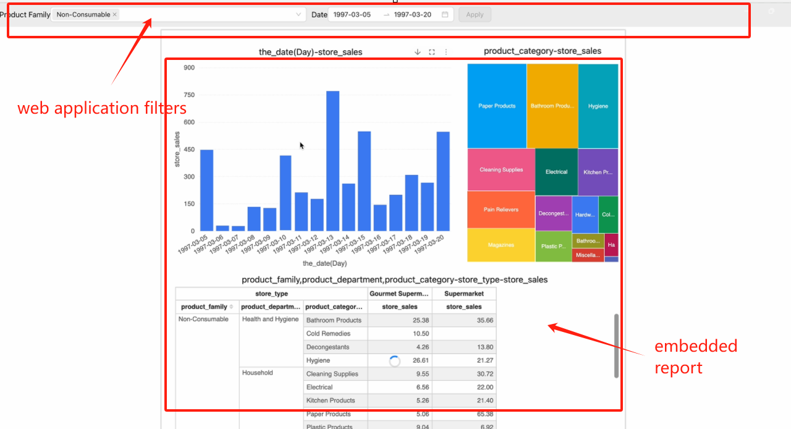

> **Note:**
> The term "**report**" in this document refers to the visual reports created using Datafor or the Visualizer plugin.

A report opened in an `iframe` (or in a window opened with `window.open`) accepts filter messages from the host page through XDM (cross-document messaging, the browser's `postMessage` API). The report applies the filters to its charts, which re-query their data without reloading the page.

Typical uses:

1. Passing filters when the report opens, so the first data shown is already filtered.
2. Changing filters in the host application later and passing them to the report (without reloading it).

## How it works

- XDM works only in read-only views: the open and embed URLs and share links. A report opened in edit mode ignores XDM messages.
- When the report has loaded, it posts `{"event":"visualizerReportFileLoaded","id":"<id>"}` to its parent window (or opener). Every message the host sends must carry that `id` as `trustMark`; messages with another or no `trustMark` are dropped.
- The report waits for an initial filter message (`init: true`) before it queries data. By default it waits only **50 ms**; add `__xdmTimeout=<milliseconds>` to the report URL to wait longer. After the wait it loads unfiltered, and a late `init` message no longer re-queries the charts. Messages without `init` are applied at any time.
- XDM filters only narrow the data the signed-in user may see. They are not a security control: anyone who can open the report can send other messages from the browser console. Use [row-level security](/documentation/Datasource/Row-Level-Security-in-Analytics/) to restrict data per user.

## Steps

### Add the `XDMWorker` class to the host page

Add the following `XDMWorker` class to the page that embeds the report. It records the report's `id` and sends filter messages with its `send` method.

```js
class XDMWorker {
    constructor({ onPageInitEvent = () => { } }) {
        this.reportId = null;
        window.addEventListener('message', (msg) => {
            const { data } = msg;
            let reportMessage;
            try { reportMessage = JSON.parse(data); } catch (d) { }
            if (reportMessage) {
                if (reportMessage.event == 'visualizerReportFileLoaded') {
                    this.reportId = reportMessage.id;
                    onPageInitEvent();
                }
            }
        });
    }

    send(data, target, init = false) {
        if (!this.reportId) {
            console.error('No reportId found, please wait for the report to be loaded');
            return;
        }
        const message = {
            trustMark: this.reportId,
            event: 'query',
            init,
            filters: data,
        };
        target?.postMessage(JSON.stringify(message), '*');
    }
}
```

### Scenario 1: Filter the report when it opens

1. **Create an XDMWorker before the report loads**

   To filter the first load, call `send` inside `onPageInitEvent`, with the third argument set to `true`.

   **Example:**

   ```js
   const xdm = new XDMWorker({
       onPageInitEvent: () => {
          iframeRef?.current && xdm.send(
                  [
                     {
                       value: [
                         'product_family_1',
                         'product_family_2'
                       ],
                       name: '[product_class].[hierarchy_product_family].[product_family]',
                       type: 'name',
                       datatype: 'string'
                     }
                  ],
                  iframeRef.current?.contentWindow,
                  true
              );
       }
   });
   ```

   **Filter format:** an array of filter objects. Several objects filter together (AND).

   ```
   [{
       name: string,                                  // uniqueName of the field's level
       value: [ string | [from, to] , ... ],          // values and ranges
       type: 'name' | 'caption' | 'uniqueName',       // default 'name'
       datatype: 'string' | 'numeric' | 'timestamp',  // default 'string'
       exclude: boolean                               // default false
   }]
   ```

   - **name:** the `uniqueName` of the field's level in the report's analysis model, see [below](#find-a-field-s-uniquename).
   - **type:** what the values are compared with: `name` (member name, default), `caption` (displayed name), or `uniqueName` (each value is a full member unique name, such as `[product_class].[product_family].[Drink]`).
   - **datatype:** how values and range bounds are compared.
   - **exclude:** `true` keeps everything except the given values or ranges.
   - **value:** single values and ranges can be mixed; the conditions are combined with OR (with AND when `exclude` is `true`). A range is an inner array `[from, to]`. Each bound is a value, or an object `{"i": "1" | "0", "v": value}` where `i` is `"1"` to include the bound (default) or `"0"` to exclude it.

   | Condition | Filter |
   | --- | --- |
   | x in ('a', 'b', 'c') | `{"value":["a","b","c"],"datatype":"string"}` |
   | x not in ('a', 'b') | `{"value":["a","b"],"datatype":"string","exclude":true}` |
   | x >= 1 and x < 3 | `{"value":[[{"i":"1","v":"1"},{"i":"0","v":"3"}]],"datatype":"numeric"}` |
   | x between 2 and 5, or between 4 and 6 | `{"value":[["2","5"],["4","6"]],"datatype":"numeric"}` |
   | x between 2 and 5, or between 4 and 6, or x in (7, 8) | `{"value":[["2","5"],["4","6"],"7","8"],"datatype":"numeric"}` |
   | x >= '2024-01-01 00:00:00+8' and x < '2025-01-01 00:00:00+8' | `{"value":[[{"i":"1","v":"1704038400"},{"i":"0","v":"1735660800"}]],"datatype":"timestamp"}` |

   Each row also needs `name` (and `type` when it is not `name`). The field does not have to be used by the charts: a filter on a field that a chart does not show still filters that chart's data.

2. **Open the report in the iframe**

   - Use the report's embed URL, see [Report URLs](/documentation/Embedded/Reports-REST-API/).
   - Add `__xdmTimeout` so the report waits long enough for your first message, for example `http://your-server:28080/datafor/plugin/datafor/api/integrate/L2hvbWUvYWRtaW4vZXhhbXBsZTEuZGF0YWZvcg==?__xdmTimeout=150`. Set it to how fast your page answers `visualizerReportFileLoaded`. It is not needed if you don't filter the first load.

### Scenario 2: Change filters after the report has loaded

Call `send` without the third argument whenever the host's filters change. The report applies the filters and re-queries its charts immediately.

```
send(message, target)
```

- **message:** filters in the format above.
- **target:** the `contentWindow` of the iframe that shows the report.

## Find a field's `uniqueName`

In the report designer, hover over a field in the field list: the tooltip shows its `uniqueName`.

The `uniqueName` of the `product_family` field in the image below is `[product_class].[product_family].[product_family]`.


<div align="left"></div>

## Example

A host page with its own filters (top) driving an embedded report:

<div align="left"></div>
