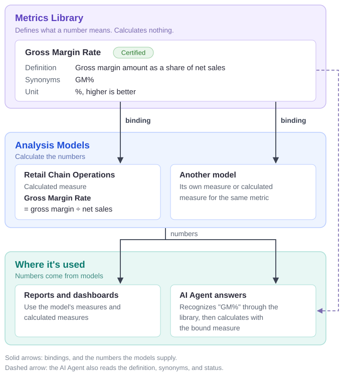

# Understanding Metrics Library

Metrics Library is your organization's official list of business metrics, such as Net Sales, Gross Margin Rate, and Average Order Value. Each metric records what the figure means, what it includes and excludes, who owns it, and whether the definition has been approved.

Metrics Library does not calculate anything. Numbers still come from the measures and calculated measures in your Analysis Models.

::: tip In short
Metrics Library defines what a number means. A measure in a model calculates it. A binding connects the two.
:::

## The problem it solves

Ask three teams for "sales" and you may get three different numbers. One includes cancelled orders, another deducts returns, a third excludes tax. Every number can be calculated correctly; the teams simply mean different things by the same word.

The sample **Retail Chain Operations** model shows this. Its measure named **Sales** is bound to the **Gross Sales** metric, which includes cancelled and unpaid orders and does not deduct returns. **Net Sales** is a separate metric that excludes those orders and deducts returns. Metrics Library keeps the two apart, so anyone can see which definition a number follows.

A metric looks like this:

| Field | Example: Net Sales |
| --- | --- |
| **Business definition** | Transaction value of completed and paid orders, net of returned amounts. Cancelled and unpaid orders are excluded. |
| **Synonyms** | Actual Sales, Valid Sales |
| **Unit and direction** | CNY, higher is better |
| **Owner** | Tom |
| **Status** | Certified (new metrics start as Draft) |

## When you need it

Metrics Library is worth setting up when any of these sound familiar:

- **Reports disagree on the same metric.** Agree on one definition, name an owner, and certify it.
- **Several models calculate the same metric.** Define it once and bind it in each model, so every model is checked against the same definition.
- **People ask the AI Agent in their own words**, such as "GM%" or "AOV". Synonyms lead the Agent to the official metric and the measure bound to it, not a similarly named field. If the metric is a draft or not bound in that model, the answer says so.
- **Formulas or definitions change.** The binding is marked **Needs comparison**, and **Compare definition** asks AI whether the two still agree.
- **People keep asking how a figure is defined.** The AI Agent answers "How is Net Sales defined?" from the library, without running a query.

You may not need it yet if you have one model, a small team, and measures whose meaning nobody disputes. Clear captions, descriptions, and aliases on the measures may be enough for now. When you start, register the 5 to 15 metrics that are reported to management or often disputed, not every measure.

## Metrics, measures, and calculated measures

| | Measure | Calculated measure | Metric |
| --- | --- | --- | --- |
| **Lives in** | An Analysis Model | An Analysis Model | Metrics Library |
| **What it is** | Adds up, counts, or averages a column of data | A formula that combines other measures | The official definition of a business figure |
| **Example** | Net Sales | Gross Margin Rate = Gross Margin Amount ÷ Net Sales | Gross Margin Rate: gross margin amount as a share of net sales |
| **Calculates numbers** | Yes | Yes | No |
| **Used in** | One model | One model | Every model that binds it |
| **Maintained by** | Model author | Model author | Metric owner |

A metric and the measure that calculates it often share a name, like Gross Margin Rate above, but they do different jobs: the measure **calculates** the number, and the metric records what the business **means** by it. Either kind of measure can be bound to a metric. A simple total is usually a measure; a rate or ratio is usually a calculated measure.

## How a binding connects them

A **binding** tells Datafor: *in this model, this measure calculates that metric.* A model author creates it in the Model Designer: select the measure or calculated measure, expand **Metric governance**, choose the metric under **Enterprise metric**, and save the model. See [Metrics Library](/documentation/Metrics-Library/Metrics-Library/) for the full steps.

Keep bindings clear:

- **One measure per metric in each model.** If two measures in the same model are bound to one metric, Datafor warns you, because the AI Agent cannot tell which one to use.
- **One metric can serve many models.** Each model binds its own measure, and each binding is reviewed separately.
- **Not every measure needs a metric.** Technical or intermediate measures, such as Fact Count, can stay unbound.

## Certified, bound, and compared are separate checks

Each check answers a different question, and none implies the others:

| Check | What it tells you | What it does not tell you |
| --- | --- | --- |
| **Certified** | The metric owner has approved the definition, and the AI Agent must follow it. | That any model can calculate it. |
| **Bound** (shown as *Model references*) | A model has a measure that calculates this metric. | That the definition is approved or the formula is right. |
| **Matches definition** | An AI comparison found the model's formula consistent with the definition. | That the data is correct. The comparison reads the model, not the data, and never changes the model. |

Treat a metric as ready for production use only when all three are in place for the model you use. If a certified or bound definition changes later, the metric gets a new version and its bindings must be compared again.

## Common questions

**Is Metrics Library a data source? Can I build a report from it?**\
No. It stores definitions only. Reports and AI answers get their numbers from Analysis Models.

**Does binding a measure change my reports?**\
No. Binding does not change the measure's formula, aggregation, or filters, and it does not copy the library's text into the measure. If the unit, direction, or synonyms differ, the designer shows the difference so you can decide.

**The library shows a calculation such as "Gross Margin Amount ÷ Net Sales". Is that the formula Datafor runs?**\
No. It describes how the metric relates to other metrics and is used only when comparing definitions. The formula that runs is the calculated measure in the model.

**A measure is called "Sales" but is bound to "Gross Sales". Is that a mistake?**\
No. The binding, not the name, decides which metric a measure calculates.

**What is the difference between measure aliases and metric synonyms?**\
Aliases help people and the AI Agent find a measure in one model. Synonyms lead to the official metric in every model that binds it. The AI Agent matches metric names and synonyms exactly, so add the words people really use. When you bind a measure, the designer lists aliases missing from the library and can add them for you.

**Is a Certified metric ready to use?**\
Not on its own. Certification approves the definition; a model author must also bind a measure to it in the model you use. Until then, the AI Agent can explain the definition, but its numbers come from the model's own fields, with a note saying so.

**I can't find Metrics Library in the menu.**\
Opening it requires administrator or metric-creation permission. You can still ask the AI Agent how a metric is defined, or ask a metric owner for an exported list.

**What is the Dimension concepts tab?**\
It lists business dimensions shared across models, such as Region, with their synonyms. Metrics reference them to state where they apply, and the AI Agent uses them to recognize that words such as "region" and "territory" mean the same thing.

## Related topics

- [Metrics Library](/documentation/Metrics-Library/Metrics-Library/)
- [Measures and Calculated Measures](/documentation/Model/Measures-and-Calculated-Measures/)
- [Business Semantics for AI](/documentation/Model/Business-Semantics-for-AI/)
- [Improving AI Agent Answers](/documentation/AI-Agent/Improving-Answer-Quality/)
