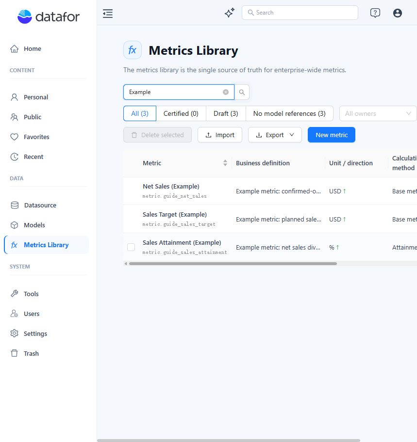
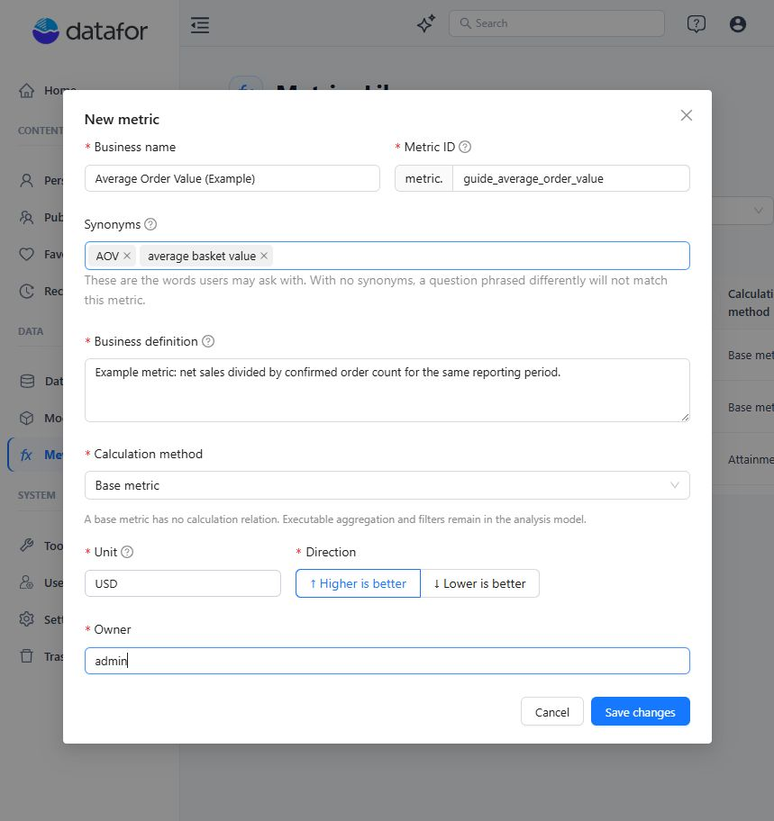
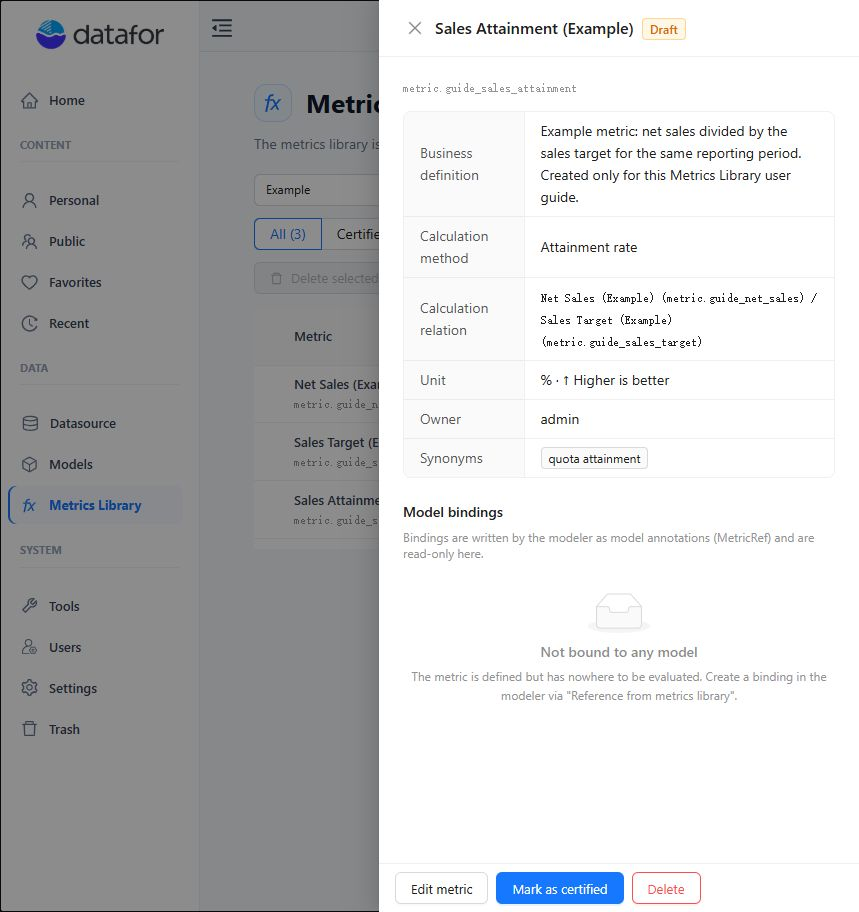
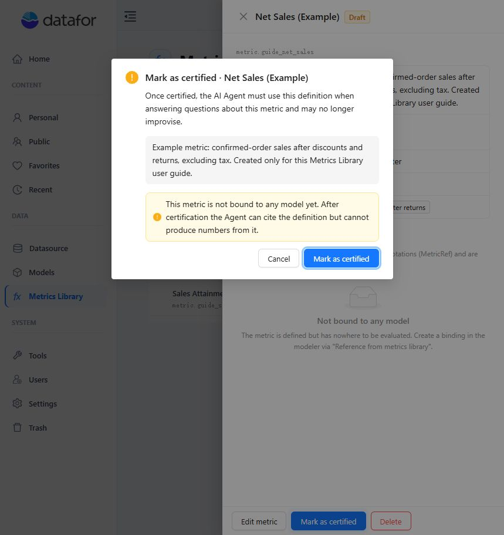
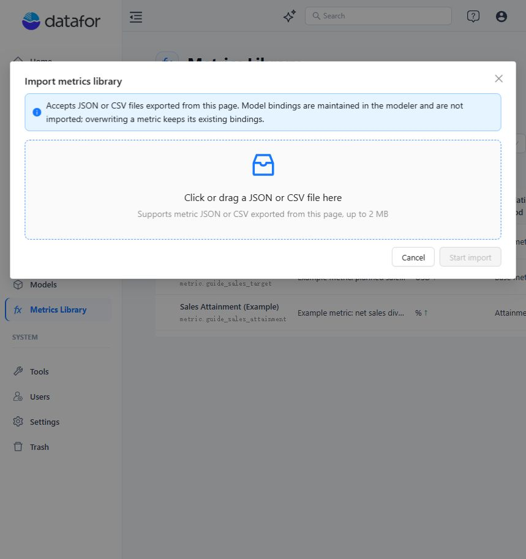
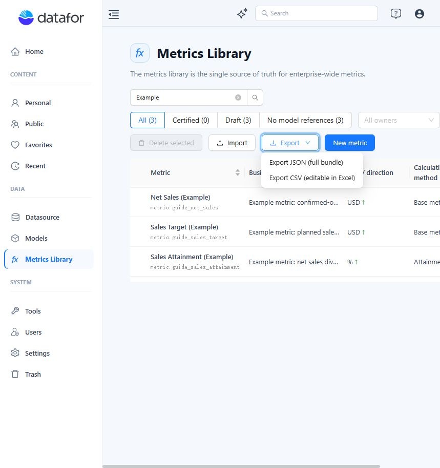

# Metrics Library

Metrics Library is the single source of truth for enterprise-wide metric definitions in Datafor. It gives each metric a stable identity and a governed business meaning that can be reused across analysis models and understood consistently by the AI Agent.

Use Metrics Library to:

- Define a metric once and reuse the same definition across models.
- Record business names, stable IDs, synonyms, definitions, units, directions, and owners.
- Describe how derived metrics relate to their base metrics.
- Review where a metric is referenced by Analysis Models.
- Certify approved definitions for use by the AI Agent.
- Import, export, and maintain metric definitions in bulk.

**Core concept:** Metrics Library governs what a metric means. An Analysis Model still determines where the metric can be evaluated and how model-specific data is aggregated or filtered.

## 1. Understand metric records

Each metric record contains the following information:

| Element | Purpose |
| --- | --- |
| **Business name** | The reader-facing name shown in the library and model selector. |
| **Metric ID** | A stable identifier in the form `metric.<suffix>`. It cannot be changed after creation. |
| **Synonyms** | Alternative wording that helps users and the AI Agent match questions to the metric. |
| **Business definition** | The meaning, inclusions, exclusions, time scope, and caveats that govern interpretation. |
| **Calculation method** | A base metric, ratio, difference, attainment rate, or custom formula relationship. |
| **Unit and direction** | How values are expressed and whether higher or lower values are desirable. |
| **Owner and status** | The accountable person or team, plus the Draft or Certified governance state. |
| **Model references** | Read-only references written by Analysis Models through MetricRef annotations. |

### Draft, Certified, and model binding

These are separate decisions:

- **Draft** is the default status for manually created metrics and newly imported records.
- **Certified** tells the AI Agent to use the approved business definition instead of creating a different interpretation.
- A metric can be Certified without a model binding. The Agent can cite its definition, but it cannot produce a value from that metric.
- The Modeler can currently select both Draft and Certified metrics. Certification does not create a model binding.

**Access:** If **Metrics Library** is not visible under **Data**, ask an administrator to confirm that your account has administrator or metric-creation access.

### Quick-start workflow

1. **Define** the metric name, stable ID, synonyms, business definition, unit, direction, and owner.
2. **Relate** the metric to its base metrics when it uses a derived calculation.
3. **Bind** the metric to a Measure or Calculated Measure in an Analysis Model.
4. **Review** the definition, model binding, effective grain, and implementation consistency.
5. **Certify** the metric after the governance review is complete.

## 2. Open and search Metrics Library

1. Sign in to the Datafor console.
2. In the left navigation, go to **Data > Metrics Library**.
3. Use the table to review each metric's definition, unit, direction, calculation method, owner, status, model references, and available actions.

### Search and filters

- Search matches the **Business name**, **Metric ID**, and **Synonyms** using case-insensitive substring matching.
- Business definition, calculation text, and owner are not included in text search.
- Use **All**, **Certified**, **Draft**, or **No model references**, then optionally select an owner.
- Search, status or reference filters, and the owner filter are combined.

**Tip:** Search by a stable Metric ID fragment when names are similar. Add common, unambiguous synonyms so users can still find the correct metric with their usual business wording.

## 3. Create a metric

1. Click **New metric**.
2. Enter the metric's identity and meaning: **Business name**, **Metric ID**, useful synonyms, and a complete business definition.
3. Choose a **Calculation method**. Select **Base metric** when no library-level relationship is needed, or select a derived method and its operands.
4. Set the **Unit**, **Direction**, and **Owner**.
5. Click **Save changes**. The new metric is created as Draft.

### Field reference

| Field | Required | Guidance |
| --- | --- | --- |
| **Business name** | Yes | Up to 64 characters. Use a recognizable, business-facing name. |
| **Metric ID suffix** | Yes | Up to 64 lowercase letters, digits, or underscores. The UI adds `metric.` and locks the ID after creation. |
| **Synonyms** | No | Press Enter or type a comma after each phrase. At least one synonym is recommended. |
| **Business definition** | Yes | Up to 700 characters. State the meaning, inclusions, exclusions, timing, and caveats. |
| **Calculation method** | Yes | Choose the relationship that matches the governed metric. |
| **Unit** | Yes | Up to 32 characters. Choose a common unit or enter a custom value. |
| **Direction** | Yes | Choose **Higher is better** or **Lower is better**. |
| **Owner** | Yes | Up to 64 characters. Use the accountable owner or team name used by your organization. |

**Definition standard:** Write a business contract, not an implementation shortcut. Include what counts, what does not count, the reporting period, and any material historical or policy caveat.

## 4. Choose a calculation method

Calculation methods describe how a metric relates to base metrics. They do not replace the Analysis Model binding required to produce values.

| Method | Required setup | Use when |
| --- | --- | --- |
| **Base metric** | No library calculation relationship. | Aggregation and filters are implemented in the Analysis Model. |
| **Ratio** | A numerator base metric and denominator base metric. | One governed metric is divided by another. |
| **Difference** | A minuend base metric and subtrahend base metric. | One governed metric is subtracted from another. |
| **Attainment rate** | An actual base metric and target base metric. | Actual performance is compared with a goal. The unit defaults to `%`. |
| **Custom formula** | Insert base metrics and use numbers, `+`, `-`, `x`, `/`, and parentheses. | The relationship requires more than a standard two-operand pattern. SQL and MDX are not supported in this editor. |

**Dependency warning:** A derived metric stores references to its base metrics. Deleting a referenced base metric does not automatically repair the derived relationship.

## 5. View, edit, and certify a metric

### View metric details

Click a metric name to open its detail drawer. The drawer summarizes the governed definition, calculation relationship, unit and direction, owner, synonyms, and model bindings.

Model bindings are read-only in Metrics Library because they are written by the Modeler.

### Edit a metric

- Use **Edit metric** in the detail drawer or **Edit** in the row's **Actions** menu.
- You can update the business name, synonyms, definition, calculation method, unit, direction, and owner.
- You cannot change the Metric ID after creation because model bindings reference it.

### Mark a Draft metric as Certified

1. Open the metric detail drawer and confirm that its definition and metadata are complete.
2. Click **Mark as certified**.
3. Review the confirmation and any warnings about missing synonyms or model bindings.
4. Confirm the action.

After certification, the AI Agent must use the approved definition for the metric and may no longer improvise a different meaning.

**Important:** The current interface and API do not provide an **Uncertify** or **Revert to Draft** action. Review the metric carefully before confirming certification.

### Certification checklist

- The business name and immutable Metric ID identify the intended concept.
- The definition covers inclusions, exclusions, timing, and caveats.
- Synonyms cover common user wording without introducing ambiguity.
- Unit, direction, calculation relationship, and owner are correct.
- The intended model binding and effective grain have been reviewed.

## 6. Bind a metric to an Analysis Model

A library metric becomes evaluable only after a Measure or Calculated Measure references it in an Analysis Model. Binding and certification are independent.

1. Open **Models**, then open the Analysis Model that implements the metric.
2. Select the relevant **Measure** or **Calculated Measure** in the model tree.
3. In **Properties**, expand **Business semantics**, then **Metric governance**.
4. Under **Enterprise metric**, search by the official name, Metric ID, or synonym and select the library metric.
5. Set **Effective grain** only when necessary. Leave it empty when the metric is meaningful at any grain; specify a grain when other grains would be invalid, such as for a daily inventory snapshot.
6. Save the model. The model writes the MetricRef annotation and the registry binding record.

### Review and maintain bindings

- The Modeler's **Metric bindings** panel lists the Measure, Metric, Status, Grain, and Last compared values.
- **Compare definition** asks AI to compare a measure implementation with the library's business definition. The verdict is saved to Metrics Library; the model is not changed.
- Binding the same metric to multiple measures in one model produces an ambiguity warning but is not blocked.
- Changing or clearing **Enterprise metric** updates the model annotation and registry binding. Clearing it also removes the effective-grain annotation.

**Metric missing:** If a bound metric was deleted, the Modeler displays **Metric missing**. Use **Rebind** to select the correct metric, or clear **Enterprise metric** if the measure should no longer be governed by the library.

## 7. Import metrics

Import is designed for JSON or CSV files previously exported from Metrics Library. Use an exported file as your template.

1. Click **Import** and choose or drag one `.json` or `.csv` file of up to 2 MB.
2. Review the preview. Each row is classified as **New**, **Overwrite**, **Skip**, or **Error**.
3. Choose the conflict behavior. **Skip** is the default when a Metric ID already exists. Choose **Overwrite** only when the file should replace governed metadata.
4. Choose the status behavior. **Keep certification status** is off by default. New metrics become Draft, and overwrites keep the library record's current status. Enable this option only for a controlled environment migration.
5. Start the import and review the final created, overwritten, skipped, and failed counts.

**Bindings are separate:** Model bindings are not imported. Overwriting a metric preserves its existing bindings; a newly imported metric starts with no model references.

### Import validation

- Metric IDs must be unique and use the valid `metric.<suffix>` form.
- Business name, business definition, and unit are required.
- An invalid or missing direction is treated as **Higher is better** with a warning.
- If a CSV header is not recognized, start from a CSV file exported by Metrics Library.

## 8. Export metrics

The **Export** menu provides JSON for a complete metric bundle and CSV for Excel-friendly editing.

1. Apply search, status or reference, and owner filters to define the export scope.
2. Open **Export**.
3. Choose **JSON (full bundle)** or **CSV (editable in Excel)**.
4. Store the JSON file for transport or backup, or use the CSV file for controlled spreadsheet review and editing.

**Current behavior:** Export uses the current filtered result set. Row-selection checkboxes do not define the export scope. Clear all filters before exporting when you need the complete library.

| Format | Best for | Important note |
| --- | --- | --- |
| **JSON** | Environment transfer, backup, or round-trip preservation. | Use the exported structure as-is for re-import. |
| **CSV** | Review and controlled editing in Excel. | Keep the exported header and validate IDs before import. |

## 9. Delete metrics safely

Delete is available in the metric drawer, the row's **Actions** menu, and through **Delete selected** for checked rows. Single and batch deletion are permanent.

**Before deleting:** Confirm that the metric is not required by an Analysis Model or another derived metric. The product warns about references but does not block the deletion or automatically clean up dependent references.

1. Open the detail drawer and review **Model references**.
2. Identify ratio, difference, attainment-rate, or custom metrics that reference the metric.
3. Rebind models or update derived relationships before deletion whenever possible.
4. Confirm the permanent deletion.
5. Search for the Metric ID and review model health warnings to verify the result.

If deletion leaves a stale binding, the Modeler displays **Metric missing** and asks you to rebind or clear it. A batch deletion can partially fail; failed rows remain selected so you can investigate or retry them.

## 10. Troubleshooting

| Symptom | What to do |
| --- | --- |
| Metric not found in search | Search for the Metric ID or an exact synonym, then clear status and owner filters. Definitions and owner text are not searched. |
| No model references | Bind the metric from a Measure or Calculated Measure in the Modeler. Certification alone does not make the metric evaluable. |
| AI recognizes only one phrase | Add common, unambiguous synonyms and save the metric. |
| Import file rejected | Use an export-generated JSON or CSV file, keep it at or below 2 MB, preserve the CSV header, and fix preview errors. |
| **Metric missing** in Modeler | Rebind to the correct library metric or clear **Enterprise metric**, then save the model. |
| Definition comparison reports drift | Review the model implementation and governed definition. The comparison records a verdict but does not modify the model. |
| Export contains fewer rows than expected | Clear search, status or reference, and owner filters before exporting. |

### Recommended operating practices

- Establish a naming convention and stable Metric ID policy before teams create many records.
- Require an accountable owner and definition review before certification.
- Treat synonyms as a controlled vocabulary, not a list of loosely related concepts.
- Review model bindings and definition consistency after material definition changes.
- Export a filtered review set for governance work; clear filters for a complete library backup.
- Repair model and derived-metric references before deleting a metric.
