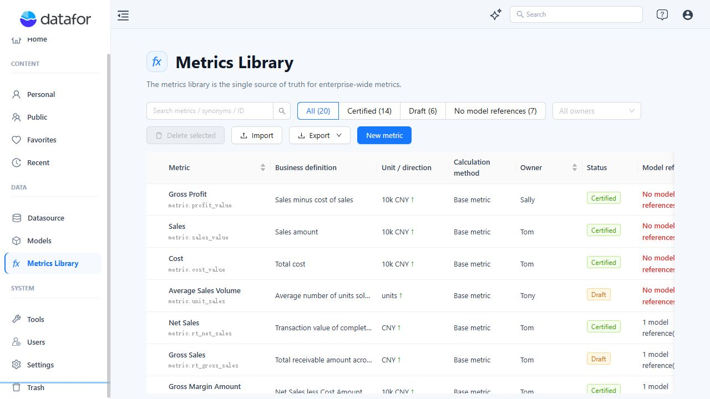
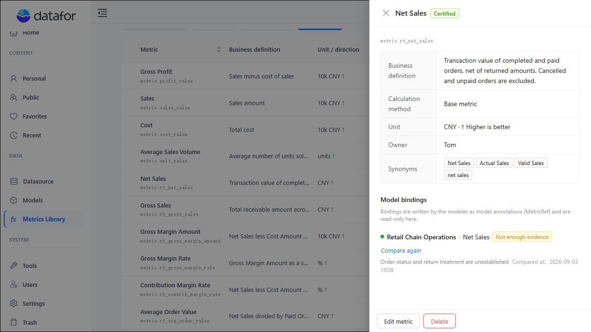
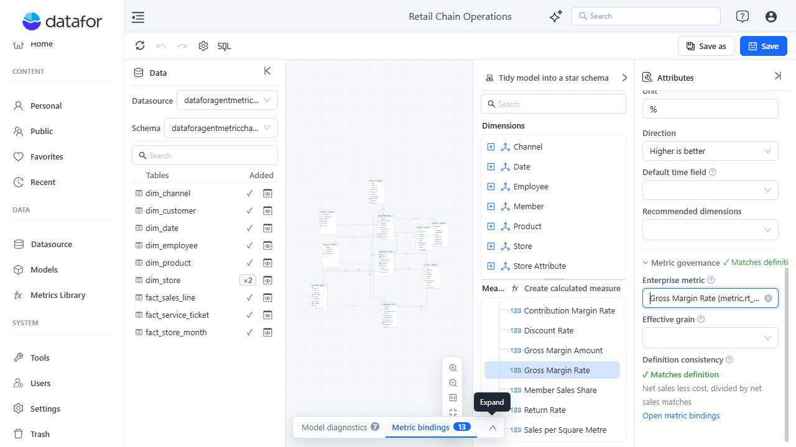
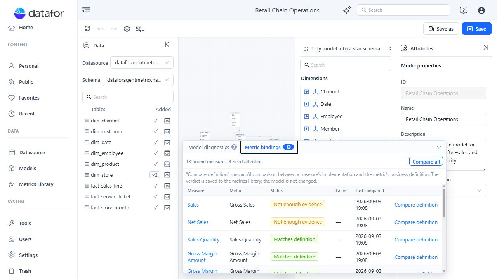
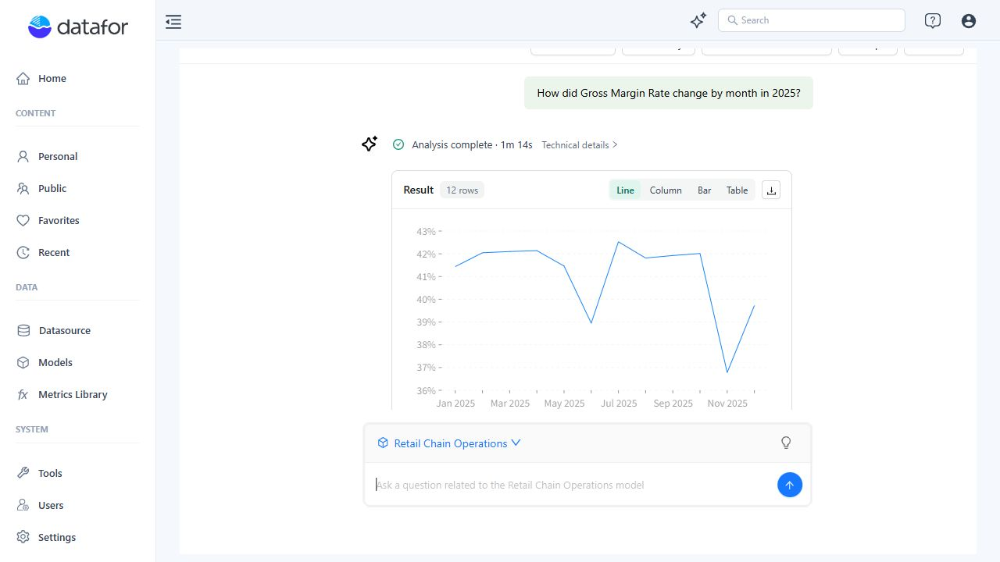

# Metrics Library

Metrics Library stores the governed business definition of each enterprise metric. It does not calculate data by itself. A measure or calculated measure in an Analysis Model supplies the executable implementation.

| Object | Responsibility |
| --- | --- |
| **Enterprise metric** | Stable ID, business name, synonyms, definition, calculation relationship, unit, direction, owner, and governance status. |
| **Model measure** | Formula, aggregation, filters, and data source used to calculate a value. |
| **Metric binding** | Connects a model measure to an enterprise metric and can declare an effective grain. |

For reliable analysis, use a Certified metric whose model binding has been reviewed.

## 1. Find and assess a metric

Open **Data > Metrics Library**.

Search by business name, Metric ID, or synonym. Use **Certified**, **Draft**, **No model references**, and the owner filter to narrow the table.

The indicators answer different questions:

| Indicator | Meaning |
| --- | --- |
| **Draft** | The definition is still under review. |
| **Certified** | The business definition is approved. Certification does not create or validate a model implementation. |
| **No model references** | No Analysis Model currently links a measure to this metric. |
| **Model references** | One or more model measures are bound. Open the metric to review each binding and its comparison result. |

A metric can be Certified and still have no model reference. It can also be Certified and bound while its implementation comparison needs attention.

The example below shows **Net Sales** as Certified and bound to the **Retail Chain Operations** model, but the comparison result is **Not enough evidence** because the implementation does not provide enough evidence about order-status and return treatment.

## 2. Create and certify a metric

Click **New metric**, then complete:

| Field | Guidance |
| --- | --- |
| **Business name** | Use the name people should see in reports and questions. |
| **Metric ID** | Enter a lowercase suffix beginning with a letter and containing only letters, digits, or underscores. Datafor adds the `metric.` prefix. The ID cannot be changed after creation. |
| **Synonyms** | Add common, unambiguous business wording. |
| **Business definition** | State what is included, excluded, and any timing or policy conditions. |
| **Calculation method** | Choose **Base metric**, **Ratio**, **Difference**, **Attainment rate**, or **Custom formula**. |
| **Unit / Direction / Owner** | Set the displayed unit, whether higher or lower is better, and the accountable owner. |

A custom formula accepts metric references, numbers, arithmetic operators, and parentheses. It is a governance relationship, not SQL, MDX, or a replacement for the model measure.

Click **Save changes**. New records are Draft.

Use **Mark as certified** only after the definition, synonyms, calculation relationship, unit, direction, owner, and intended model implementation have been reviewed. Missing synonyms or model bindings produce warnings but do not block certification. The current interface does not provide a return-to-Draft action.

## 3. Bind a metric in Retail Chain Operations

1. Open **Models > Retail Chain Operations**.
2. Select the measure or calculated measure that implements the metric. For example, open **Calculated measures > Gross Margin Rate**.
3. In **Attributes**, expand **Business semantics > Metric governance**.
4. Under **Enterprise metric**, select the matching library record by name, Metric ID, or synonym.
5. Set **Effective grain** only when the value is valid at a specific analytical grain; otherwise leave it empty.
6. Click **Save** for the model.

Saving the model writes the binding back to Metrics Library. The current Modeler allows both Draft and Certified records to be selected; use a Certified record for governed production analysis.

Binding one enterprise metric to multiple measures in the same model is allowed but produces an ambiguity warning. Avoid duplicate bindings unless the measures are intentionally equivalent.

## 4. Review definition consistency

Open **Metric bindings** at the bottom of the Modeler. The panel lists the model measure, enterprise metric, comparison status, effective grain, and last comparison time.

The sample model currently shows 13 bound measures, with four requiring attention.

Use **Compare definition** for one binding or **Compare all** for the model. Datafor sends the model implementation and business definition to AI and stores the verdict in Metrics Library. It does not change the formula, aggregation, filters, or model.

| Status | Required response |
| --- | --- |
| **Not compared** | Run the comparison before governance approval. |
| **Matches definition** | The supplied implementation evidence supports the definition. |
| **Possible drift** | Review a likely conflict between the implementation and definition. |
| **Needs comparison** | Re-run the comparison because the definition or implementation changed. |
| **Not enough evidence** | Inspect the measure manually; the result is inconclusive, not proof that the implementation is wrong. |

Resolve comparison warnings before treating a metric as production-ready.

## 5. Ask AI Agent about an enterprise metric

1. Open **Home > AI Agent**.
2. Select **Retail Chain Operations**.
3. Ask with the official metric name or an unambiguous synonym, and include the required time period and breakdown.

Example:

> How did Gross Margin Rate change by month in 2025?

Metrics Library supplies the governed meaning and synonyms. The selected model binding supplies the measure that can be queried. A library record without a usable binding does not provide an executable value by itself.

Synonyms must remain unambiguous. In the sample data, **GM%** resolves to **Gross Margin Rate** and **AOV** resolves to **Average Order Value**, while **Profit Rate** matches both **Gross Margin Rate** and **Contribution Margin Rate**. Use the official name or Metric ID when a term can identify more than one metric.

Draft, stale, drift, or inconclusive bindings can produce governance warnings in an Agent answer. Treat the warning as a review requirement.

## 6. Common questions

| Question | Answer |
| --- | --- |
| **Does Certified mean the metric can be queried?** | No. Certification approves the definition. The selected Analysis Model still needs a usable metric binding. |
| **Does a binding mean the definition is approved?** | No. A Draft metric can currently be bound. Review and certify it separately. |
| **Does Compare definition fix the measure?** | No. It records an AI verdict and never edits the model. |
| **Why is a Certified metric marked Not enough evidence?** | The definition is approved, but the supplied model metadata does not prove that every rule is implemented. Review the formula, aggregation, filters, and supporting descriptions. |
| **Can one metric be reused across models?** | Yes. Each model supplies its own binding and implementation. Review each binding independently. |
| **Why did the Agent ask which metric I meant?** | A name or synonym matched multiple metrics. Use the official name or Metric ID, then remove ambiguous synonyms during governance review. |
| **Can I change a Metric ID?** | No. Create a replacement metric and rebind affected model measures. |
| **What does Metric missing mean in Modeler?** | The referenced library record no longer exists. Use **Rebind**, or clear **Enterprise metric** and save the model. |

## 7. Bulk maintenance and access

- **Import:** Accepts exported JSON or CSV files up to 2 MB. Resolve each conflict as Skip or Overwrite. New records default to Draft unless certification status is explicitly retained. Model bindings are never imported; overwriting a metric preserves its existing bindings.
- **Export:** If rows are selected, Datafor exports the selection. With no selection, it exports the complete library. Search and filters do not define the export scope.
- **Delete:** Deletion is permanent. Existing model bindings and derived-metric references produce warnings but do not block deletion or repair dependent objects. Rebind or update dependencies first.
- **Access:** Metrics Library requires a signed-in, non-share session with administrator or metric-creation permission.
