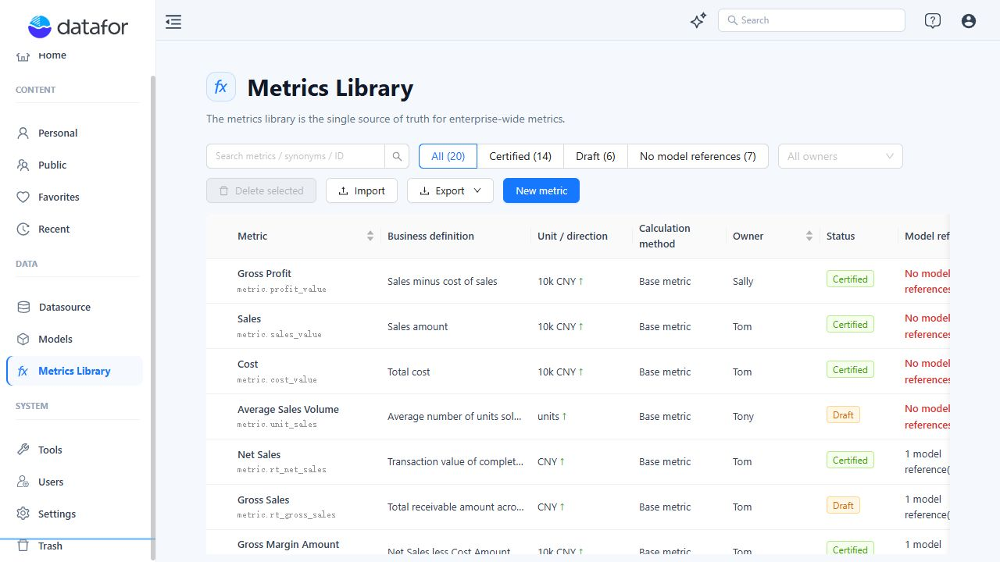
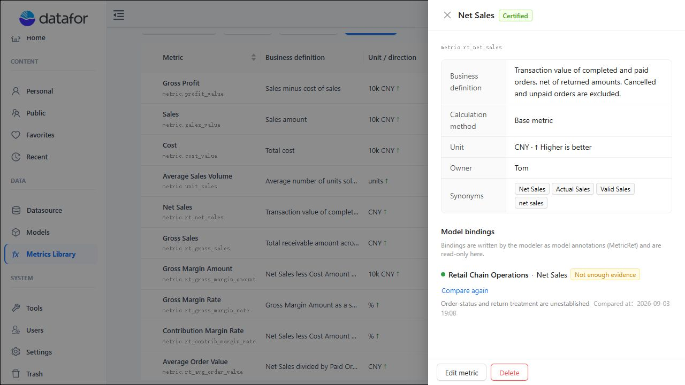
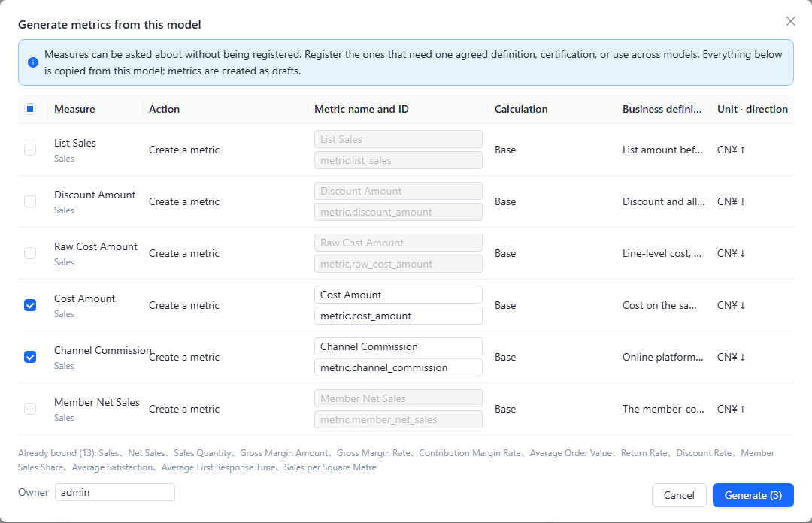
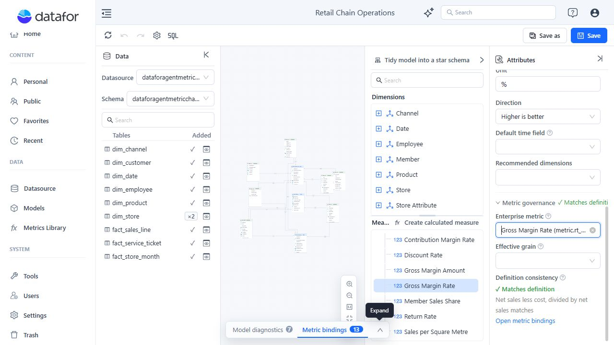
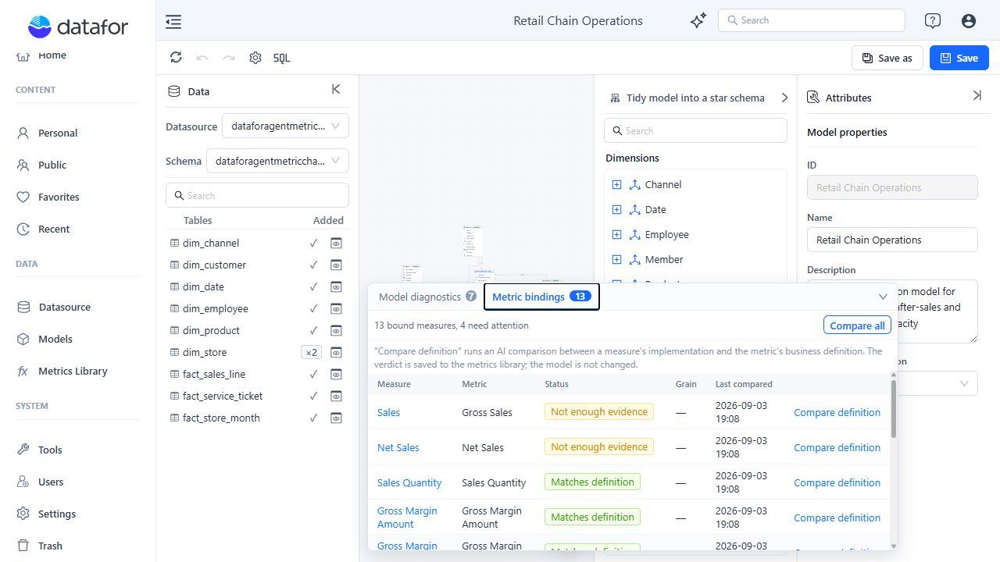
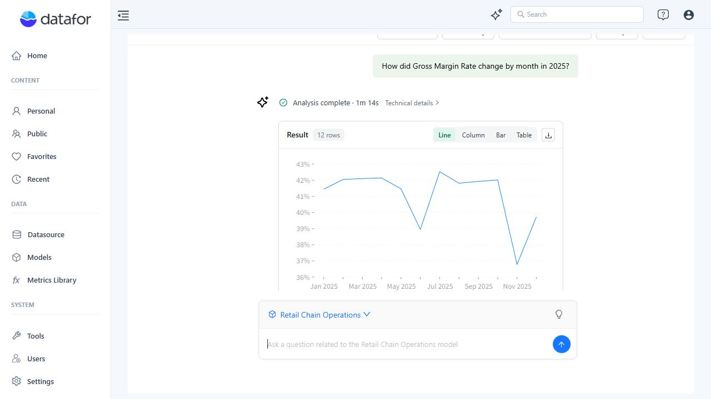

# Metrics Library

Metrics Library stores the governed business definition of each enterprise metric. It does not calculate data by itself. A measure or calculated measure in an Analysis Model supplies the executable implementation.

New to Metrics Library? Start with [Understanding Metrics Library](/documentation/Metrics-Library/Understanding-Metrics-Library/), which explains what it is, when you need it, and how metrics relate to measures and calculated measures.

| Object | Responsibility |
| --- | --- |
| **Enterprise metric** | Stable ID, business name, synonyms, definition, calculation relationship, unit, direction, owner, and governance status. |
| **Model measure** | Formula, aggregation, filters, and data source used to calculate a value. |
| **Metric binding** | Connects a model measure to an enterprise metric and can declare an effective grain. |

## 1. Find and assess a metric

Open **Data > Metrics Library**.

Search by business name, Metric ID, or synonym. Use **Certified**, **Draft**, **No model references**, **From model** (shown when metrics were generated from a model), and the owner filter to narrow the table. The whole library is listed on one page.

The indicators answer different questions:

| Indicator | Meaning |
| --- | --- |
| **Draft** | The definition is still under review. |
| **Certified** | The business definition is approved. Certification does not create or validate a model implementation. |
| **No model references** | No Analysis Model currently links a measure to this metric. |
| **Model references** | One or more model measures are bound. Open the metric to review each binding and its comparison result. |

A metric can be Certified and still have no model reference. It can also be Certified and bound while its implementation comparison needs attention.

The example below shows **Net Sales** as Certified and bound to the **Retail Chain Operations** model, with the comparison result **Not enough evidence**.

## 2. Create and certify a metric

Click **New metric**, then complete:

| Field | Guidance |
| --- | --- |
| **Business name** | Use the name people should see in reports and questions. |
| **Metric ID** | Enter a lowercase suffix beginning with a letter and containing only letters, digits, or underscores. Datafor adds the `metric.` prefix. The ID cannot be changed after creation. |
| **Synonyms** | Add common, unambiguous business wording, at least one. See [Synonyms](#synonyms). |
| **Business definition** | State what is included, excluded, and any timing or policy conditions. See [Business definition and caveats](#business-definition-and-caveats). |
| **Caveats / notes** | Aggregation traps and historical breaks. The AI Agent carries this text whenever it reports or explains the metric. |
| **Calculation method** and **Calculation relation** | Choose **Base metric**, **Ratio**, **Difference**, **Attainment rate**, or **Custom formula**, and pick the base metrics it relates. A **Base metric** has no relation. |
| **Unit / Direction / Owner** | Set the unit, whether higher or lower is better (or **Not specified**), and the accountable owner, whom the Agent can name as the person to ask. Units are stored as language-neutral codes and shown in each user's language; see [Units and Display Scale](/documentation/Model/Units-and-Display-Scale/). |
| **Applicable dimensions (concept references)** | The dimension concepts the metric is meaningful on. Register them on the **Dimension concepts** tab first. |

A relation is not SQL or MDX; the executable aggregation and filters stay in the analysis model. A custom formula accepts metric references, numbers, arithmetic operators, and parentheses. For **Ratio**, **Difference** and **Attainment rate** the relation decides which measures the Agent queries (see [section 6](#_6-ask-ai-agent-about-an-enterprise-metric)); a **Custom formula** relation is read only when comparing definitions.

Click **Save changes**. New records are Draft.

### Synonyms

The AI Agent matches metrics by exact name and synonym, with no fuzzy guessing: "Net Sales", "Gross Sales" and "Sales after Returns" sound alike and mean different things, and a wrong guess would be a silently wrong number. The price is that a wording you did not register does not match. The Agent then falls back to the model's own field, without a warning, which looks exactly as if the term were never governed.

- Include the wording people actually use: `AOV, average order value, basket size`. The form warns when a metric has no synonyms.
- Check the synonyms again before certifying. A certified metric without synonyms is the definition that most needs governance and the easiest to bypass.
- When a model author binds a measure, the modeler lists **Synonyms missing from the metrics library** and offers **Add to metrics library**.

### Business definition and caveats

Write the business meaning and, in the same place, what is included, what is excluded, and any caveats. The Agent uses the text to disambiguate, to explain results, and to compare the model implementation. Make it specific enough for **Compare definition** to reach a verdict:

- Weak: `Net sales`
- Usable: `Sales amount of completed and paid orders, net of returned amounts`
- Good: `Sales amount of completed and paid orders, net of returned amounts. Cancelled and unpaid orders are excluded. Differs from "Gross Sales", which includes cancelled and unpaid orders and does not deduct returns.`

Use **Caveats / notes** for traps and breaks such as `Do not average line-level margin rates; aggregate numerator and denominator first` or `Data before June 2025 still includes internal transfers`.

### Dimension concepts

The **Dimension concepts** tab registers business dimensions shared across models, each with **Name**, **Concept ID**, **Synonyms** and **Description** (**Register concept**). Metrics reference them in **Applicable dimensions**. The Agent sees every concept with its synonyms, so it knows that "region", "area" and "territory" describe the same business dimension, and on which dimensions a metric is meaningful.

### Certify

Certification requires a **Business definition** and a **Unit**; without them Datafor asks you to fill them in first. Use **Mark as certified** only after the definition, synonyms, calculation relationship, unit, direction, owner, and intended model implementation have been reviewed. Missing synonyms or model bindings produce warnings but do not block certification. The current interface does not provide a return-to-Draft action.

Draft metrics take part in answers, but the Agent labels the definition as not certified. Once certified, the Agent must use the definition when answering questions about the metric and may no longer improvise. A certified metric that no model binds can still be explained in full; asked for a number, the Agent answers from the model's fields and says that the number did not come through a certified binding.

### Change a certified or bound definition

Editing a substantive field (**Business definition**, **Calculation relation**, **Unit**, **Direction**, **Applicable dimensions**) of a certified or bound metric opens **Definition change requires a new version** when you save. **Bump version and save** increments the version, and every model binding switches to **Needs comparison (metric definition changed)**. Until a model author runs **Compare against new definition** on the **Metric bindings** tab, answers that use the metric carry a "pending re-check" note. Drafts without bindings can be edited freely and keep their version.

## 3. Generate metrics from an analysis model

When a model already has the measures, generate their metrics in one step instead of typing each one. Everything is copied from the model; nothing is written by AI.

1. Open the dialog in either way:
   - **Data › Metrics Library → Generate from a model**, select the analysis model and click **Open in the modeler**;
   - or in the modeler, open the **Metric bindings** tab at the bottom and click **Generate metrics from this model** (shown while the model has measures that are not bound).
2. In **Generate metrics from this model**, select the measures to register. Calculated measures and the measures their formulas use are selected by default; measures already bound are listed as *Already bound*.
3. For each row check the **Action** (**Create a metric**, or **Bind to existing** when a library metric has exactly the same name or synonym), the **Metric name and ID**, the **Calculation** read from the formula (**Base**, **Ratio**, **Difference**, **Custom formula**), the **Business definition** and **Unit · direction**. Empty fields show *To be filled in*.
4. Set the **Owner** and click **Generate (n)**.
5. **Save the model**: the bindings take effect only when the model is saved.

| Pre-filled from the model | Source |
| --- | --- |
| Name, synonyms, definition | Measure caption, aliases, description |
| Unit | Measure unit, or % when the format is a percentage |
| Direction | Measure direction (empty when neutral or unset) |
| Calculation | The calculated measure's formula: A/B is a ratio, A−B a difference, other arithmetic a custom formula. If an operand measure is not selected, the metric is registered without the relation. |
| Metric ID | Internal name or caption; non-Latin names get a short generated ID, duplicates get _2, _3 |

Generated metrics are **Draft**, version v1, tagged **From model**. Drafts may stay without definition and unit; certify them once those are filled in. Editing a generated metric's definition, calculation or notes turns it into an ordinary metric (the tag disappears). An untouched generated draft does not trigger draft warnings in AI answers, because its definition is only the model description.

The batch is all or nothing: if one metric cannot be saved, none is created.

## 4. Bind a metric in Retail Chain Operations

1. Open **Models > Retail Chain Operations**.
2. Select the measure or calculated measure that implements the metric. For example, open **Calculated measures > Gross Margin Rate**.
3. In **Attributes**, expand **Metric governance**. It is a separate group below **Business semantics** and is collapsed by default; its header shows whether the measure is bound.
4. Under **Enterprise metric**, select the matching library record by name, Metric ID, or synonym.
5. Set **Effective grain** only when the value is valid at a specific analytical grain; otherwise leave it empty.
6. Click **Save** for the model.

Saving the model writes the binding back to Metrics Library. The modeler allows both Draft and Certified records to be selected; use a Certified record for governed production analysis.

Keep one measure per metric in each model. Binding a metric that another measure in the model already uses opens **Metric already bound**, because the AI Agent cannot tell which measure to compute with; if you confirm, Model diagnostics reports both measures as an Error. For the other binding options, see [Bind a governed enterprise metric](/documentation/Model/Business-Semantics-for-AI/#bind-a-governed-enterprise-metric).

## 5. Review definition consistency

Open **Metric bindings** at the bottom of the modeler. The panel lists the model measure, enterprise metric, comparison status, effective grain, and last comparison time.

Use **Compare definition** for one binding (also in the **Definition consistency** row under the measure's **Metric governance**) or **Compare all** for the model. Datafor sends the model implementation and business definition to AI and stores the verdict in Metrics Library. It does not change the formula, aggregation, filters, or model.

The comparison judges only what the model shows: which measures a formula combines, how they are aggregated, what it divides by, what it excludes, empty values and grain. A bound measure, and every measure its formula uses, is assumed to hold what its name and description say, or what the definition says when it has no description. Exclusions count only when the definition or its notes state them, so write a scope that matters, such as "the denominator excludes cancelled orders", into the definition; a measure description that contradicts it is flagged. When a comparison flags something that is not really wrong, fix the description or the definition text rather than changing the model to silence the warning. A verdict stored before 10.00 was made under stricter rules; run **Compare all** again.

A successful comparison also moves the binding to the metric's current version, which clears "Bound to v1, current is v2". Saving the model writes the measure's **Effective grain** and dimension mapping into the bindings it creates.

| Status | Required response |
| --- | --- |
| **Not compared** | Run the comparison before governance approval. |
| **Matches definition** | The supplied implementation evidence supports the definition. |
| **Possible drift** | The implementation likely contradicts the definition; the one-line reason says how. Agree with the metric owner whether to change the formula or the definition, then compare again. |
| **Needs comparison** | The definition got a new version or the implementation changed. Click **Compare against new definition**. |
| **Not enough evidence** | Part of the implementation could not be read, for example a referenced member of unknown kind or a cut-off formula. Inspect the measure manually; the result is not proof that the implementation is wrong. |

## 6. Ask AI Agent about an enterprise metric

1. Open **AI Agent** in the left navigation.
2. Leave **Auto-select model** in the model selector, or select **Retail Chain Operations**. Selecting the model is optional: a metric bound to a model selects that model, and the answer card states "Basis: the governed metric … is bound to this model." When the metric is bound in several models you can use, the card lists the others, or the Agent asks which model to use.
3. Ask with the official metric name or an unambiguous synonym, and include the required time period and breakdown.

Example:

> How did Gross Margin Rate change by month in 2025?

Metrics Library supplies the governed meaning and synonyms. The model binding supplies the measure that is queried. A library record without a usable binding does not provide an executable value by itself.

The **Calculation method** also affects how the value is computed. For a **Ratio**, **Difference**, or **Attainment rate** metric, the Agent resolves the numerator and denominator (or the two operands) through their own bindings in the same model, queries them, and computes the result itself, unless the model's formula already declares them. Year-over-year comparisons of the ratio are then exact, and "why did it change?" questions can split the change into the effect of each member's share and of its own ratio, or into the contributions of the operand metrics. Bind the operand metrics in the model for this to work. A **Custom formula** relation is used only for the definition comparison.

Synonyms must remain unambiguous. In the sample data, **GM%** resolves to **Gross Margin Rate** and **AOV** resolves to **Average Order Value**, while **Profit Rate** matches both **Gross Margin Rate** and **Contribution Margin Rate**. Use the official name or Metric ID when a term can identify more than one metric.

Draft, stale, drift, or inconclusive bindings can produce governance warnings in an Agent answer. Treat the warning as a review requirement. A draft generated from the model and never edited carries no draft warning. AI clients connected through MCP do not receive these warnings in the default data mode.

## 7. Common questions

| Question | Answer |
| --- | --- |
| **Does Certified mean the metric can be queried?** | No. Certification approves the definition. The selected Analysis Model still needs a usable metric binding. |
| **Does a binding mean the definition is approved?** | No. A Draft metric can currently be bound. Review and certify it separately. |
| **Does Compare definition fix the measure?** | No. It records an AI verdict and never edits the model. |
| **Why is a Certified metric marked Not enough evidence?** | Certification approves the definition; the comparison checks the model separately. **Not enough evidence** means the comparison could not read part of the implementation. A verdict stored before 10.00 may come from the old rules; compare again. Review the formula, aggregation, filters, and supporting descriptions. |
| **Can one metric be reused across models?** | Yes. Each model supplies its own binding and implementation. Review each binding independently. |
| **Why did the Agent ask which metric I meant?** | A name or synonym matched multiple metrics. Use the official name or Metric ID, then remove ambiguous synonyms during governance review. |
| **Can I change a Metric ID?** | No. Create a replacement metric and rebind affected model measures. |
| **What does Metric missing mean in the modeler?** | The referenced library record no longer exists. Use **Rebind**, or clear **Enterprise metric** and save the model. |

## 8. Bulk maintenance and access

- **Import:** Accepts exported JSON or CSV files up to 2 MB. Resolve each conflict as Skip or Overwrite. New records arrive as Draft and existing ones keep their status unless **Keep the certification status from the file** is ticked; tick it only when migrating a whole environment. Model bindings are never imported; overwriting a metric preserves its existing bindings.
- **Export:** **Export CSV (editable in Excel)** suits bulk editing of synonyms and definitions; **Export JSON (full bundle)** moves the library between environments. If rows are selected, Datafor exports the selection. With no selection, it exports the complete library. Search and filters do not define the export scope.
- **Delete:** Deletion is permanent. Existing model bindings and derived-metric references produce warnings but do not block deletion or repair dependent objects. Rebind or update dependencies first.
- **Access:** The Metrics Library page requires administrator or metric-creation permission. Metric definitions themselves are readable by every signed-in user (not share links), so the AI Agent can use them when anyone asks.
