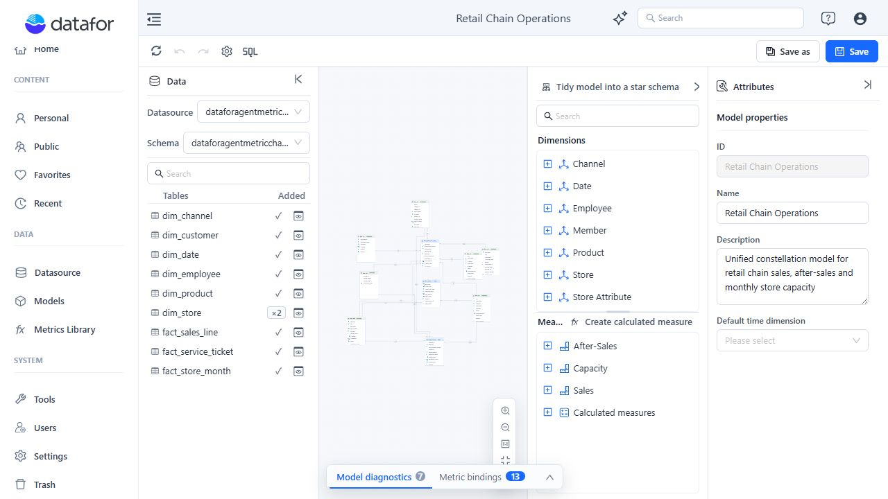

# Analysis Model Overview

An Analysis Model is the semantic layer between a data source and Datafor reports or AI-assisted analysis. It turns database tables and columns into reusable business objects with consistent joins, names, calculations, formats, and definitions.

## What a model contains

| Object | Purpose |
| --- | --- |
| **Table** | A physical table, view, or custom SQL result used by the model. |
| **Relationship** | Defines how two tables are joined and the cardinality of each side. |
| **Dimension** | Groups descriptive attributes used to filter, group, and drill into data. |
| **Attribute** | A business-facing field such as Store, Product, Status, or Order Date. |
| **Hierarchy** | Orders attributes into drill paths such as Year → Month → Day. |
| **Measure** | Aggregates a source field with a method such as Sum, Count, or Distinct Count. |
| **Calculated measure** | Evaluates a reusable model-level expression at query time and can reference Measures. |
| **Business semantics** | Adds descriptions, aliases, roles, units, direction, and recommended dimensions. |
| **Enterprise metric binding** | Connects a model measure to a governed definition in Metrics Library. |

## Designer workspace

| Area | Use it to |
| --- | --- |
| **Toolbar** | Refresh connection metadata, undo or redo model edits, open settings, create a SQL table, and save the model. |
| **Data panel** | Select a datasource and schema, search tables, preview data, and add tables to the model. |
| **Canvas** | Inspect tables, arrange the model, and create or edit relationships. |
| **Analysis model** | Manage Dimensions, Attributes, Hierarchies, Measures, and calculated measures. |
| **Attributes** | Edit the selected object's core properties, business semantics, advanced settings, and metric governance. |
| **Insights** | Review model diagnostics and enterprise metric bindings. |

## Recommended modeling sequence

1. Add only the tables required for the intended analysis.
2. Define and verify every relationship.
3. Remove semantic objects that do not match each table's role.
4. Build useful Dimensions, Attributes, Hierarchies, and Measures.
5. Add business descriptions and other semantic metadata.
6. Resolve model diagnostics.
7. Save the model and validate representative queries or reports.

Diagnostics detect many structural and semantic problems, but they cannot prove that a join or business definition is correct. Validate important totals against a trusted source before publishing the model.

## Related topics

- [Creating an Analysis Model](/documentation/Model/Creating-an-Analysis-Model/)
- [Working with Tables and the Canvas](/documentation/Model/Working-with-Tables-and-the-Canvas/)
- [Establishing Table Relationships](/documentation/Model/Establishing-Table-Relationships/)
- [Creating Hierarchy](/documentation/Model/Creating-Hierarchy/)
- [Calculated Field](/documentation/Model/Calculated-Field/)
- [Measures and Calculated Measures](/documentation/Model/Measures-and-Calculated-Measures/)
- [Business Semantics for AI](/documentation/Model/Business-Semantics-for-AI/)
- [Model Diagnostics](/documentation/Model/Model-Diagnostics/)
- [Use Aggregation Tables](/documentation/Model/Use-Aggregation-Tables/)
