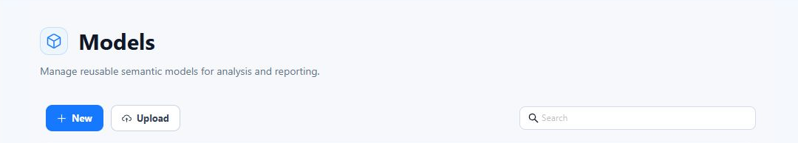
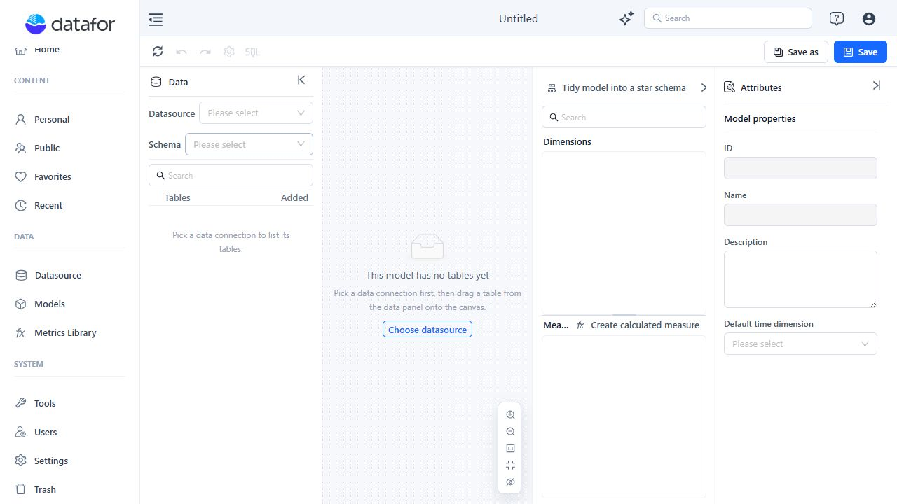
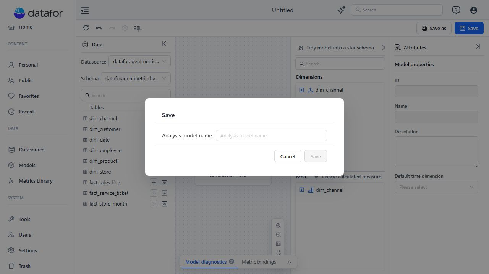

# Creating an Analysis Model

Before you start, make sure you have permission to create Analysis Models and can read the required data source schema and tables.

## 1. Start a model

Open **Data > Models**, then click **New**.

The new model opens without tables. Select a **Datasource** and **Schema** in the Data panel, or click **Choose datasource** on the canvas.

## 2. Add tables

Find a table in the Data panel, then use one of these methods:

- Click the add control beside the table.
- Double-click the table.
- Drag the table onto the canvas.

Adding a table initially creates:

- A **Dimension** containing its fields as Attributes.
- A **Measure Group** containing eligible numeric fields as Sum measures and a **Fact Count** measure.

Primary keys, foreign keys, and identifier-like numeric fields are excluded from automatic Sum measures. These generated objects are a starting point; remove objects that do not match the table's real business role.

## 3. Create relationships

Connect tables using their actual business keys. Set **Key values are unique** only when the selected field combination is unique on that side of the relationship.

For details, see [Establishing Table Relationships](/documentation/Model/Establishing-Table-Relationships/).

## 4. Define the semantic model

Use the **Analysis model** tree and **Attributes** panel to:

- Keep descriptive fields in Dimensions.
- Set the correct aggregation for each Measure.
- Add Hierarchies only where their level order has a clear analytical meaning.
- Add descriptions, aliases, semantic roles, units, and time settings.
- Create calculated measures when the calculation must be reusable across reports.

## 5. Review and save

If the **Insights** panel is displayed, expand **Model diagnostics** and review its findings before saving. Insights is hidden when there are no diagnostics or metric bindings.

- Warnings and hints do not stop the save operation.
- Errors require an explicit decision to return to the model or continue saving.
- Server-side model verification runs after the client diagnostics.
- A model with no tables cannot be saved.

Click **Save**. On the first save, provide the analysis model name.

Use **Save as** when you need a separate model rather than changing the current one.

Continuing after a diagnostic error can save an incomplete or inconsistent model. Resolve structural and reference errors whenever possible.

## Related topics

- [Analysis Model Overview](/documentation/Model/Analysis-Model-Overview/)
- [Working with Tables and the Canvas](/documentation/Model/Working-with-Tables-and-the-Canvas/)
- [Creating SQL Views](/documentation/Model/Creating-SQL-Views/)
- [Advanced Relationship Modeling](/documentation/Model/Advanced-Relationship-Modeling/)
- [Tidy Model into a Star Schema](/documentation/Model/Tidy-Model-into-a-Star-Schema/)
- [Time Semantics and Default Time Settings](/documentation/Model/Time-Dimensions-and-Time-Intelligence/)
- [Measures and Calculated Measures](/documentation/Model/Measures-and-Calculated-Measures/)
- [Model Diagnostics](/documentation/Model/Model-Diagnostics/)
