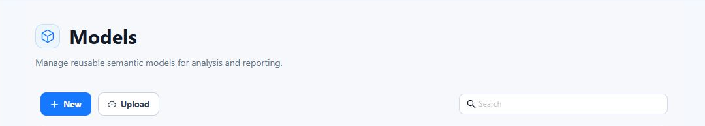
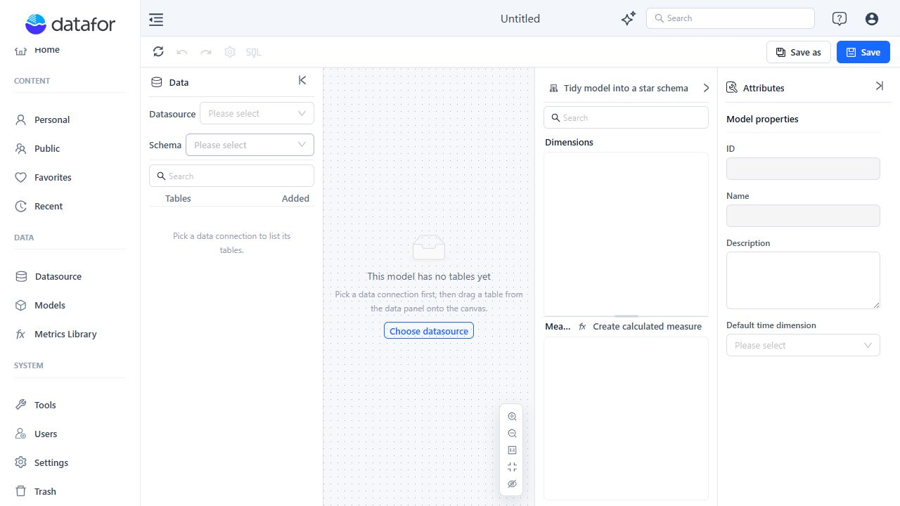
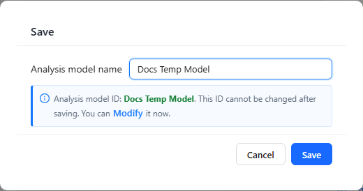

# Creating an Analysis Model

Before you start, make sure you have permission to create Analysis Models and **Read** permission on the data source you will use. Saving a new model, or saving a model with a different data source, is refused without Read on that data source (administrators are exempt).

## 1. Start a model

Open **Data > Models**, then click **New**. The other actions on this page, such as uploading, copying and sharing models, are described in [Managing Analysis Models](/documentation/Model/Managing-Analysis-Models/).

The new model opens without tables. Select a **Datasource** and **Schema** in the Data panel, or click **Choose datasource** on the canvas.

## 2. Add tables

Find a table in the Data panel, then use one of these methods:

- Click the add control beside the table.
- Double-click the table.
- Drag the table onto the canvas.

Adding a table initially creates:

- A **Dimension** containing its fields as Attributes.
- A **Measure Group** containing eligible numeric fields as Sum measures and a **Fact Count** measure.

Primary keys, foreign keys, and identifier-like numeric fields are excluded from automatic Sum measures. These generated objects are a starting point; remove objects that do not match the table's real business role.

## 3. Create relationships

Connect tables using their actual business keys. Set **Key values are unique** only when the selected field combination is unique on that side of the relationship.

For details, see [Establishing Table Relationships](/documentation/Model/Establishing-Table-Relationships/).

## 4. Define the semantic model

Use the **Analysis model** tree and **Attributes** panel to:

- Keep descriptive fields in Dimensions.
- Set the correct aggregation for each Measure.
- Add Hierarchies only where their level order has a clear analytical meaning.
- Add descriptions, aliases, semantic roles, units, and time settings.
- Create calculated measures when the calculation must be reusable across reports.

## 5. Review and save

If the bar at the bottom of the canvas is displayed, click its **Model diagnostics** tab and review the findings before saving. The bar has the tabs **Model diagnostics** and **Metric bindings** and is hidden when the model has no diagnostics, no bound measures, and no unbound visible measures.

- Warnings and hints do not stop the save operation.
- Errors require an explicit decision to return to the model or continue saving.
- Server-side model verification runs after the client diagnostics.
- A model with no tables cannot be saved.

Click **Save**. On the first save, enter the **Analysis model name**. The name you type also fills the **Analysis model ID**, and the dialog shows “Analysis model ID: … This ID cannot be changed after saving. You can Modify it now.” Click **Modify** to enter a different ID. The ID must be unique; **Save** stays disabled while the ID is empty, being checked, or already used.

Use **Save as** when you need a separate model rather than changing the current one.

If you have view-only access to a model, **Save** is disabled with the tooltip “You have view-only access to this model, so changes can't be saved”. **Save as** still works and creates your own copy.

## 6. Data security and cache settings

After the first save, the gear button in the toolbar opens **Data security setting**. Changes are saved as soon as you click **OK**.

| Setting | Meaning |
| --- | --- |
| **Apply data security** | Applies the data security configured on the data source (row and object policies) to queries on this model. On by default. See [Data Security](/documentation/Datasource/Data-Security/). |
| **Cache expire** | How long query results of this model are cached, in seconds. New models start with **Settings › General › System configuration › Default model cache expiration**; `0` means never expires. |

Continuing after a diagnostic error can save an incomplete or inconsistent model. Resolve structural and reference errors whenever possible.

## Related topics

- [Analysis Model Overview](/documentation/Model/Analysis-Model-Overview/)
- [Working with Tables and the Canvas](/documentation/Model/Working-with-Tables-and-the-Canvas/)
- [Creating SQL Views](/documentation/Model/Creating-SQL-Views/)
- [Advanced Relationship Modeling](/documentation/Model/Advanced-Relationship-Modeling/)
- [Tidy Model into a Star Schema](/documentation/Model/Tidy-Model-into-a-Star-Schema/)
- [Time Semantics and Default Time Settings](/documentation/Model/Time-Dimensions-and-Time-Intelligence/)
- [Measures and Calculated Measures](/documentation/Model/Measures-and-Calculated-Measures/)
- [Model Diagnostics](/documentation/Model/Model-Diagnostics/)
