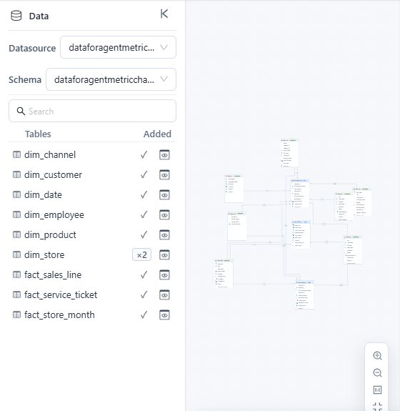

# Working with Tables and the Canvas

The Data panel controls which source objects enter the model. The canvas shows those objects and their relationships.

## Add and locate tables

1. Select a **Datasource** and **Schema**.
2. Search for the required table.
3. Click its add control, double-click it, or drag it onto the canvas.

A check mark means the table is already in the model. A count such as **×2** means that the same source table has been added with multiple aliases. Select the table entry to locate a specific alias on the canvas.

## Preview source data

Click the preview control in the Data panel, or select **Preview data** from a table menu. The preview displays the first 50 rows available to the current user.

Use the preview to verify:

- Join keys contain the expected values.
- Date and numeric columns have the expected source types.
- Candidate unique keys do not contain obvious duplicates or nulls.

## Use the table menu

Depending on the selected table, the menu can include:

| Action | Result |
| --- | --- |
| **Add as Dimension** | Generates a Dimension from the table when one does not exist. |
| **Add as measure group** | Generates Measures from eligible numeric fields and adds Fact Count. |
| **Preview data** | Opens a sample of the source rows. |
| **New column** | Creates a row-level calculated column with a datasource SQL expression. |
| **Clone** | Adds another model instance of the same source table with a different alias. |
| **Rename alias** | Changes the model alias without renaming the source table. |
| **Join to** | Starts a relationship with another table. |
| **Change schema** | Changes the schema stored for a physical table. Verify that the same table and required fields exist in the target schema. |
| **Delete** | Removes the table and its dependent model objects. |

Changing schema takes effect without a confirmation dialog and does not verify table or field compatibility.

Deleting a table also removes all of its relationships, Dimensions, and Measure Groups. Review calculated measures and enterprise metric bindings after deletion. Undo can restore editor state, but it does not restore changes already written to the external Metrics Library registry.

## Create or edit a SQL View

Click **SQL** in the toolbar to enter a **View Name** and **SQL Expression**, then use **Check and preview** before adding the result to the model draft.

Editing an existing SQL View rebuilds its model table. Existing relationships, Dimensions, and Measure Groups are removed from the draft, and default semantic objects are generated again. Review the complete workflow and safeguards in [Creating SQL Views](/documentation/Model/Creating-SQL-Views/) before confirming an edit.

## Navigate a large canvas

Use the controls in the lower-right corner to:

- Zoom in or out.
- Return to actual size.
- Fit the whole model into the available space.
- Show or hide the minimap.

Use the minimap to move quickly between distant parts of a large model.

## Tidy semantic roles

**Tidy model into a star schema** uses the currently configured relationship cardinalities and semantic objects to preview a cleanup:

- A fact-like table can lose its Dimension.
- A dimension-like table can lose its Measure Group.
- Ambiguous tables remain unchanged.

The operation does not retest key uniqueness, create relationships, choose join fields, or rearrange the canvas. It can remove bound Measures or leave calculated measures with missing references, so review every proposed removal and validate the result before saving.

If the cleanup removes bound Measures, the designer requests that their enterprise metrics be unbound. Verify **Metric bindings** after applying or undoing the cleanup: Undo can restore the editor model, but it cannot restore external Metrics Library registry changes.

See [Tidy Model into a Star Schema](/documentation/Model/Tidy-Model-into-a-Star-Schema/) for the required pre-checks and post-apply validation.

## Related topics

- [Creating an Analysis Model](/documentation/Model/Creating-an-Analysis-Model/)
- [Creating SQL Views](/documentation/Model/Creating-SQL-Views/)
- [Establishing Table Relationships](/documentation/Model/Establishing-Table-Relationships/)
- [Advanced Relationship Modeling](/documentation/Model/Advanced-Relationship-Modeling/)
- [Tidy Model into a Star Schema](/documentation/Model/Tidy-Model-into-a-Star-Schema/)
- [Calculated Columns](/documentation/Model/Calculated-Field/)
- [Model Diagnostics](/documentation/Model/Model-Diagnostics/)
