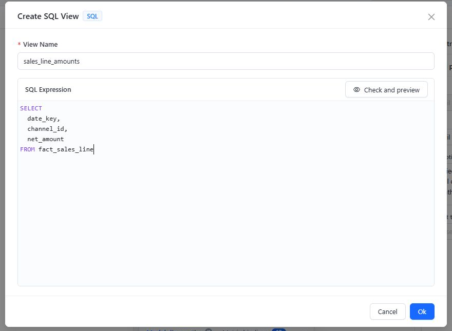

# Creating SQL Views

A SQL View adds a query result to an Analysis Model as a model table. Use one when the required row set or fields are easier to define in SQL than with a physical table and individual calculated columns. It is stored in the model definition; it does not create a view in the source database.

## Create a SQL View

1. In the model designer toolbar, click **SQL**.
2. Enter a unique **View Name**. Do not reuse another table or SQL View name in the model.
3. Enter the **SQL Expression** using syntax supported by the selected datasource.
4. Click **Check and preview**.
5. Verify that the first 50 rows contain the expected fields, types, and representative values. Do not continue until a failed preview is understood.
6. Click **Ok** to add the SQL View to the designer draft.
7. Review the generated table and semantic objects. Add the required relationships, Dimensions, Measure Groups, and business metadata.
8. Click the model designer's **Save** button to persist the model.

The screenshot illustrates the editor; preview success still depends on the selected connection's raw-SQL permission. Clicking **Ok** changes the current designer draft; it does not replace the model-level **Save** step or prove that the query is valid.

### Raw SQL permission

**Check and preview** requires permission to execute raw SQL on the connection. In the current release, uploaded datasets do not allow raw SQL execution; use a native database connection when a SQL View is required.

The generic message **The table fields are empty, the table may not exist** can also represent a permission or SQL execution failure. Check the connection type and raw-SQL policy before concluding that the referenced table is missing.

## Edit an existing SQL View safely

Open the SQL View table's menu and select **Edit**. Editing is a rebuild operation, not an in-place SQL text update. When you confirm the dialog, the designer replaces the model table and regenerates default semantic objects from the current output fields. This removes the SQL View's existing relationships, Dimensions, and Measure Groups from the draft.

Before confirming an edit:

- Record the existing relationships and semantic objects that must be recreated.
- Check for calculated measures that reference Measures from the SQL View.
- Check **Metric bindings** for Measures linked to Metrics Library.
- Keep output field names and types stable unless the downstream model changes are intentional.

After confirming:

1. Recreate and verify the required relationships.
2. Rebuild the required Dimensions, Measure Groups, and business metadata.
3. Repair calculated measures that reference removed Measures.
4. Review **Metric bindings**. The designer can request unbinding when bound Measures are removed.
5. Run **Model diagnostics** and validate representative totals before saving.

An unbind request can fail independently of the editor change. Verify the binding state rather than relying on the editor notification.

Confirming an unchanged SQL expression still performs the rebuild. If you opened the dialog only to inspect the SQL, close it with **Cancel** or the close control.

## SQL View or calculated column?

| Requirement | Use |
| --- | --- |
| Add one row-level expression to an existing physical table | [Calculated column](/documentation/Model/Calculated-Field/) |
| Define a reusable query result with its own output fields | SQL View |
| Join, filter, or reshape source data before modeling it | SQL View |

## Related topics

- [Working with Tables and the Canvas](/documentation/Model/Working-with-Tables-and-the-Canvas/)
- [Establishing Table Relationships](/documentation/Model/Establishing-Table-Relationships/)
- [Measures and Calculated Measures](/documentation/Model/Measures-and-Calculated-Measures/)
- [Model Diagnostics](/documentation/Model/Model-Diagnostics/)
