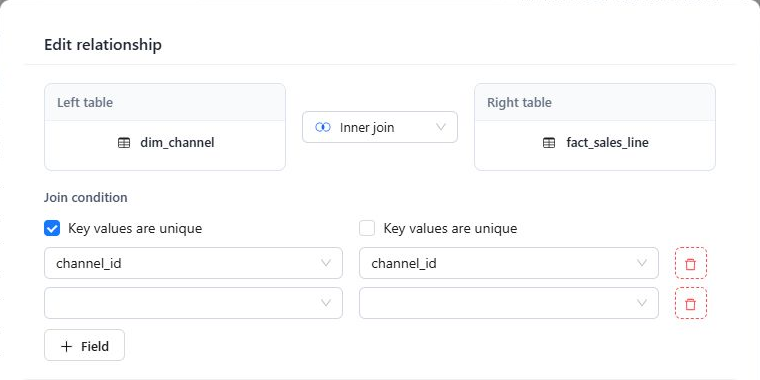

# Establishing Table Relationships

Relationships determine how Datafor joins tables when a query uses fields from more than one table. An incorrect key or cardinality can duplicate rows, remove valid rows, or produce misleading totals.

## Create a relationship

1. Open a table menu and select **Join to**.
2. Select the other table.
3. Choose the join type.
4. Select the matching field on each side.
5. For a composite key, click **Field** and add every required field pair.
6. Enable **Key values are unique** on each side only when that side's selected key combination is unique.
7. Confirm the relationship, then review the edge on the canvas.

## Choose the join type

The available join types depend on the current data source. When supported by the connection, the designer can offer:

| Join | Use when |
| --- | --- |
| **Inner join** | Only rows with matches on both sides should be returned. |
| **Left join** | Every row from the left table must remain, even without a right-side match. |
| **Right join** | Every row from the right table must remain, even without a left-side match. |
| **Full join** | Rows from both sides must remain when either side has no match. |

Choose the table order and join type from the required query result, not only from the physical foreign-key direction.

## Set cardinality correctly

The relationship edge derives its **1** and **N** labels from the two uniqueness settings:

- **Key values are unique** enabled: the side is labeled **1**.
- **Key values are unique** disabled: the side is labeled **N**.

For example, a unique customer key joined to repeated customer keys in a sales table is a 1:N relationship.

The designer can check whether a selected field combination is unique in the current source data. Treat a warning or inconclusive result as evidence to investigate; it does not always prevent you from confirming the relationship.

## Composite keys

Use multiple field pairs when the business key is only unique as a combination. Keep the fields aligned in the same logical order on both sides. Do not omit tenant, organization, date, or version fields when they are part of the real key.

## Edit or delete a relationship

Select an existing relationship to edit its join type, keys, or uniqueness settings. Use the relationship context menu to delete it.

Deleting a relationship takes effect immediately and does not display a confirmation dialog.

After any relationship change, open **Model diagnostics** and check for:

- Missing tables or fields.
- Disconnected Dimensions or Measure Groups.
- Cycles or ambiguous join paths.
- Measure Groups that no longer have a relationship path to their Dimensions.
- Calculated measures that reference missing Measures.

## Practical checks

- Join fields must represent the same business value and use compatible source types.
- Validate both matched and unmatched records when using an outer join.
- Avoid many-to-many (N:N) relationships unless the bridge-table design is intentional and tested.
- Compare representative totals with a trusted query before publishing the model.

## Related topics

- [Working with Tables and the Canvas](/documentation/Model/Working-with-Tables-and-the-Canvas/)
- [Model Diagnostics](/documentation/Model/Model-Diagnostics/)
