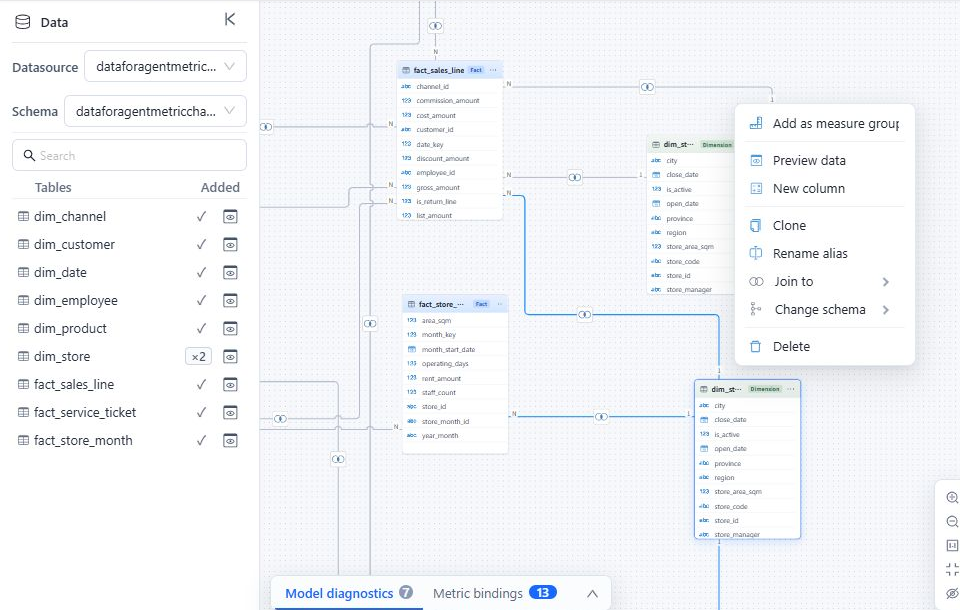

# Advanced Relationship Modeling

Use advanced relationship patterns when a model contains multiple fact tables, one source table serving several business roles, or a genuine many-to-many association. The objective is still a predictable path from each Measure Group to every applicable Dimension.

Before using these patterns, verify the keys, join type, and **Key values are unique** settings described in [Establishing Table Relationships](/documentation/Model/Establishing-Table-Relationships/).

## Use an alias for each table role

One source table can represent different roles. A date table, for example, may be **Order Date**, **Ship Date**, and **Return Date**. Give each role its own table alias and relationship so users and queries can distinguish the paths.

1. Open the source table's menu and select **Clone**.
2. Open the cloned table's menu and select **Rename alias**.
3. Enter a unique, role-specific alias.
4. Create the relationship for that role.
5. Give its Dimension and Attributes role-specific captions.

**Clone** creates another model-table alias for the same physical table, including its calculated columns. It generates new default Dimensions and Measure Groups but does not copy the original hierarchy or business semantics. Remove the new role's unnecessary Measure Group and configure its hierarchy, time roles, captions, and descriptions explicitly.

The following model uses two aliases of the store source table. The table menu provides **Clone** and **Rename alias** for maintaining those roles.

Do not reuse one alias for two different foreign keys only because both keys point to the same source table. Separate aliases make the intended join path explicit.

For role-playing dates, assign each Measure's **Default time field** to the correct date role. The model-level **Default time dimension** can designate only one Dimension and does not replace those Measure settings.

## Share Dimensions across fact tables

For a model with several fact tables, connect a conformed Dimension directly to each fact table that uses the same business key and member definitions. Keep Measures from each fact table in its own Measure Group.

Check these points before publishing:

- The Dimension key is unique on the **1** side of every relationship.
- The same member key means the same thing in every fact table.
- Join types preserve the records required by each business process.
- A Dimension that does not apply to a Measure Group is not presented as though it does.

If two fact tables use the same source Dimension in different roles or at different grains, create separate aliases instead of forcing both paths through one alias.

## Keep composite keys in one relationship

The same pair of table aliases can have one relationship record. When the business key contains several columns, add every field pair to that relationship and verify uniqueness for the complete combination.

Each field pair is drawn as an edge on the canvas. Deleting one edge removes that pair; deleting the final edge removes the relationship. A partially completed field-pair row is not retained, so review all pairs after editing.

## Model a many-to-many association with a bridge

Use a bridge table when one business entity can be associated with several members of a Dimension, such as an order assigned to multiple sales representatives.

A typical bridge design has:

- A 1:N relationship from the Dimension's unique key to its repeated key in the bridge.
- A 1:N relationship from the fact's unique grain key to its repeated key in the bridge.
- One bridge row for each valid association.

A bridge can let one fact participate in multiple associations. Validate additive Measures at the total level and at each bridged Dimension level; do not assume duplicate contributions are removed. Do not expose bridge-row Measures unless those values have an intentional business meaning.

If a direct N:N relationship is intentional, leave **Key values are unique** disabled on both sides and validate its results with a trusted source query. The designer warns about N:N cardinality but does not prevent confirmation. Prefer a bridge when the association itself needs a defined grain or attributes.

**Left table**, **Right table**, and the join type control row preservation in the SQL join. They are not cross-filter direction settings.

## Avoid ambiguous paths

Two valid relationships can still create an invalid model when they produce competing paths between the same tables. This often happens when a shortcut relationship is added to a multi-fact model or when a role-playing table is connected through the wrong alias.

After adding or changing an advanced relationship:

1. Open **Model diagnostics**.
2. Resolve reported cycles, disconnected objects, and missing Measure Group-to-Dimension paths.
3. Run representative queries using one Measure Group at a time, then queries that combine the intended shared Dimensions.
4. Compare totals and unmatched-record counts with a trusted source query.
5. Save only after the relationship graph and results agree.

An intentional multi-fact constellation can contain several relationship branches without being an error. Components with multiple Measure Group tables are exempt from the cycle diagnostic, so inspect competing routes yourself. The important test is that each requested Measure-to-Dimension combination has one unambiguous business path.

## Related topics

- [Establishing Table Relationships](/documentation/Model/Establishing-Table-Relationships/)
- [Model Diagnostics](/documentation/Model/Model-Diagnostics/)
- [Time Semantics and Default Time Settings](/documentation/Model/Time-Dimensions-and-Time-Intelligence/)
