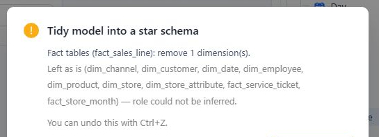

# Tidy Model into a Star Schema

**Tidy model into a star schema** reviews the model's relationship cardinalities and current semantic objects, then proposes removing semantic roles that conflict with an inferred star-schema role.

The operation is deliberately limited:

- From a fact-like table, it can remove a Dimension.
- From a dimension-like table, it can remove a Measure Group.
- It leaves tables unchanged when no removal is proposed.

It does not create or edit relationships, change join keys, add tables, rearrange the canvas, or modify source data.

## Before running Tidy

Verify every relevant relationship first. Tidy uses the current **Key values are unique** settings and the resulting **1** and **N** cardinalities; it does not retest key uniqueness in the datasource.

Also review:

- Which tables should provide Dimensions.
- Which tables should provide Measure Groups.
- Measures that are bound to enterprise metrics.
- Calculated measures that depend on Measures that could be removed.
- Current model-level and Measure-level time settings.

## Review and apply the preview

1. Click **Tidy model into a star schema** in the model designer.
2. Review every proposed removal in the preview. Tidy can remove the last Measure Group or Dimension from a table.
3. Review **Left as is**. This section contains tables for which no removal is proposed; it can include already-correct tables as well as tables whose role could not be inferred.
4. Click **Cancel** if a proposed role is wrong. Correct the relationship cardinality or semantic design, then run Tidy again.
5. Confirm only when every listed removal is intended.

## Validate the result before saving

After applying the cleanup:

1. Verify the remaining Dimensions, Measure Groups, Measures, and calculated measures.
2. Review the model's **Default time dimension** and every Measure's **Default time field**.
3. Open **Metric bindings** and verify any enterprise metrics associated with removed Measures.
4. Resolve relevant **Model diagnostics** issues.
5. Validate representative totals and drill paths, then save the model.

When a removed Measure has a Metrics Library binding, the designer requests an unbind. That request can fail independently of the editor change. Treat the registry separately from editor history: **Ctrl+Z** can restore the editor draft, but it does not restore an external Metrics Library binding. Always recheck **Metric bindings** after applying or undoing Tidy.

## When not to use Tidy

Do not use Tidy as an automatic model-design step for an unverified schema. It cannot determine whether join keys are correct, resolve an intentional many-to-many design, or decide which business Measures and Dimensions users need. Model those cases explicitly and use diagnostics plus result validation.

## Related topics

- [Establishing Table Relationships](/documentation/Model/Establishing-Table-Relationships/)
- [Advanced Relationship Modeling](/documentation/Model/Advanced-Relationship-Modeling/)
- [Time Semantics and Default Time Settings](/documentation/Model/Time-Dimensions-and-Time-Intelligence/)
- [Model Diagnostics](/documentation/Model/Model-Diagnostics/)
