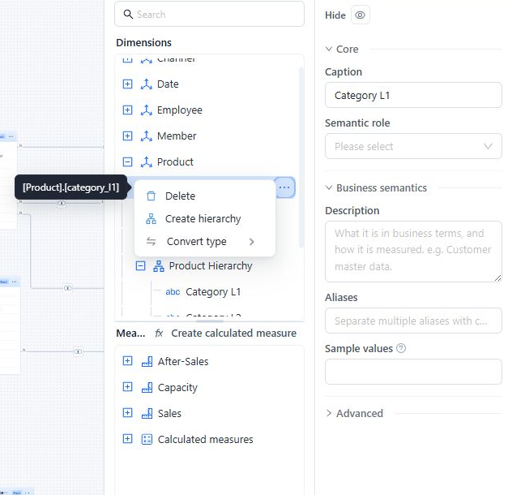
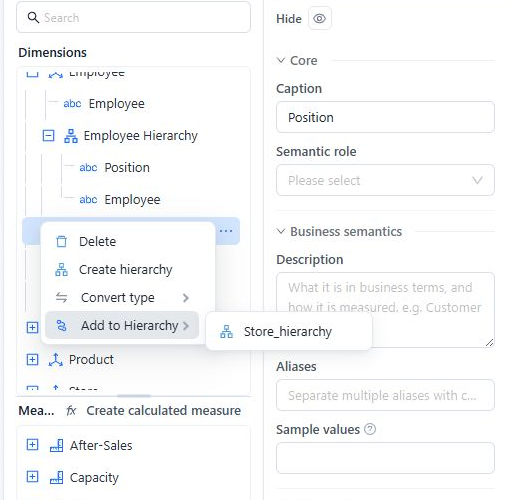
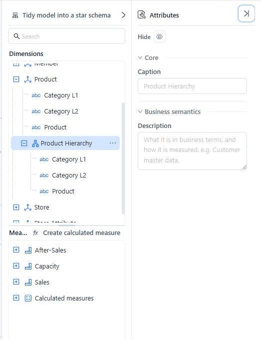

# Creating Hierarchies

A hierarchy gives report authors a defined drill path inside one Dimension, such as **Category L1 → Category L2 → Product**. Put levels in broad-to-detailed order and use Attributes that describe the same business entity.

## Create a hierarchy

1. Open the Analysis Model and expand the required Dimension.
2. Open an Attribute's **Actions** menu and select **Create hierarchy**.
3. Select the new hierarchy and replace its generated **Caption** with a business-facing name.
4. Optionally add a **Description** and set **Hide** if the hierarchy is not ready for report authors.

The selected Attribute becomes the first level. The initial caption follows the pattern `<attribute>_hierarchy` until you rename it.

## Add and order levels

To append another Attribute, open its **Actions** menu and select **Add to Hierarchy**, then choose the target hierarchy.

You can also drag Attributes and levels in the Dimensions tree:

- Drag an Attribute onto a hierarchy to insert it as the first level.
- Drag an Attribute onto a level to insert it after that level.
- Drag an existing level within its hierarchy to reorder it.

An Attribute can appear only once in the same hierarchy. Attributes and levels cannot be moved between Dimensions, and an existing level cannot be moved directly to another hierarchy.

Check the final order from broadest to most detailed. In this example, **Product Hierarchy** drills from Category L1 to Category L2 and then Product.

## Maintain a hierarchy

- Select the hierarchy to edit its **Caption**, **Description**, or **Hide** state.
- Select a level to edit its caption and description. Its source Attribute is read-only.
- Use **Delete** on a level or hierarchy to remove it. Deletion is immediate in the editor and does not delete the source Attributes.
- Click **Save** after validating the hierarchy.

After renaming, reordering, or deleting levels, test one report that uses the hierarchy. For report controls and reset behavior, see [Drill Down](/documentation/Analysis/Drill-down/).

## Design checks

- Use stable business levels; do not mix unrelated Attributes simply because they are in the same table.
- Avoid skipping a level that users need for aggregation or navigation.
- Give each level a clear caption; duplicate captions make drill paths difficult to understand.
- For a time hierarchy, assign the matching time Semantic role to each source Attribute.
- Review [Model Diagnostics](/documentation/Model/Model-Diagnostics/) before publishing the model.

## Related topics

- [Working with Tables and the Canvas](/documentation/Model/Working-with-Tables-and-the-Canvas/)
- [Time Semantics and Default Time Settings](/documentation/Model/Time-Dimensions-and-Time-Intelligence/)
- [Business Semantics for AI](/documentation/Model/Business-Semantics-for-AI/)
- [Drill Down](/documentation/Analysis/Drill-down/)
