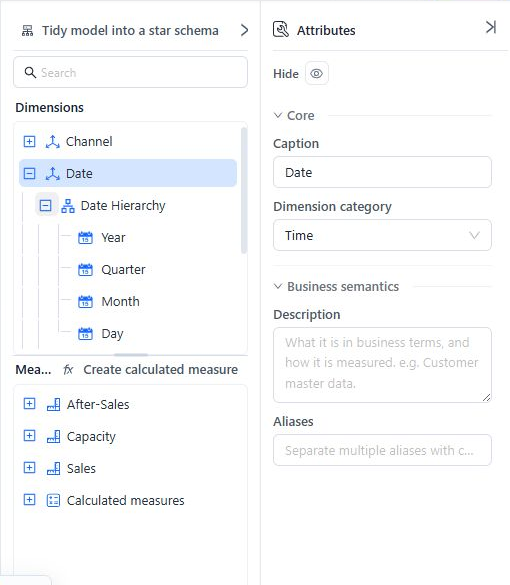
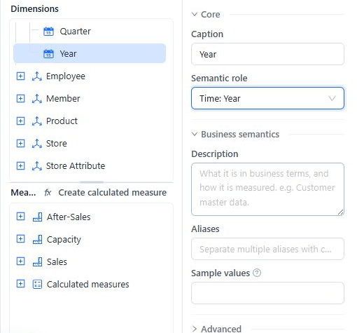
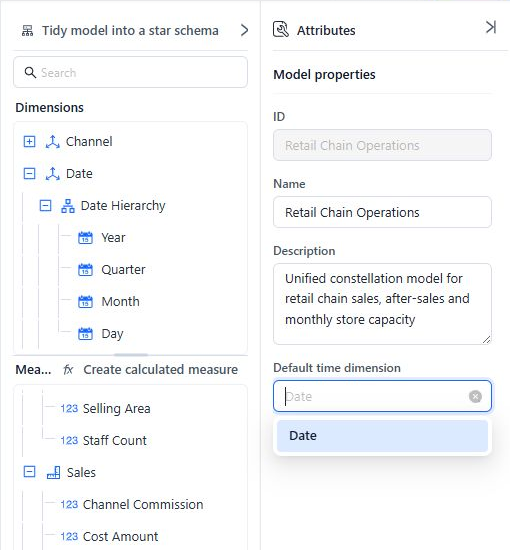
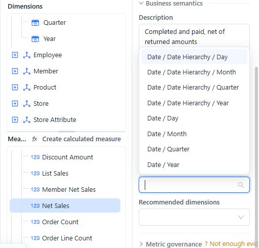

# Time Semantics and Default Time Settings

Datafor has three time settings with different purposes. Configure the setting used by each consumer; one setting does not substitute for another.

| Setting | Configure it on | What it controls |
| --- | --- | --- |
| Time **Semantic role** | An Attribute | Identifies Year, Quarter, Month, Week, or Date levels for time-aware report and MDX behavior. |
| **Default time field** | A Measure or calculated measure | Tells the Agent which date context to use for that Measure. |
| **Default time dimension** | Model properties | The model-wide date context. The Agent uses it for Measures without a **Default time field**. It does not replace Attribute time roles. |

## Configure a time Dimension

1. Select the Dimension in the model tree.
2. Set **Dimension category** to **Time**.
3. Include the Attributes needed for the intended calendar or fiscal time structure.
4. Create a hierarchy in broad-to-detailed order, such as **Year → Quarter → Month → Day**, with **Time: Date** assigned to the Day Attribute.

For each time Attribute, select the matching **Semantic role**:

| Attribute meaning | Semantic role |
| --- | --- |
| Year | **Time: Year** |
| Quarter | **Time: Quarter** |
| Month | **Time: Month** |
| Week | **Time: Week** |
| Calendar date or day | **Time: Date** |

A caption such as “Year” does not make an Attribute time-aware; assign the Semantic role.

You can also set the time level from the model tree: open the Attribute's **Actions** menu and choose **Convert type → Date → Year**, **Quarter**, **Month**, **Week**, **Day**, or **Datetime**. **Convert type → String** or **Number** turns a time Attribute back into a non-time Attribute.

### Source column format

Every time Attribute needs a **Source column format** (in the Attribute's **Advanced** settings) that matches how the value is stored in the source column. The list offers the formats for the Attribute's time level; you can also type a pattern. Examples:

| Stored value | Time level | Source column format |
| --- | --- | --- |
| `2005` | Year | `yyyy` |
| `20051` | Quarter | `yyyyq` |
| `Q1` | Quarter | `'Q'q` |
| `200506` | Month | `yyyyMM` |
| `2005-06` | Month | `yyyy-MM` |
| `2005-27` (week 27) | Week | `yyyy-ww` |
| `20050615` | Day | `yyyyMMdd` |
| `2005-06-15` | Day | `yyyy-MM-dd` |

If a time Attribute has no format when you save, the model shows “The … in dimension … has no date format”. You can still choose **Continue to save**, but set the format so that time functions and relative dates resolve correctly.

Week levels must use the same first day of the week as **Settings › General › System configuration › First day of the week**; otherwise “this week” can resolve to the wrong member.

## Set the model's Default time dimension

With no model-tree object selected, use **Model properties > Default time dimension** to designate the primary time Dimension in model metadata.

The Agent uses this Dimension as the date context for Measures that have no **Default time field** of their own: a question such as “sales this year” is read against a date field of this Dimension. If the selected Dimension is later removed, the value can appear as **no longer exists**; clear or reselect it and review **Model diagnostics**.

If the intended Dimension is not available in the list, confirm that it is visible and contains at least one Attribute, then set **Dimension category** to **Time**. Assign the time Semantic roles as a separate step so its Attributes work correctly in time-aware queries.

## Set the Agent's time field for each Measure

Select a Measure or calculated measure, expand **Business semantics**, and choose its **Default time field**. Select the Attribute or hierarchy level that represents when that Measure occurs.

Examples:

- Net sales normally use the order or transaction date.
- Refund Measures may use return date rather than order date.
- Inventory snapshots use the snapshot date.

Set this value independently for Measures with different date meanings. A Measure's own setting takes precedence over the model's **Default time dimension**, and a date the user names in the question wins over both. Measures without a setting use the model's Default time dimension. With neither setting, the Agent judges which date the Measure describes and the answer states that assumption.

## Models with several date roles

When one date source serves several roles:

1. Clone the date table and give each alias a role-specific name, such as **Order Date** or **Ship Date**.
2. Create a separate relationship from each alias to the correct fact-table key.
3. Expose role-specific Dimensions and hierarchies.
4. Assign each Measure's **Default time field** to the correct role.

See [Advanced Relationship Modeling](/documentation/Model/Advanced-Relationship-Modeling/) for role-playing aliases.

## Time-intelligence checks

- Keep hierarchy levels ordered from the broadest period to the individual date.
- Assign an explicit time Semantic role to every time level used in calculations.
- Verify the Source column format when the source does not use a native date value.
- Test year-to-date, quarter-to-date, and period-comparison calculations at more than one hierarchy level.
- When multiple time hierarchies exist, select explicit time fields in Measures and calculation templates. Zero-argument YTD and QTD functions use the first eligible time hierarchy; the model's **Default time dimension** does not choose it.
- Review **Model diagnostics** after renaming or removing a time Dimension, Attribute, hierarchy, or level.

## Troubleshooting

| Symptom | Check |
| --- | --- |
| A time Dimension is missing from **Default time dimension** | Visibility, at least one Attribute, and the **Time** category; then verify its time Semantic roles. |
| The Agent uses the wrong date | The affected Measure's **Default time field**, not only the model setting. |
| Time calculations use the wrong hierarchy | Time Semantic roles, hierarchy order, and explicit time-field selections. |
| A setting shows **no longer exists** | Reselect or clear the stale reference, then run Diagnostics. |

## Related topics

- [Creating Hierarchies](/documentation/Model/Creating-Hierarchy/)
- [Measures and Calculated Measures](/documentation/Model/Measures-and-Calculated-Measures/)
- [Business Semantics for AI](/documentation/Model/Business-Semantics-for-AI/)
- [Model Diagnostics](/documentation/Model/Model-Diagnostics/)
- [Advanced Relationship Modeling](/documentation/Model/Advanced-Relationship-Modeling/)
- [Quick Calculated Measures](/documentation/Analysis/Quick-Calculated-Measures/)
- [MDX Functions](/documentation/Advanced/MDX-Functions/)
