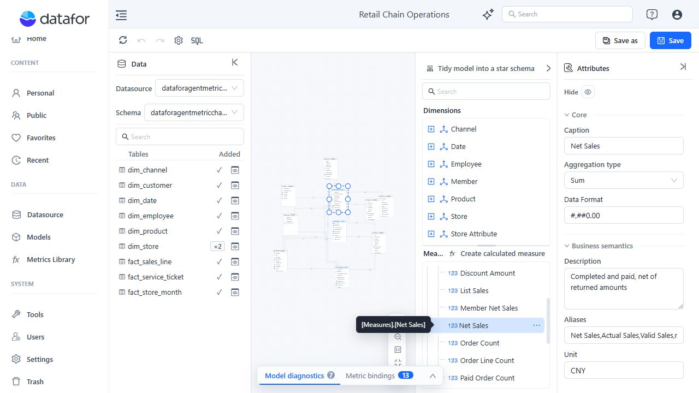
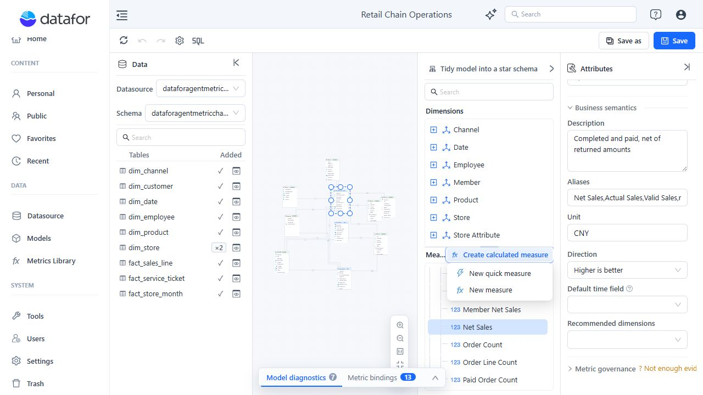
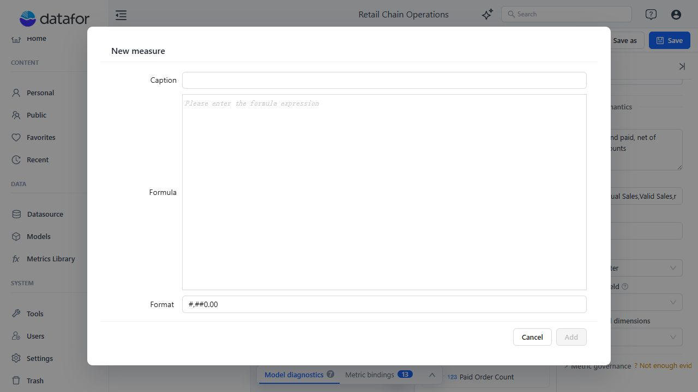
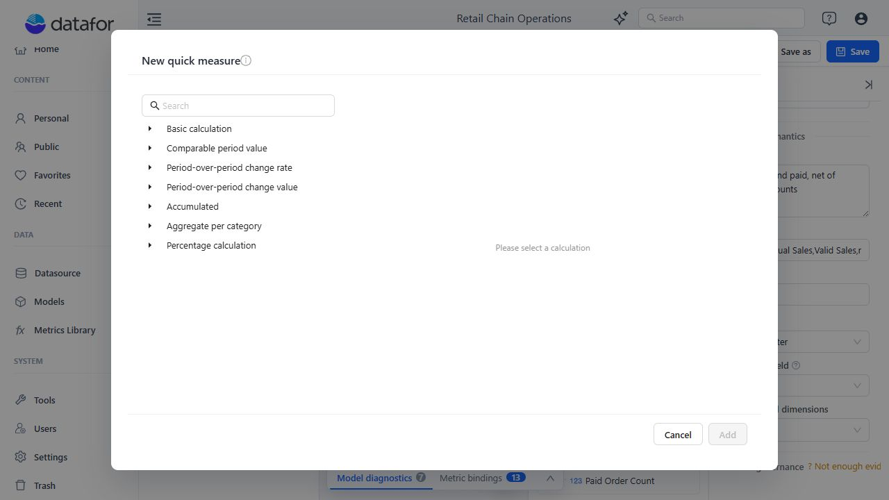

# Measures and Calculated Measures

A Measure aggregates a source field. A calculated measure is evaluated at query time and can reference Measures in a reusable model-level expression. Use a calculated column instead when the calculation must run row by row in the data source SQL layer.

## Configure a Measure

When a table is added, eligible numeric fields are initially created as Sum measures. The generated Measure Group also contains **Fact Count**.

To add or remove a source field as a Measure, open the field menu and toggle **Set as measure**. If the table has no Measure Group, the designer creates one when you add the Measure. A nonnumeric field is initially assigned Count rather than Sum.

Select a Measure in the **Analysis model** tree and configure its properties.

<div align="left"></div>

| Property | What to set |
| --- | --- |
| **Caption** | The business-facing name shown to report authors. |
| **Aggregation type** | How source values combine at query time. |
| **Data Format** | Display format for the result. |
| **Description** | What the measure represents and how it is calculated. |
| **Aliases** | Other terms users or AI may use for the same measure. |
| **Unit** | Currency, percentage, quantity, duration, or another business unit. |
| **Direction** | Whether higher, lower, or neither direction is preferred. |
| **Default time field** | Date context the Agent should use for this Measure. |
| **Recommended dimensions** | Dimensions normally used to analyze the measure. |

Available aggregation types include Sum, Average, Min, Max, Count, Distinct Count, population or sample standard deviation, and population or sample variance. Choose the method from the business meaning: for example, a unit price usually needs Average rather than Sum.

## Create a calculated measure

Click **Create calculated measure**, then choose:

- **New measure** to write a formula.
- **New quick measure** to generate a formula from a template.

<div align="left"></div>

For a standard calculated measure:

1. Enter a **Caption**.
2. Enter the **Formula**.
3. Select a **Format**.
4. Click **Add**.

<div align="left"></div>

Reference a model Measure with syntax such as:

```text
[Measures].[Net Sales]
```

An unknown Measure reference produces a diagnostic warning.

## Use a quick measure

Quick measures generate formulas for common patterns. Current template groups include:

- Basic calculation
- Comparable period value
- Period-over-period change rate
- Period-over-period change value
- Accumulated
- Aggregate per category
- Percentage calculation

<div align="left"></div>

After creating a quick measure, inspect the generated formula and confirm that its time hierarchy, comparison period, aggregation, and denominator match the business definition. See [Time Semantics and Default Time Settings](/documentation/Model/Time-Dimensions-and-Time-Intelligence/) before using a time-intelligence template.

## Change or remove Measures safely

- Renaming or deleting a Measure can break calculated-measure references.
- Fact Count cannot be deleted individually.
- Deleting a Measure or calculated measure is immediate; deleting a Measure Group requires confirmation.
- Deleting a bound Measure attempts to remove its enterprise metric binding. Undo can restore the editor object but not an external registry update.

Always review [Model Diagnostics](/documentation/Model/Model-Diagnostics/) after changing Measure names, formulas, groups, or source fields.

## Related topics

- [Business Semantics for AI](/documentation/Model/Business-Semantics-for-AI/)
- [Time Semantics and Default Time Settings](/documentation/Model/Time-Dimensions-and-Time-Intelligence/)
- [Model Diagnostics](/documentation/Model/Model-Diagnostics/)
- [MDX Functions](/documentation/Advanced/MDX-Functions/)
