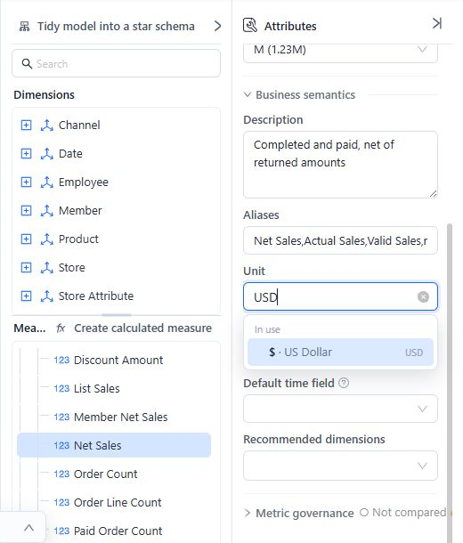
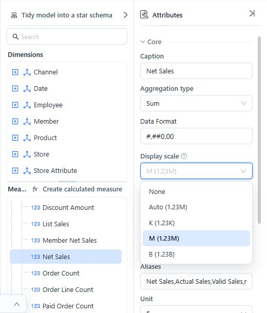
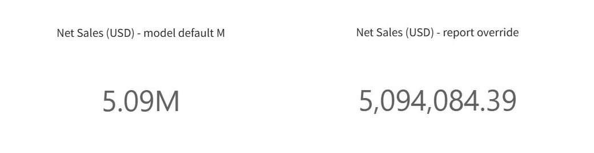
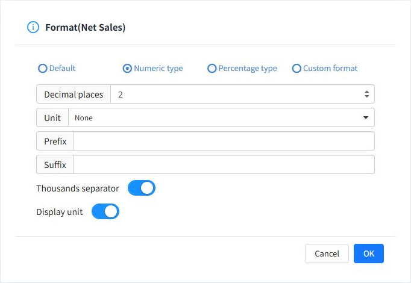

Use **Unit** to describe what a measure represents, and **Display scale** to make large values easier to read. Set them on a measure in the Model Designer, then check how a report displays that measure.

For example, a sales amount can have unit **USD** and display scale **M**. The amount is still measured in US dollars; the report displays it in millions.

## Understand the three settings

| Setting | What it controls | Example |
| --- | --- | --- |
| **Unit** | The business meaning of the value. | USD, orders, days, or kilograms. |
| **Display scale** | The model's default display magnitude for reports. | **M** displays a numeric value divided by 1,000,000, with an M suffix in English reports. |
| **Data Format** | The number format of the measure. | `#,##0.00` for a number with two decimal places, or `0.0%` for a percentage. |

These settings do not convert source data or change a formula or aggregation. Changing **USD** to **EUR** does not convert dollars to euros. If the source already stores amounts in thousands, selecting **K** would scale those numbers again. Define the measure in the intended base unit before choosing its display scale.

## Set a measure's unit and display scale

You need permission to edit and save the analysis model.

1. Open **Models** in the console and open your model.
2. In **Analysis model → Measures**, expand the measure group and select a measure, such as **Net Sales**. You can also configure a calculated measure.
3. In **Business semantics → Unit**, search for the unit and select the matching option. For an amount already expressed in US dollars, search for **USD** and select **US Dollar**.
4. In **Core**, check **Data Format**, then choose **Display scale** directly below it.
5. Click **Save**. Open or reload a report that uses the model to check the result.

The examples in this guide use a separate model named *Units and Scale Example*. Use an equivalent measure in your own model.

### Choose a unit

The picker accepts codes and familiar names. The selected label can differ from the stored code: for example, **USD** is displayed as **$** in the English interface.

| Search for | Standard unit | Typical measure |
| --- | --- | --- |
| USD or dollar | US Dollar (`USD`) | Net Sales |
| EUR or euro | Euro (`EUR`) | Operating Cost |
| orders | Orders (`{order}`) | Order Count |
| days | Days (`day`) | Delivery Time |
| kg or kilogram | Kilograms (`kilogram`) | Shipment Weight |
| MB or megabyte | Megabytes (`megabyte`) | Data Volume |
| percent or % | Percentage (`%`) | Gross Margin Rate |

Previously used units appear under **In use**. Other choices are grouped under **Currency**, **Ratio**, **Count**, **Time**, **Quantity**, and **Data**. Search by currency code when a currency is not in the initial list.

For a business unit outside the standard choices, type a descriptive term such as **pallets**, then select **Custom unit: “pallets”**. Custom text is not translated. Use a consistent spelling and explain unfamiliar units in the measure's **Description**.

### Choose a display scale

| Option in the English interface | Report behavior | When to use it |
| --- | --- | --- |
| **None** | Adds no model scaling default. Other report formatting still applies. | Unit prices, detailed amounts, and values that should retain their full magnitude. |
| **Auto** | Adds no fixed scaling default to the report. Existing number formatting and automatic chart-axis scaling continue to apply. | Letting each report control its presentation. |
| **K** | Scales by 1,000. | Order volumes or amounts in thousands. |
| **M** | Scales by 1,000,000. | Revenue or cost in millions. |
| **B** | Scales by 1,000,000,000. | Very large totals in billions. |

The dropdown includes sample labels such as **M (1.23M)**. The sample beside **Auto** is not a promise that every card or table will use compact notation.

With a fixed model scale, reports use at least two decimal places; a model number format with more decimal places retains that precision. For example, 1,234,567.89 with **M** and a two-decimal format displays as **1.23M**.

## Understand the result in a report

The model scale supplies a default for measures that have no explicit number format on the report component. An explicit report format takes precedence.

In the example below, both cards use **Net Sales = 5,094,084.39** from the same model:

- The left card inherits **M** and displays **5.09M**.
- The right card has an explicit report format with no scaling and displays **5,094,084.39**.

The **USD** text in the card titles was added to identify the currency. Setting the model's **Unit** does not automatically add a currency symbol to every chart value. Use a clear title, or a report format's **Prefix** or **Suffix**, when the displayed value needs that context.

### Override the scale on one component

To show the full amount on a measure card:

1. Select the card and open **Data**.
2. On the assigned measure, click **More (⋮) → Format**.
3. Select **Numeric type**.
4. Set **Unit** to **None** and **Decimal places** to **2**. Turn on **Thousands separator** for easier reading.
5. Click **OK**, then save the report.

**Unit in this report dialog means the display magnitude.** It is separate from the model's business unit, such as USD or orders.

To remove the report override, reopen **Format**, select **Default**, and click **OK**. The model default can then apply again. The dialog may show **Default** while the rendered value uses the model's **M** scale.

### Check charts with a shared axis

For bar, line, area, and scatter charts, the model scaling default is applied only when the measures without explicit report formats resolve to the same display scale. For example, **Revenue = M** and **Order Count = K** do not supply a consistent default for a shared axis.

Use separate components for measures with different meanings, or configure their report formats deliberately. Tables and measure cards apply defaults to each measure independently.

## Format percentages correctly

Use **Unit = %** to identify a ratio and a percentage **Data Format** to display it. For example, a margin value of **0.185** with format `0.0%` displays as **18.5%**.

A percentage format already multiplies the displayed value by 100. A source value of **18.5** is not automatically converted to **0.185** when you choose the percent unit. Check the measure's formula and source representation.

Leave **Display scale** at **None** for percentages. Percentage number formats are excluded from model scaling.

## Use the model across languages

Standard units are stored as common codes and their labels follow the user's interface language. A different label does not mean the unit or the data has changed. Custom units remain as typed.

Available scale choices also depend on language. Some interfaces offer **10k** or **100M** in addition to thousands, millions, and billions. English reports do not apply those two fixed model defaults; existing report formatting and chart-axis behavior remain in control.

For reports used across languages, prefer **K**, **M**, or **B**, and review the result in the intended viewing language. Avoid putting an abbreviation such as “million dollars” into a new unit definition when you can select **USD** and **M** separately.

Older models may contain combined text such as **million USD**. The Model Designer can interpret recognized combinations as a unit plus a scale. Check both fields before saving a change, especially when the source itself already contains scaled amounts.

## Use units in Metrics Library and AI

**Metrics Library → New metric** and the metric editor use the same unit picker. Metrics Library has a **Unit** field but no separate **Display scale** field; configure report defaults on the model measure.

For standard units, JSON exports retain the code. CSV exports include **Unit** for the code and **Unit (display)** for the localized label. On import, a supplied code takes precedence over a display label. Custom and legacy combined units can remain text, so review them when exchanging definitions.

Unit comparisons between a model and a bound enterprise metric use the normalized unit code. A display-scale difference alone is not a unit mismatch.

Accurate units also give the AI Agent context for interpreting measures. Describe the base unit and how ratios are stored in **Description**, especially for custom units. See [Business Semantics for AI](/documentation/Model/Business-Semantics-for-AI/) for the rest of the model metadata.

## Troubleshoot an unexpected display

| Symptom | What to check |
| --- | --- |
| A report ignores the model scale. | Check the component's measure **Format** for an explicit override, save the model, and reload the report. |
| A card shows a rounded total. | Use a smaller scale or an explicit format with more decimal places. The underlying value is unchanged. |
| A chart with several measures is not scaled. | Check for mixed model scales, including a measure with no scale, on the shared axis. |
| Auto does not produce an M or K suffix. | Auto does not impose a compact format on every report component. Choose a fixed scale or set a report format. |
| A percent is 100 times too large. | Check whether the source stores a proportion such as 0.185 or a percentage value such as 18.5. |
| A unit is not translated for a colleague. | It may be custom text. Select a standard unit when one matches the business meaning. |

## Related topics

- [Measures and Calculated Measures](/documentation/Model/Measures-and-Calculated-Measures/)
- [Business Semantics for AI](/documentation/Model/Business-Semantics-for-AI/)
- [Metrics Library](/documentation/Metrics-Library/Metrics-Library/)
