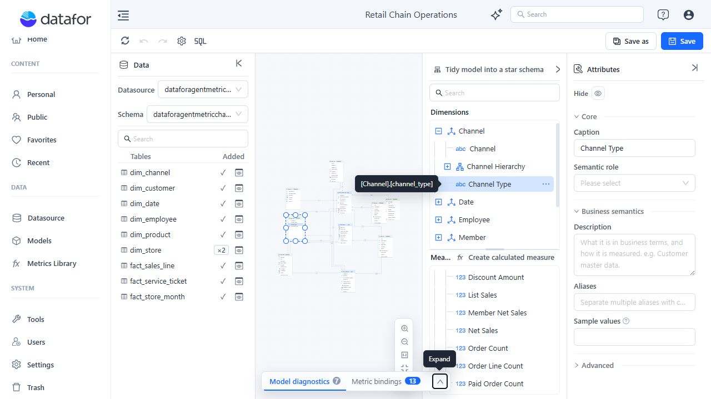
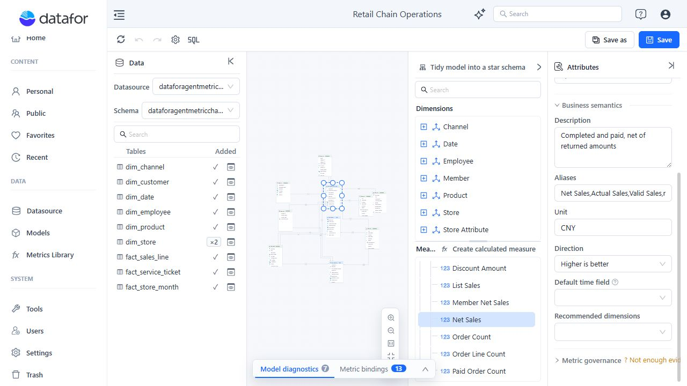

# Business Semantics for AI

Business semantics make technical model objects understandable to report authors and AI-assisted analysis. They do not change the source data type or calculation. Add metadata where a database name alone does not express the business meaning.

## Configure the model

When no tree object is selected, use **Model properties** to set:

- **Name**: the model name shown to users.
- **Description**: the business domain, data coverage, and intended use.
- **Default time dimension**: the model's designated time Dimension, stored as model metadata.

Default time dimension is a single model-level selection. It does not choose the Agent's date context and is not a fallback for a Measure's **Default time field**. A model without a time Dimension is still valid.

## Describe Dimensions and Attributes

For a Dimension, configure a clear Caption, Description, Aliases, and a **Dimension category** such as Business entity, Time, Geography, or Category.

For an Attribute, configure:

| Property | Guidance |
| --- | --- |
| **Caption** | Use the term report users expect. |
| **Semantic role** | Identify whether the field is an ID, name, category, status, flag, time, geography, numeric value, or sort field. |
| **Description** | State what one value represents. Include important scope or exclusions. |
| **Aliases** | Add genuine alternative business terms, not spelling variations with no user value. |
| **Sample values** | Add a few representative values when they help identify the field's meaning. |

Advanced Attribute settings can include **Caption column**, **Source column format**, **Order by**, and **Member formatter**. Make sure a source format matches the stored value. The JavaScript Member formatter accepts executable configuration and should only be changed by trusted model authors.

## Describe Measures

For each user-visible Measure or calculated measure, set:

- A precise Caption and Description.
- Common business Aliases.
- Unit and Direction.
- Default time field when time intelligence is expected.
- Recommended dimensions when the measure is normally analyzed by a specific set of Dimensions.

Good descriptions answer the questions that the column name cannot:

- Which records are included or excluded?
- Is the value gross, net, booked, paid, estimated, or recognized?
- Which time field defines the reporting period?
- Which unit and scale apply?

## Bind a governed enterprise metric

To connect an implementation to a governed definition:

1. Select a Measure or calculated measure.
2. Expand **Metric governance**.
3. Select an **Enterprise metric**.
4. Review differences in unit, direction, aliases, and metric version.
5. Set **Effective grain** when the metric is only valid for specific Dimensions.

Leaving **Effective grain** empty does not restrict the metric to specific Dimensions. Binding the same enterprise metric to multiple Measures in one model creates ambiguity and is reported as an Error by Model diagnostics.

Changing or clearing the selected Enterprise metric clears the existing dimension mapping. Clearing it also clears Effective grain. Adding Measure-only aliases to Metrics Library requires Metrics Library write permission. Changes already written to the external registry are not reversed by the model editor's Undo command.

If a binding shows **Not registered**, save the model and retry or refresh the binding status.

For the complete governance workflow, see [Metrics Library](/documentation/Metrics-Library/Metrics-Library/).

## Minimum semantic checklist

Before an administrator adds a model to the AI index:

1. Describe every user-visible Dimension, Measure, and calculated measure.
2. Assign Semantic roles to important IDs, names, time fields, and geography fields.
3. Define Measure units and directions.
4. Set each Measure's Default time field when the Agent needs a date context; set the model's Default time dimension separately when that metadata is required.
5. Resolve semantic-completeness hints in Diagnostics.

Administrators can start indexing from the model's **Add to index** action on the Models page.

## Related topics

- [Preparing Data for AI](/documentation/AI-Agent/Preparing-Data-for-AI/)
- [Measures and Calculated Measures](/documentation/Model/Measures-and-Calculated-Measures/)
- [Time Semantics and Default Time Settings](/documentation/Model/Time-Dimensions-and-Time-Intelligence/)
- [Model Diagnostics](/documentation/Model/Model-Diagnostics/)
