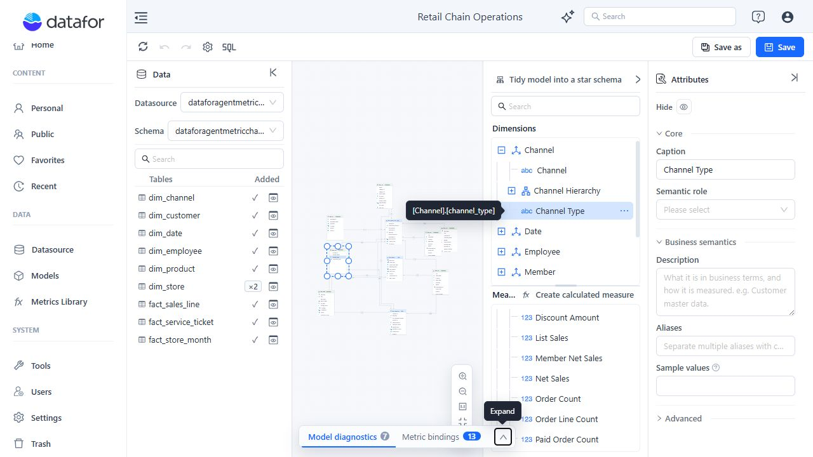
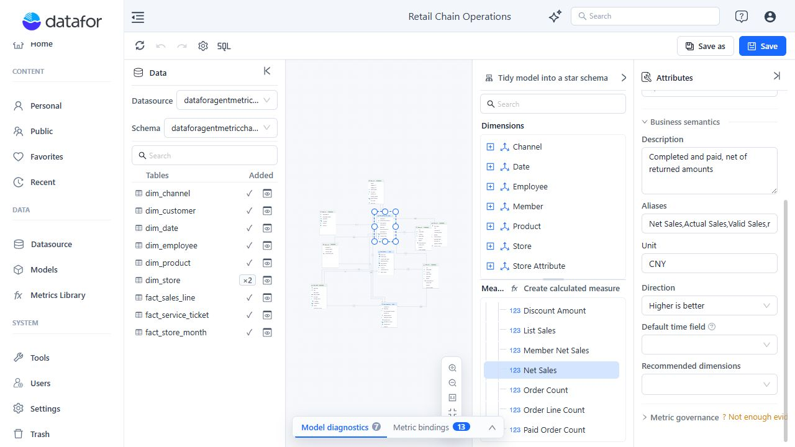

# Business Semantics for AI

Business semantics make technical model objects understandable to report authors and AI-assisted analysis. They do not change the source data type or calculation. Add metadata where a database name alone does not express the business meaning.

Select an object in the **Analysis model** tree or on the canvas and edit it in the **Attributes** panel on the right. The panel is grouped into **Core**, **Business semantics**, **Advanced** (attributes only) and **Metric governance** (measures only). Besides the caption, the AI Agent reads **Semantic role** and **Data Format** in **Core**, and the **Business semantics** and **Metric governance** groups.

The metadata does not have to be perfect, but it has to be readable and written in business language. When a particular phrasing does not work, fix the description or aliases first; you rarely need to restructure the model.

## Configure the model

When no tree object is selected, use **Model properties** to set:

- **Name**: the model name shown to users.
- **Description**: the business domain, data coverage, and intended use.
- **Default time dimension**: the model's designated time Dimension, stored as model metadata.

Default time dimension is a single model-level selection. The Agent reads it as evidence of the model-wide date context: when a Measure declares no **Default time field** of its own, "this year" is read against a date field of this Dimension. A Measure's own Default time field always takes precedence, and a date the user names wins over both. A model without a time Dimension is still valid.

## Write captions and descriptions

Captions and descriptions are the Agent's primary material: the words in a user's question have to match a caption, an alias or a description.

| Object | What to write |
| --- | --- |
| Dimension | The business entity it represents: "Product master data with brand and category" |
| Attribute | Its business meaning: "Unique product code, same as the ERP item number" |
| Hierarchy | The drill-down path: "Country → Province → City" |
| Measure | The business definition: "Store sales including tax, excluding returns" |
| Calculated measure | What it measures and how: "Gross margin rate = gross margin / sales" |

- **Use business words for captions**: "Sales" rather than `AMT_1`.
- **Tell apart fields with the same name and different meanings.** A model with both "Sales (gross)" and "Net Sales" is common and legitimate, but each description must state what it includes and excludes. This is the most frequent source of wrong answers.
- **Do not put SQL or table names in descriptions.** The Agent does not need them and users cannot read them.

A good description answers the questions that the column name cannot:

- Which records are included or excluded?
- Is the value gross, net, booked, paid, estimated, or recognized?
- Which time field defines the reporting period?
- Which unit and scale apply?

**Model diagnostics** lists every object that "has no description for AI to read" under the category **Semantic completeness**. Use it as a checklist; see [Model Diagnostics](/documentation/Model/Model-Diagnostics/).

## Describe Dimensions and Attributes

For a Dimension, configure a clear Caption, Description, Aliases, and a **Dimension category** such as Business entity, Time, Geography, or Category.

For an Attribute, configure:

| Property | Guidance |
| --- | --- |
| **Caption** | Use the term report users expect. |
| **Semantic role** | Identify whether the field is an ID, name, category, status, flag, time, geography, numeric value, or sort field. |
| **Description** | State what one value represents. Include important scope or exclusions. |
| **Aliases** | Add genuine alternative business terms, not spelling variations with no user value. |
| **Sample values** | Add a few representative values when they help identify the field's meaning. |

### Aliases and sample values

**Aliases** (dimensions, attributes and measures) are comma separated. Register the words users really use: colloquial terms, abbreviations, English column names, and the names different departments use for the same thing. Any wording users tried that did not map to a field belongs here.

- Dimension: `goods, items, SKUs`
- Attribute: `product code, SKU, item number`
- Measure: `revenue, sales, turnover`

**Sample values** (attributes only, below **Aliases**) solve a different miss: the user names a value, not a field. "East Region sales last month" never mentions "region", so the Agent has to know which field "East Region" belongs to. A region field might carry `East, North, South`; a status field `Completed, Cancelled`.

- Three to five representative values are enough. For fields with a few dozen members the Agent reads every member itself, so sample values matter most for fields with many members: cities, stores, products, customers.
- Write the values as they appear in the data. The Agent uses them only to pick the field; the filter is still matched against the real members, so a sample value never becomes a filter on its own.
- They take effect within a few minutes of saving the model; no re-indexing is needed.

### Semantic roles

An attribute's **Semantic role** (in **Core**) changes how the Agent understands the field:

- **Time: Year**, **Time: Quarter**, **Time: Month**, **Time: Week** and **Time: Date** set the field's time grain, so that "trend by month", "same period last year" and "month over month" have something to land on. Build the full date hierarchy (Year → Quarter → Month, optionally → Day) and give every level its matching role. See [Time Semantics and Default Time Settings](/documentation/Model/Time-Dimensions-and-Time-Intelligence/).
- **Geography: Country**, **Geography: State / Province**, **Geography: City**, **Identifier / Code**, **Name / Display name**, **Category**, **Type**, **Segment / Range**, **Status**, **Flag**, **Numeric attribute** and **Sort field** help the Agent judge how a field is used: a code is not a good grouping label, and a status is usually a filter.

Advanced Attribute settings can include **Caption column**, **Source column format**, **Order by**, and **Member formatter**. Make sure a source format matches the stored value.

**Member formatter** offers **No member formatter** and **Dictionary**. **JavaScript** is offered only when model scripting was enabled by the administrator when the server started; a script runs on the server, so leave it to trusted model authors. On a server without scripting:

- A model that already uses a JavaScript member formatter shows **No member formatter**.
- A model that contains any script cannot be saved or published; the save fails with `SCHEMA_SCRIPT_FORBIDDEN: model scripting is disabled on this server`.

Custom formatter classes are never accepted (`SCHEMA_SCRIPT_FORBIDDEN: custom formatter classes are not allowed`); the built-in **Dictionary** formatter is the exception.

## Describe Measures

For each user-visible Measure or calculated measure, set a precise Caption and Description, common business Aliases, and these fields:

| Field | Group | Effect on the Agent |
| --- | --- | --- |
| **Data Format** | Core | A percentage format such as `0.00%` makes the Agent present a ratio as 41% instead of 0.41. Required for ratios. |
| **Display scale** | Core | The Agent and reports present the number at this magnitude (K, M, B). Use it for amounts and counts read as trends; leave detail values unscaled. |
| **Unit** | Business semantics | The Agent names the unit in the reader's language (dollars, days, orders). Pick a standard unit or type your own; units already used in the model are listed first. See [Units and Display Scale](/documentation/Model/Units-and-Display-Scale/). |
| **Direction** | Business semantics | **Higher is better**, **Lower is better** or **Neutral**: whether a change is described as good or bad. Set **Lower is better** for costs and return rates. |
| **Default time field** | Business semantics | The date that "this year" is read against for this measure; see below. |
| **Recommended dimensions** | Business semantics | One to three Dimensions users most often split this measure by. When a question asks for a breakdown without naming the axis, the Agent groups by these first; it also breaks down a change ("why did sales fall?") by them, and the suggested questions on the model's start page use them. A Dimension the user names always wins, and no grouping is added to a question that did not ask for one. |

With several measures selected, fields such as **Unit** and **Direction** can be set in bulk. Caption, Description, Aliases and the enterprise metric binding identify a single measure and are set one at a time.

### Default time field

An order fact table often has an order date, a ship date and a delivery date. When a user says "this year", the Agent has to decide which one applies; without a declaration it asks or infers from descriptions, and neither is stable.

Set **Default time field** on the measure to a time attribute or hierarchy level. "Sales this year" is then read against that date, and the answer's **Technical details** show it as the date basis. Each measure can differ: "Refund amount" can default to the return date while "Sales" defaults to the order date. A measure without one falls back to the model's **Default time dimension** (see [Configure the model](#configure-the-model)).

### Write ratios as numerator and denominator

When the Agent can see a ratio's numerator and denominator, it queries both and computes the ratio itself. Period comparisons of the ratio (year over year, against last month) are then exact, and a "why did it change?" question can split each member's contribution into the part from its weight in the denominator and the part from its own ratio. A ratio without visible components is opaque: its comparison may be missing and the answer partial.

The Agent reads the components from a calculated measure's formula only in these shapes:

| Shape | Example |
| --- | --- |
| `N / D` or `(N) / (D)` | `[Measures].[Gross Profit] / [Measures].[Net Sales]` |
| `IIf(D = 0, NULL, N / D)` | `IIf([Measures].[Paid Orders] = 0, NULL, [Measures].[Net Sales] / [Measures].[Paid Orders])` |
| `N - D` (a difference) | `[Measures].[Net Sales] - [Measures].[Cost]` |

- N and D must each be a measure users can see, or a parenthesized expression that equals another visible calculated measure. For example, `([Measures].[Net Sales] - [Measures].[Cost]) / [Measures].[Net Sales]` works when the model also has a visible calculated measure Gross Profit = Net Sales − Cost.
- `*100`, any other function, or three or more operands make the ratio opaque. Show a percentage with a percentage **Data Format** instead of multiplying by 100.
- When the formula cannot take one of these shapes, bind the measure to a Metrics Library metric whose **Calculation method** is **Ratio**, **Difference** or **Attainment rate**, with its operand metrics bound in the same model. A component declaration in the model formula takes precedence.
- Declared relations also answer "is it A or B?" questions. With Average Order Value = Net Sales / Paid Orders declared, a change in net sales can be split into the contributions of paid orders and of average order value.

## Bind a governed enterprise metric

A definition in Metrics Library constrains the Agent's computation only once it is bound to a measure in the model. To bind an existing Measure or calculated measure:

1. Select the measure.
2. Expand **Metric governance**.
3. Select an **Enterprise metric**.
4. Review differences in unit, direction, aliases, and metric version. Aliases that the library lacks are listed under **Synonyms missing from the metrics library**; **Add to metrics library** adds them.
5. Set **Effective grain** only when the metric stops being meaningful at other grains (sales per square meter is valid only by store and month, for example).
6. Save the model.

To create a new calculated measure from a metric, choose **Reference from metrics library** when creating it, select the metric, and click **Next: write formula**.

Leaving **Effective grain** empty does not restrict the metric to specific Dimensions. Keep one measure per metric in each model: binding a metric that another measure in the model already uses opens **Metric already bound**, which warns that the AI Agent cannot tell which one to compute with. If you bind it anyway, Model diagnostics reports both measures as an Error.

Saving the model writes the binding and a snapshot of the measure's implementation (aggregation or formula) to Metrics Library; the definition can be compared only after that. After renaming a measure or changing its formula, save again: the snapshot updates and the binding switches to **Needs comparison**. See [Review definition consistency](/documentation/Metrics-Library/Metrics-Library/#_5-review-definition-consistency).

Bindings also choose the model: when a user asks without selecting one, the Agent answers from the model the named metric is bound to. Bind each metric in the model that should answer for it.

Changing or clearing the selected Enterprise metric clears the existing dimension mapping. Clearing it also clears Effective grain. Adding Measure-only aliases to Metrics Library requires Metrics Library write permission. Changes already written to the external registry are not reversed by the model editor's Undo command.

If a binding shows **Not registered**, save the model and retry or refresh the binding status.

For the complete governance workflow, see [Metrics Library](/documentation/Metrics-Library/Metrics-Library/).

## Minimum semantic checklist

Before users start asking the AI Agent about a model:

1. Describe every user-visible Dimension, Measure, and calculated measure.
2. Assign Semantic roles to important IDs, names, time fields, and geography fields.
3. Define Measure units and directions.
4. Set the model's Default time dimension when most Measures follow the same date, and give each Measure that follows a different date its own Default time field; the Agent reads the Measure's field first and the model's Dimension when the Measure declares none.
5. Resolve semantic-completeness hints in Diagnostics.

Saving the model builds or updates its AI knowledge index in the background while **Auto-build knowledge index** is on (the default, under **Settings › General › System configuration**). Administrators can also start it from the model's **Prep data for AI** action on the Models page, and follow its progress under **Settings › AI Agent › Knowledge indexes**.

## Related topics

- [Preparing Data for AI](/documentation/AI-Agent/Preparing-Data-for-AI/)
- [Measures and Calculated Measures](/documentation/Model/Measures-and-Calculated-Measures/)
- [Units and Display Scale](/documentation/Model/Units-and-Display-Scale/)
- [Time Semantics and Default Time Settings](/documentation/Model/Time-Dimensions-and-Time-Intelligence/)
- [Model Diagnostics](/documentation/Model/Model-Diagnostics/)
