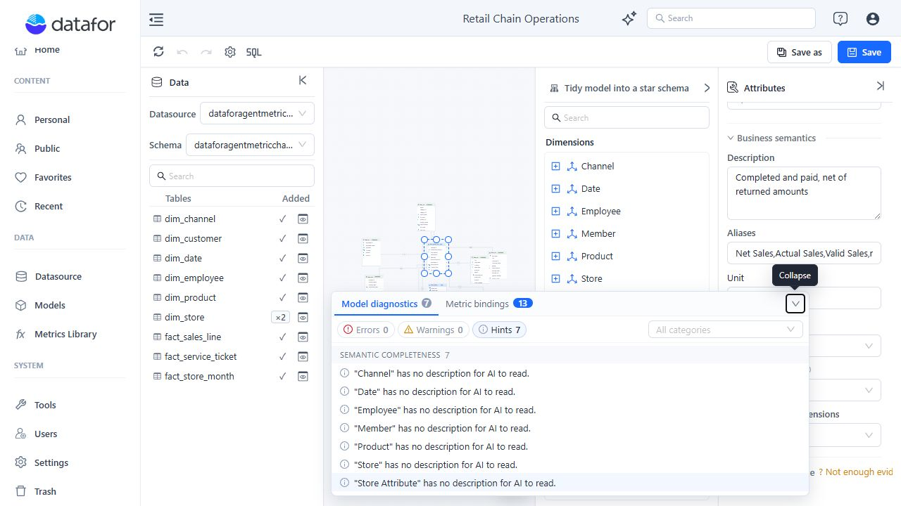

# Model Diagnostics

Model diagnostics identify structural, reference, semantic, and metric-governance problems before a model is used in reports or AI-assisted analysis.

## Open Diagnostics

When diagnostics or metric bindings exist, expand the **Insights** panel at the bottom of the designer, then select **Model diagnostics**.

Use the severity controls and **All categories** filter to narrow the list. Select an issue to focus the designer on the related table, relationship, field, Dimension, or Measure.

## Severity levels

| Severity | Meaning | Recommended action |
| --- | --- | --- |
| **Error** | A structural, reference, or governance problem that can make the model inconsistent. | Resolve it before use whenever possible. Saving requires an explicit override. |
| **Warning** | A likely modeling or compatibility problem that needs review. | Confirm the design and expected query result. |
| **Hint** | Missing semantic metadata or another recommended improvement. | Complete it for user-facing and AI-enabled models. |

## What is checked

Diagnostics can report:

- Duplicate table aliases.
- Missing table or field metadata.
- Relationships that reference missing tables or fields.
- Empty calculated-column or calculated-measure expressions.
- Missing or invalid Measure aggregations.
- Unknown Measure references in calculated formulas.
- Isolated tables or disconnected Dimensions and Measure Groups.
- Relationship cycles in single-fact components. Components with multiple Measure Group tables are exempt from this cycle warning, so inspect each fact-to-Dimension route manually.
- Missing business descriptions or incomplete time settings.
- Missing, stale, drifting, or duplicate enterprise metric bindings.

## Diagnostics during Save

When you save a model:

- Warnings and hints do not block the save operation.
- Errors open a detailed review dialog.
- You can return to the designer or explicitly choose to continue saving.
- Server-side verification runs after the client diagnostics.

An **Error** requires an explicit override; it is not an absolute save block. Use **Continue to Save** only when you understand the impact. A model with no tables cannot be saved.

## Review metric bindings

The **Metric bindings** tab summarizes model Measures and calculated measures linked to Metrics Library. **Compare definition** asks the configured AI service to compare an implementation with the enterprise metric's business definition. Use **Compare all** to run the comparison for all eligible bindings. If a row shows **Not registered**, save the model before retrying.

The comparison result is stored with the binding and does not modify the model. It can fail when the AI service is unavailable, misconfigured, unauthorized, or times out.

## Before using the model

1. Resolve all Errors, including structural, reference, and metric-governance errors.
2. Verify every relationship's keys, join type, and cardinality.
3. Review disconnected Dimensions and Measure Groups.
4. Check calculated-measure references and formats.
5. Add descriptions to user-visible Dimensions and Measures.
6. Review enterprise metric bindings and definition consistency.
7. Save, then validate representative totals and drill paths in a report.

## Related topics

- [Establishing Table Relationships](/documentation/Model/Establishing-Table-Relationships/)
- [Advanced Relationship Modeling](/documentation/Model/Advanced-Relationship-Modeling/)
- [Tidy Model into a Star Schema](/documentation/Model/Tidy-Model-into-a-Star-Schema/)
- [Time Semantics and Default Time Settings](/documentation/Model/Time-Dimensions-and-Time-Intelligence/)
- [Measures and Calculated Measures](/documentation/Model/Measures-and-Calculated-Measures/)
- [Business Semantics for AI](/documentation/Model/Business-Semantics-for-AI/)
- [Metrics Library](/documentation/Metrics-Library/Metrics-Library/)
