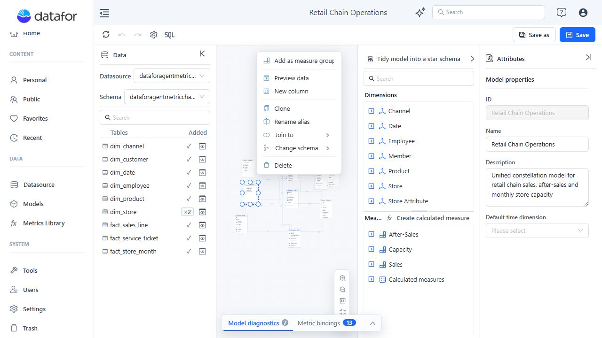
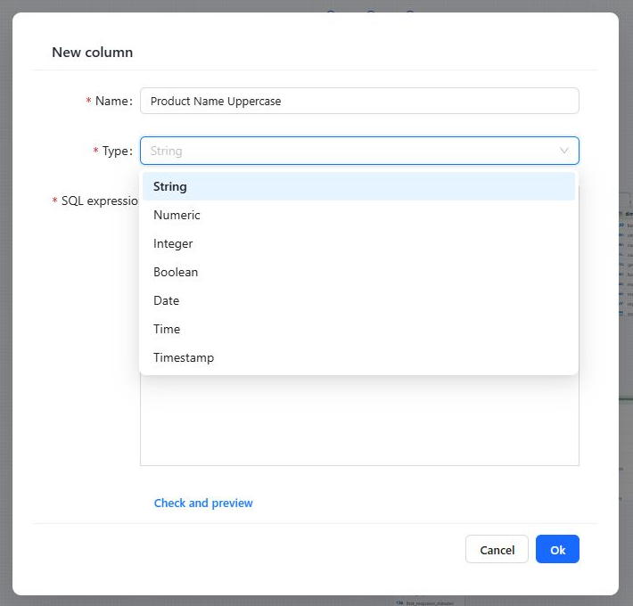
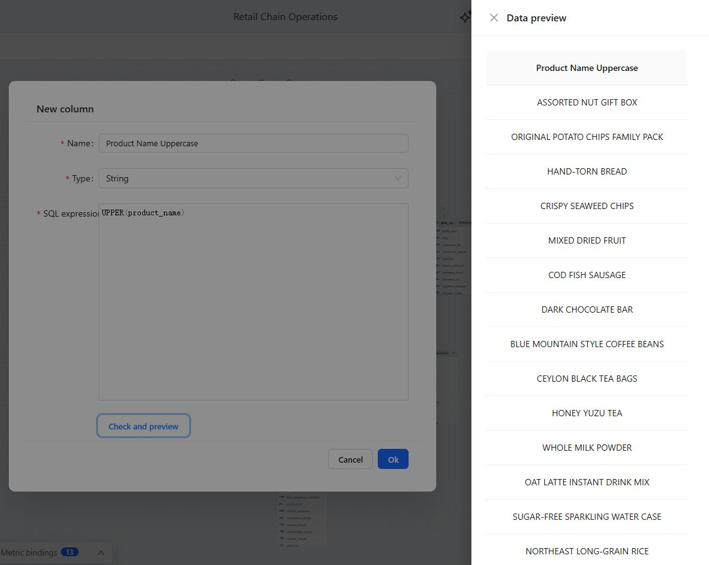

# Calculated Columns

A calculated column evaluates a SQL expression for each row of one physical source table. Use it when the model needs a reusable row-level value that is not stored in the source.

| Requirement | Use |
| --- | --- |
| Derive a row-level category, label, date part, or normalized value | Calculated column |
| Aggregate a source column | [Measure](/documentation/Model/Measures-and-Calculated-Measures/#configure-a-measure) |
| Calculate from Measures at query time | [Calculated measure](/documentation/Model/Measures-and-Calculated-Measures/#create-a-calculated-measure) |

## Create a calculated column

1. Open the table's menu and select **New column**. This action is available for physical tables, not custom-SQL tables.
2. Enter a unique **Name**.
3. Select the result **Type**: String, Numeric, Integer, Boolean, Date, Time, or Timestamp.
4. Enter a **SQL expression** using columns from the selected table.
5. Click **Check and preview**. Confirm both the returned values and the selected result type.
6. Close the preview, click **Ok**, and then save the Analysis Model.

<div align="left"></div>

The editor below shows every supported result type.

<div align="left"></div>

## Example: normalize a product name

Create a String column named **Product Name Uppercase** on `dim_product`:

```sql
UPPER(product_name)
```

The preview runs the expression against a sample from that physical table. The function syntax must match the SQL dialect of its data source.

<div align="left"></div>

## Use the result in the model

The calculated column appears with the source fields in its table. Open its menu and choose:

- **Set as dimension** for a grouping, filter, label, or hierarchy Attribute.
- **Set as measure** for a value that must be aggregated. Numeric results initially use Sum; other types initially use Count.

Configure the generated Attribute or Measure in the Analysis model tree just like one created from a source column.

## Edit or delete

- Select **Edit calculated column** to change the expression or result type. The column name is read-only while editing.
- Select **Delete calculated column** to remove it immediately from the editor.
- After a deletion or type change, review **Model diagnostics** for objects that referenced the column, then test affected reports before saving.

## Practical constraints

- Keep the expression row-level and limited to columns in the selected table. Use Measures for aggregation and relationships for cross-table analysis.
- Handle nulls and casts explicitly when the database does not infer the intended type.
- Preview representative edge cases, not only the first non-null value.
- Complex expressions execute in source SQL and can increase query cost. Move heavily reused or expensive logic into a database view when appropriate.

## Related topics

- [Working with Tables and the Canvas](/documentation/Model/Working-with-Tables-and-the-Canvas/)
- [Measures and Calculated Measures](/documentation/Model/Measures-and-Calculated-Measures/)
- [Model Diagnostics](/documentation/Model/Model-Diagnostics/)
