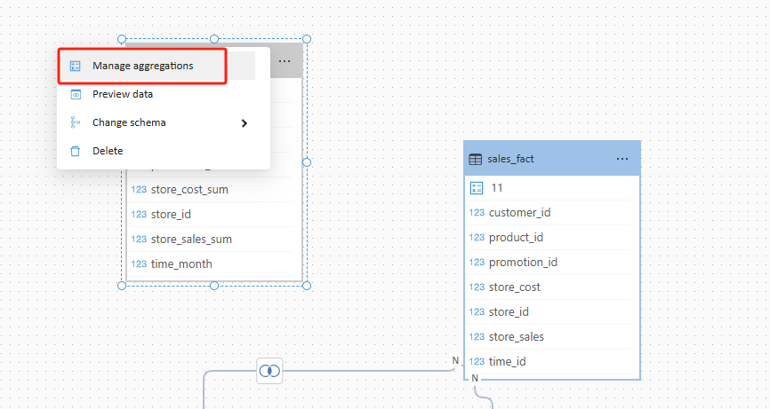
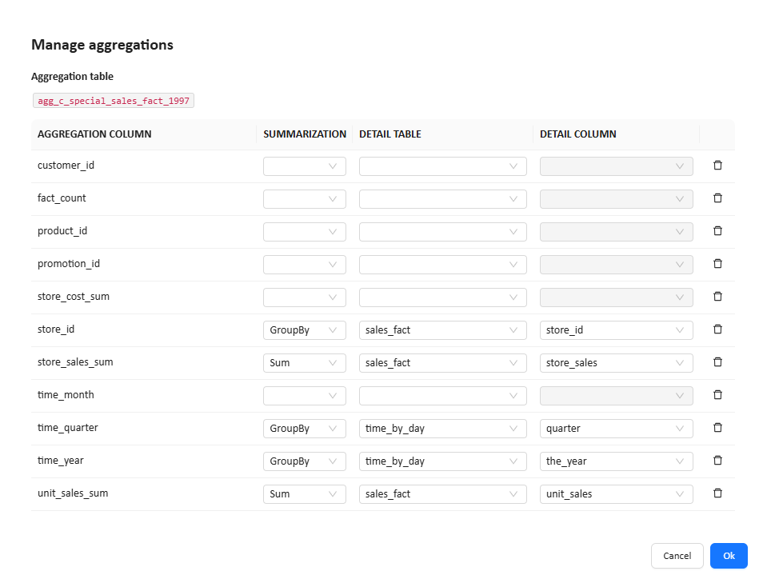
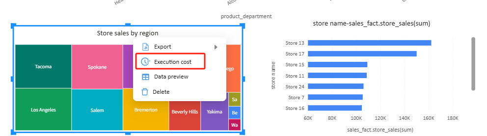
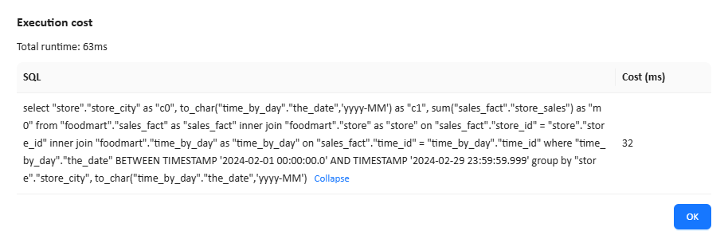

# Use Aggregation Tables

Aggregation tables are used to improve query performance in Datafor.

Instead of aggregating data from the detail fact table every time a report runs, Datafor can use a pre-aggregated table when the report query matches the granularity and metric definitions of that table. This can reduce scanned data volume, shorten SQL execution time, and improve dashboard responsiveness.

## What is an aggregation table

A fact table usually stores data at the lowest business granularity, such as one row per transaction or one row per sales record.

However, many reports do not need that level of detail. For example, users often analyze:

- sales by year
- sales by quarter
- sales by store
- sales by product category

If these queries are frequent and the fact table is large, repeatedly aggregating detail data can become expensive.

An aggregation table stores pre-calculated results at a higher level of granularity, such as:

- by store and year
- by store and quarter
- by product and month
- by region and year

When a report query is compatible with the aggregation table, Datafor can use that table instead of the detail fact table.

## Benefits of aggregation tables

Aggregation tables are mainly used for performance optimization.

Typical benefits include:

- faster report execution
- lower SQL cost
- less database load
- better user experience for dashboards and charts
- better performance for large fact tables

Aggregation tables are not a replacement for detail tables. They are an optimization layer for common analysis patterns.

## When to use aggregation tables

Aggregation tables are recommended when:

- the fact table contains a large amount of data
- users frequently run similar summary queries
- dashboards repeatedly use the same dimensions and measures
- report response time needs to be improved
- the analysis granularity is relatively stable

For example, aggregation tables are especially useful when users often analyze:

- sales by month, quarter, or year
- sales by store
- sales by product
- cost by region
- unit sales by time period

## Before you begin

Before configuring an aggregation table in Datafor, make sure the following are ready:

### 1. The aggregation table already exists in the database

Datafor maps an existing aggregation table to the detail model. It does not create the aggregation table automatically.

Examples:

- `agg_sales_store_month`
- `agg_sales_region_quarter`
- `agg_product_year`
- `agg_c_special_sales_fact_1997`

### 2. The granularity of the aggregation table is clear

You should know exactly what the table is grouped by.

Examples:

- store + year + quarter
- product + month
- region + year

This is important because only compatible queries can use the aggregation table.

### 3. The measures are clearly defined

You should know how each aggregated measure in the table was calculated.

Examples:

- `store_sales_sum` = `SUM(store_sales)`
- `unit_sales_sum` = `SUM(unit_sales)`
- `fact_count` = number of detail rows rolled into the aggregated row

## Open the aggregation configuration

In the modeling canvas, select a table, open the table menu, and click **Manage aggregations**.

The **Manage aggregations** dialog is used to map aggregation table columns to fields in the detail model.

## Fields in the Manage aggregations dialog

The dialog contains the following columns:

| Column                 | Description                                                  |
| ---------------------- | ------------------------------------------------------------ |
| **Aggregation column** | A column in the aggregation table                            |
| **Summarization**      | The aggregation behavior that explains how this aggregation column is derived from the detail model |
| **Detail table**       | The table in the detail model that the aggregation column maps to |
| **Detail column**      | The field in the detail table that the aggregation column maps to |

Each row defines one mapping between the aggregation table and the detail model.

## How to configure an aggregation table

For each aggregation table column, choose the correct summarization method and map it to the corresponding detail field.

### Example

Suppose the aggregation table is grouped by:

- `store_id`
- `time_year`
- `time_quarter`

And it stores the following aggregated measures:

- `store_sales_sum`
- `unit_sales_sum`

A typical configuration would be:

| Aggregation column | Summarization | Detail table  | Detail column |
| ------------------ | ------------- | ------------- | ------------- |
| `store_id`         | `GroupBy`     | `sales_fact`  | `store_id`    |
| `time_year`        | `GroupBy`     | `time_by_day` | `the_year`    |
| `time_quarter`     | `GroupBy`     | `time_by_day` | `quarter`     |
| `store_sales_sum`  | `Sum`         | `sales_fact`  | `store_sales` |
| `unit_sales_sum`   | `Sum`         | `sales_fact`  | `unit_sales`  |

This tells Datafor that:

- `store_id`, `time_year`, and `time_quarter` define the grouping level
- `store_sales_sum` is the sum of `sales_fact.store_sales`
- `unit_sales_sum` is the sum of `sales_fact.unit_sales`

## Summarization methods

The **Summarization** field tells Datafor how an aggregation table column was derived from the detail model.

The available options are:

- `GroupBy`
- `Sum`
- `Count`
- `Max`
- `Min`
- `Count table`

Choosing the correct summarization method is critical. If it is wrong, Datafor may not use the aggregation table, or the query result may be incorrect.

### GroupBy

Use `GroupBy` when the aggregation column is a grouping key, not a calculated metric.

Typical examples:

- `store_id`
- `product_id`
- `customer_id`
- `time_year`
- `time_quarter`
- `time_month`
- `region_id`

Example:

| Aggregation column | Summarization | Detail table  | Detail column |
| ------------------ | ------------- | ------------- | ------------- |
| `store_id`         | `GroupBy`     | `sales_fact`  | `store_id`    |
| `time_quarter`     | `GroupBy`     | `time_by_day` | `quarter`     |

Choose `GroupBy` when the column represents a dimension that defines the aggregation grain.

### Sum

Use `Sum` when the aggregation column stores the result of `SUM()` on a detail field.

Typical examples:

- sales amount
- cost amount
- quantity
- unit sales

Example:

| Aggregation column | Summarization | Detail table | Detail column |
| ------------------ | ------------- | ------------ | ------------- |
| `store_sales_sum`  | `Sum`         | `sales_fact` | `store_sales` |
| `unit_sales_sum`   | `Sum`         | `sales_fact` | `unit_sales`  |
| `store_cost_sum`   | `Sum`         | `sales_fact` | `store_cost`  |

Choose `Sum` when the metric is additive and can be safely rolled up across higher levels.

### Count

Use `Count` when the aggregation column stores the result of `COUNT()` for a detail field.

Typical examples:

- order count
- customer count
- number of non-null values in a field

Example:

| Aggregation column | Summarization | Detail table | Detail column |
| ------------------ | ------------- | ------------ | ------------- |
| `order_count`      | `Count`       | `sales_fact` | `order_id`    |

Choose `Count` when the metric is the count of a specific field.

### Max

Use `Max` when the aggregation column stores the result of `MAX()` for a detail field.

Typical examples:

- highest price
- latest date
- maximum discount

Example:

| Aggregation column | Summarization | Detail table | Detail column |
| ------------------ | ------------- | ------------ | ------------- |
| `max_price`        | `Max`         | `sales_fact` | `unit_price`  |

Choose `Max` when the metric represents the maximum value at the aggregation grain.

### Min

Use `Min` when the aggregation column stores the result of `MIN()` for a detail field.

Typical examples:

- lowest price
- earliest date
- minimum inventory value

Example:

| Aggregation column | Summarization | Detail table | Detail column |
| ------------------ | ------------- | ------------ | ------------- |
| `min_price`        | `Min`         | `sales_fact` | `unit_price`  |

Choose `Min` when the metric represents the minimum value at the aggregation grain.

### Count table

Use `Count table` when the aggregation column stores the number of detail fact rows represented by the aggregated row.

Typical examples:

- `fact_count`
- `row_count`
- `record_count`

This is commonly used when the aggregation table stores how many fact table rows were rolled up into each aggregate row.

Example:

| Aggregation column | Summarization | Detail table | Detail column |
| ------------------ | ------------- | ------------ | ------------- |
| `fact_count`       | `Count table` | `sales_fact` |               |

Choose `Count table` when the column represents the count of underlying fact rows rather than the count of one specific detail field.

> If you are not sure whether a count-related column should use `Count` or `Count table`, first confirm the exact meaning of that column in the database.

## How to choose the correct summarization method

A simple way to choose is to ask:

**Is this column a grouping key, or is it a calculated aggregate result?**

### Choose `GroupBy` for dimension keys

If the column defines the aggregation grain, use `GroupBy`.

Examples:

- `store_id`
- `product_id`
- `customer_id`
- `time_year`
- `time_quarter`
- `time_month`

### Choose `Sum` for additive metrics

If the column stores a total amount or total quantity, use `Sum`.

Examples:

- `store_sales_sum`
- `unit_sales_sum`
- `store_cost_sum`

### Choose `Count` or `Count table` for count metrics

If the column stores a count:

- use `Count` when it counts a specific field
- use `Count table` when it counts fact table rows

Examples:

| Aggregation column | Recommended summarization |
| ------------------ | ------------------------- |
| `order_count`      | `Count`                   |
| `customer_count`   | `Count`                   |
| `fact_count`       | `Count table`             |

### Choose `Max` or `Min` for extreme values

If the column stores a highest or lowest value, use `Max` or `Min`.

Examples:

| Aggregation column | Recommended summarization |
| ------------------ | ------------------------- |
| `max_discount`     | `Max`                     |
| `min_price`        | `Min`                     |

## Quick selection guide

You can use the following rule of thumb:

- dimension field -> `GroupBy`
- additive metric -> `Sum`
- count metric -> `Count` or `Count table`
- highest value -> `Max`
- lowest value -> `Min`

## Example based on the current aggregation table

For the aggregation table shown in the example, a reasonable configuration would be:

| Aggregation column | Recommended summarization                                    | Notes                                       |
| ------------------ | ------------------------------------------------------------ | ------------------------------------------- |
| `store_id`         | `GroupBy`                                                    | grouped by store                            |
| `time_year`        | `GroupBy`                                                    | grouped by year                             |
| `time_quarter`     | `GroupBy`                                                    | grouped by quarter                          |
| `time_month`       | `GroupBy` if month is part of the aggregation grain          | otherwise leave unmapped                    |
| `store_sales_sum`  | `Sum`                                                        | total store sales                           |
| `unit_sales_sum`   | `Sum`                                                        | total unit sales                            |
| `store_cost_sum`   | `Sum`                                                        | total store cost                            |
| `fact_count`       | `Count table` or `Count`                                     | depends on the actual meaning of the column |
| `customer_id`      | `GroupBy` only if customer is part of the aggregation grain  | otherwise leave unmapped                    |
| `product_id`       | `GroupBy` only if product is part of the aggregation grain   | otherwise leave unmapped                    |
| `promotion_id`     | `GroupBy` only if promotion is part of the aggregation grain | otherwise leave unmapped                    |

## How Datafor decides whether to use an aggregation table

After the aggregation table is configured, Datafor will only use it when the report query is compatible with the table.

In general, the following conditions must be satisfied.

### 1. The query grain must be compatible

The report query cannot require a finer grain than the aggregation table.

Example:

- aggregation table grain: store + year + quarter
- report query grain: store + month

Because month is more detailed than quarter, the query usually cannot use that aggregation table.

### 2. The requested measures must be compatible

The measures in the report must match the summarized metrics supported by the aggregation table.

For example, a table that only stores `SUM(store_sales)` cannot automatically answer every possible metric request, such as:

- distinct customer count
- average basket size
- ratio metrics
- complex calculated measures

### 3. Filters must be compatible

If the query uses filters that are not safely supported by the aggregation table grain, Datafor may fall back to the detail table.

## Verify whether a report query uses the aggregation table

After configuration, the best way to confirm whether the aggregation table is being used is to inspect the SQL in the report editor.

In the report editor, select a chart, open the chart menu, and click **Execution cost**.

The **Execution cost** dialog shows the generated SQL and execution time.

### What to check in the SQL

Look at the actual table names used in the SQL.

- If the SQL reads from the aggregation table, such as `agg_c_special_sales_fact_1997`, the aggregation table was used.
- If the SQL still reads from the detail fact table, such as `sales_fact`, the aggregation table was not used for that query.

## Example of a query not using the aggregation table

If the SQL still uses:

- `sales_fact`
- `time_by_day`
- `store`

instead of the aggregation table, the query did not match the aggregation table.

A common reason is grain mismatch.

For example:

- the aggregation table is grouped by year and quarter
- the SQL groups by month, such as `to_char(the_date, 'yyyy-MM')`

Since month is more detailed than quarter, the query usually has to fall back to the detail table.

This is an important point:

**Configuring an aggregation table does not mean every report will automatically use it. The query must match the table grain and measure definitions.**

## Best practices

### Start with high-frequency slow queries

Do not build many aggregation tables at once. Start with the most common slow queries and optimize those first.

### Make the grain explicit

Use clear table names that reflect the grain.

Examples:

- `agg_sales_store_month`
- `agg_sales_region_quarter`
- `agg_sales_product_year`

### Keep the measure meaning consistent

The aggregation table measure must match the semantic meaning used in reports.

### Validate with SQL

Always verify configuration results in the report editor by checking the SQL and execution time.

### Do not optimize only very coarse grains

If users often analyze data by month, a yearly aggregation table may provide limited benefit.

### Keep the aggregation table refreshed

If the detail fact table changes but the aggregation table is not updated in time, report results may become inconsistent.

## Design recommendations

### Design by time grain

Create separate aggregation tables for:

- month
- quarter
- year

This is useful when time-based analysis is common.

### Design by subject area

Create aggregation tables for frequent analysis subjects, such as:

- by store
- by product
- by region

### Design by dashboard use case

For important dashboards, build aggregation tables that specifically match the chart patterns used there.

This is often the most practical strategy.

## Special note on average, ratio, and distinct count

Some metrics are not safe to accelerate by storing only one final value.

Examples:

- average
- percentage
- ratio
- distinct count
- complex calculated measures

These usually require additional design.

For example:

- average may require both `sum` and `count`
- ratio may require numerator and denominator
- distinct count usually cannot be safely re-aggregated by simple addition

For this reason, aggregation tables are most effective when they focus first on:

- `GroupBy`
- `Sum`
- `Count`
- `Max`
- `Min`

## Troubleshooting

### The aggregation table is configured, but the report still queries the detail fact table

Possible reasons include:

- the report grain is more detailed than the aggregation table
- the report uses dimensions not covered by the aggregation table
- the metric mapping is incorrect
- the summarization method is incorrect
- the report uses unsupported filters
- the aggregation table data is incomplete or outdated

### The report result is incorrect after using the aggregation table

Possible reasons include:

- the aggregation table measure does not match the intended business metric
- the summarization method was selected incorrectly
- the aggregation grain is inconsistent with the report design
- the aggregation table data is out of sync with the detail table

### I am not sure whether to use Count or Count table

Check the meaning of the aggregation table column in the database.

- If it counts a specific field, use `Count`
- If it counts fact rows rolled into the aggregate row, use `Count table`

## FAQ

### Can one model use multiple aggregation tables

Yes. Different aggregation tables can serve different query patterns, grains, and dashboards.

### Can an aggregation table replace the detail fact table

No. Aggregation tables are used for performance optimization. Detail tables are still needed for detailed analysis and queries that do not match the aggregation table grain.

### How do I know whether performance actually improved

Compare the following before and after configuration:

- the generated SQL
- the execution time shown in **Execution cost**
- the report or dashboard response time

### What happens if the summarization method is selected incorrectly

The query may not use the aggregation table, or the query result may be incorrect.

## Summary

Aggregation tables in Datafor improve query performance by mapping pre-aggregated data to the detail model.

To use them effectively, focus on three things:

1. design the right aggregation grain
2. map dimensions and measures correctly
3. verify the generated SQL in the report editor

If these are done correctly, aggregation tables can significantly improve report performance on large datasets.