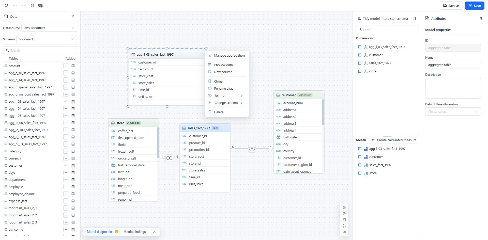
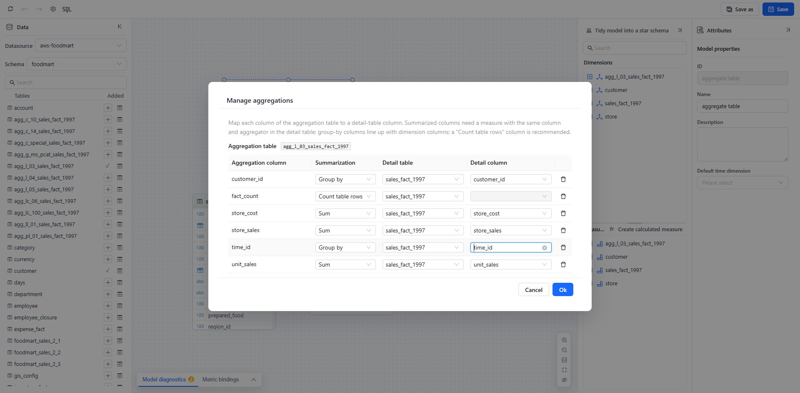
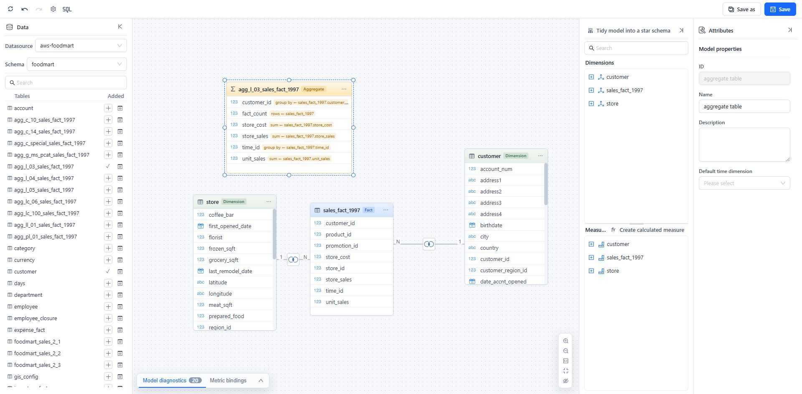
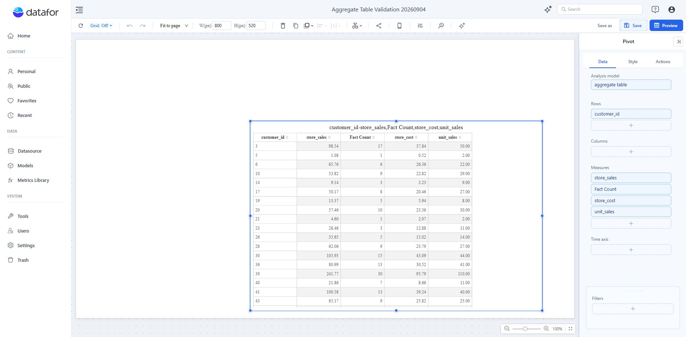

# Use Aggregation Tables

An aggregation table stores precomputed results at a coarser grain than a detail fact table. After you map its columns to the detail model, Datafor can use the aggregation table automatically for compatible report queries. Queries that require data outside the mapped grain can continue to use the detail tables.

Aggregation tables can reduce the amount of data scanned for frequently used totals. Datafor maps and queries an existing physical table; it does not create, load, or refresh that table in the datasource.

## When to use an aggregation table

Consider an aggregation table when:

- A fact table contains a large number of rows.
- Users repeatedly analyze the same Dimensions or time grain.
- The required Measures can be stored with well-defined aggregations such as Sum, Count, Min, or Max.
- The physical aggregation can be refreshed whenever the detail data changes.

For example, a sales fact table can be summarized by customer and day with precomputed sales, cost, unit, and row-count columns.

## Before you begin

Prepare the physical aggregation table in the datasource, then confirm:

- Its grain is clear. Each row must represent one unique combination of the grouping columns.
- Its measure columns use the same definitions as the Measures in the detail model.
- A row-count column, if present, contains the number of contributing detail rows.
- The detail tables and aggregation table are added to the same Analysis Model.
- The aggregation table has no regular relationships on the model canvas. **Manage aggregations** is unavailable while the selected table has a relationship.

Group-by columns can map to keys on any non-aggregation table in the model. Summarized columns must map to a detail Measure that uses the same source column and aggregation type.

## Configure the aggregation table

1. Open the Analysis Model and add the physical aggregation table to the canvas.
2. Open the table's **More** menu and select **Manage aggregations**.

3. Configure the required columns in the mapping dialog.

| Field | What to select |
| --- | --- |
| **Aggregation column** | The column stored in the aggregation table. |
| **Summarization** | How the value was produced from detail data. |
| **Detail table** | The non-aggregation table that supplies the corresponding key or Measure. |
| **Detail column** | The matching detail column. This is not required for **Count table rows**. |

Use these summarization options:

| Option | Use it for |
| --- | --- |
| **Group by** | A column that defines the aggregation table's grain, such as customer, product, or date key. |
| **Sum** | A stored sum of a detail Measure. |
| **Count** | A stored count that matches a Count Measure. |
| **Min** / **Max** | A stored minimum or maximum that matches the detail Measure. |
| **Avg** | A stored average calculated with the same definition as the detail Measure. |
| **Distinct count** | A stored distinct count calculated with the same definition and grain as the detail Measure. |
| **Count table rows** | A stored count of contributing detail rows. Select a detail table and leave **Detail column** empty. |

You can leave a column unmapped when it is not needed for aggregation-table routing. A partially completed row must be finished or cleared before you continue.

### Example mapping

The following example maps `agg_l_03_sales_fact_1997` to `sales_fact_1997`:

| Aggregation column | Summarization | Detail table | Detail column |
| --- | --- | --- | --- |
| `customer_id` | Group by | `sales_fact_1997` | `customer_id` |
| `fact_count` | Count table rows | `sales_fact_1997` | — |
| `store_cost` | Sum | `sales_fact_1997` | `store_cost` |
| `store_sales` | Sum | `sales_fact_1997` | `store_sales` |
| `time_id` | Group by | `sales_fact_1997` | `time_id` |
| `unit_sales` | Sum | `sales_fact_1997` | `unit_sales` |

4. Select **Ok**. The table card displays an **Aggregate** badge and a summary beside each mapped column.
5. Review the Analysis Model tree, then save the model.

The aggregation table does not expose its own Dimensions or Measure Group after the mapping is applied. Reports continue to use the Dimensions and Measures from the detail model; the query engine chooses the physical aggregation table when the query is compatible.

## Validate the configuration in a report

Always validate both query routing and business results before relying on an aggregation table.

1. Create a report and add a **Pivot**.
2. Select the Analysis Model that contains the aggregation mapping.
3. Add only Dimensions represented by the mapped **Group by** columns.
4. Add one or more mapped Measures.
5. Confirm that the result matches an expected total or a query against the detail data.

To inspect the generated SQL, select the Pivot in edit mode, open **More (…)**, and select **Execution cost**. If the SQL references the physical aggregation table, that query used the mapping. The menu is not available in read-only preview mode.

## Understand query matching and fallback

The query engine can use the aggregation table when the requested Dimensions, filters, and Measures can be answered from its mapped grain and columns.

If a report adds a Dimension, filter, or Measure that the aggregation table cannot answer, the engine can fall back to the detail tables. This is expected and preserves query correctness. For example, an aggregation grouped only by customer and time cannot answer a query grouped by store unless store is also represented in its mappings.

Do not assume that every query against the Analysis Model will use the aggregation table. Check representative report queries after changing the model or the physical aggregation.

## Maintain aggregation tables

- Refresh the physical aggregation whenever its detail data changes.
- Use the same business definitions, null handling, and filters as the detail Measures.
- Compare representative totals after every load or definition change.
- Update the mapping when a source column or table alias changes.
- Retest reports that use new Dimensions, filters, or Measures.

## Troubleshooting

### Manage aggregations is unavailable

The selected table has one or more regular relationships. Remove relationships that do not belong on the aggregation table, then open the table menu again.

### The mapping dialog cannot be submitted

Complete or clear every partially configured row. All mapping types require a summarization and detail table. Every type except **Count table rows** also requires a detail column.

### A report uses the detail table

Check that:

- The required Dimensions are covered by **Group by** mappings.
- Each summarized column maps to the correct detail table, column, and aggregation type.
- Report filters do not require a column outside the aggregation grain.
- The model was saved after the mapping changed.

If the mapping appears correct, ask an administrator to confirm that aggregation-table use is enabled on the server.

### Aggregated results differ from detail results

Check the physical table's refresh time, grouping keys, Measure definitions, filters, null handling, distinct-count logic, and row-count column. Rebuild or refresh the physical aggregation, then compare the same grain against the detail data again.

## Related topics

- [Working with Tables and the Canvas](/documentation/Model/Working-with-Tables-and-the-Canvas/)
- [Establishing Table Relationships](/documentation/Model/Establishing-Table-Relationships/)
- [Measures and Calculated Measures](/documentation/Model/Measures-and-Calculated-Measures/)
- [Model Diagnostics](/documentation/Model/Model-Diagnostics/)
