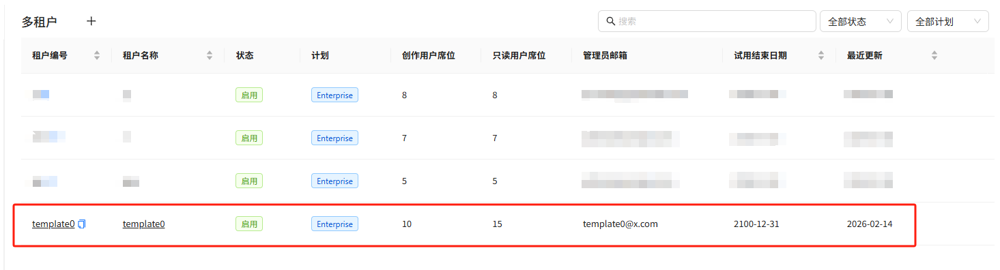
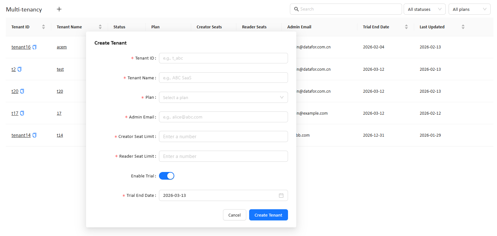
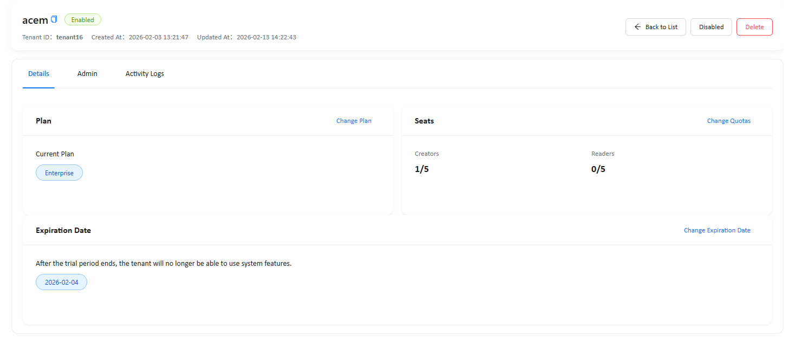
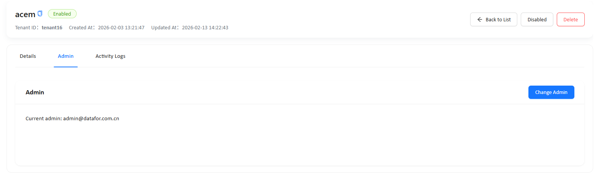
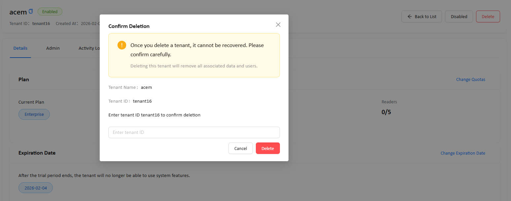

---

title: Multi-tenancy
permalink: /documentation/Multi-tenancy/Multi-tenancy/

---

# Multi-tenancy

This document is intended for **Super Admin** users. It explains how to use Datafor’s **Multi-tenancy** feature to create tenants, configure entitlements (**Plan / Seats / Trial End Date**), maintain tenant administrators, enable/disable tenants, review audit logs, and delete tenants.

## 1. Overview

**Multi-tenancy** is Datafor’s centralized tenant management console. Super Admins can manage multiple tenants from one place. Typical tasks include:

- Creating a tenant for a new customer and setting up a trial period
- Assigning a subscription plan (**Plan**) and seat quotas (**Creator / Reader Seats**)
- Maintaining the tenant administrator (**Admin Email**)
- Enabling / disabling a tenant
- Viewing tenant change audit logs (**Activity Logs**)
- Deleting a tenant (irreversible)

## 2. Access and Permissions

### 2.1 Permission Requirements

Only users logged in with a **superAdmin account** can see the **Multi-tenancy** menu in system settings.

> Important: If you upgrade the system using an **upgrade package**, you must **manually create** the **`superAdmin`** account. The upgrade process does not automatically create this account.

### 2.2 Navigation Path

**Settings → System → Multi-tenancy**

## 3. Tenant List Page

After entering Multi-tenancy, the system displays the tenant list by default. This page provides an overview and helps you quickly locate tenants.

### 3.1 Column Descriptions

The list typically includes the following columns:

- **Tenant ID**: The unique identifier of the tenant. Use the copy icon next to the Tenant ID to copy the tenant URL (see Section 11).
- **Tenant Name**: The tenant name (click to open tenant details)
- **Status**: Tenant status (e.g., Enabled)
- **Plan**: Subscription plan (e.g., Enterprise, Pro)
- **Creator Seats**: Total creator seat quota
- **Reader Seats**: Total reader seat quota
- **Admin Email**: Tenant administrator email
- **Trial End Date**: Trial end date / expiration date
- **Last Updated**: Most recent update time

### 3.2 Search and Filters

The top-right of the list page provides:

- **Search**: Search by keywords such as Tenant ID / Tenant Name / Admin Email
- **All statuses**: Filter by status
- **All plans**: Filter by plan

### 3.3 Create Tenant Entry (“+”)

Click the **“+”** button to the right of the **Multi-tenancy** page title to open the **Create Tenant** dialog and create a new tenant (see Section 4).

### 3.4 Tenant Template (template0)

In the tenant list, you may see a tenant named **template0** (as shown in the screenshot). It is a built-in **Tenant Template** used to initialize new tenants.

> Important: If you upgrade the system using an **upgrade package**, the tenant template (**template0**) is **not created automatically**. You must **manually create** the tenant template before creating new tenants.

- **Default behavior**: When you create a new tenant, the system **copies (clones) template0** to generate the tenant’s initial content and default configuration.
- **Copy scope**: The system typically copies a “ready-to-use initial tenant baseline”, which may include (but is not limited to):
  - **White-label configuration**: brand name, logo, theme color/appearance, etc.
  - **Data sources**: configured connections and related settings
  - **Analytic models**: published/available models and semantic configurations
  - **Sample pages / sample content**: sample reports, dashboards/pages, demo assets and folder structure
- **Impact**: Changes to **template0** typically affect **new tenants created after the change**. Existing tenants usually do not automatically inherit these changes.

> Recommendation: Treat **template0** as a system template tenant. Avoid using it as a real customer tenant. If you need to change the “default content/configuration for new tenants”, update template0 carefully, assess impact, and verify the initialization result by creating a new tenant.

### 3.5 Copy Tenant URL (from Tenant ID)

On the tenant list page, the **copy** button next to a **Tenant ID** is used to copy the tenant’s URL. 

## 4. Create Tenant

On the tenant list page, click **“+”** to open the **Create Tenant** dialog.

### 4.1 Steps

1. Click **“+”**
2. Fill in the required fields (marked with `*`)
3. Click **Create Tenant** to create the tenant
   - To cancel: click **Cancel**

### 4.2 Field Descriptions (Create Tenant)

| Field                  | Required                       | Description                                                  |
| ---------------------- | ------------------------------ | ------------------------------------------------------------ |
| **Tenant ID**          | Yes                            | The tenant’s unique identifier. Use a short, readable format such as letters/numbers/underscores (e.g., `tenant16`, `t_abc`). |
| **Tenant Name**        | Yes                            | The tenant display name (e.g., “ABC SaaS”).                  |
| **Plan**               | Yes                            | Subscription plan (dropdown). After creation, you can adjust it via **Change Plan** on the tenant details page. |
| **Admin Email**        | Yes                            | Email address of the tenant’s **admin account**. After creation, you can update this email on the **Admin** tab via **Change Admin**. |
| **Creator Seat Limit** | Yes                            | Maximum number of Creator seats for the tenant.              |
| **Reader Seat Limit**  | Yes                            | Maximum number of Reader seats for the tenant.               |
| **Enable Trial**       | No                             | Whether to enable trial mode (toggle).                       |
| **Trial End Date**     | Required when trial is enabled | The trial end date (date picker).                            |

### 4.3 Recommendations and Notes

- **Tenant ID must be unique**: Use a consistent naming convention (e.g., `tenant_<customer_short_name>`).
- **Seat limits should be integers**: Set Creator/Reader limits according to your licensing or contract terms.
- **Global license seat cap**: The **sum of seat quotas across all tenants** (Creators / Readers) **must not exceed** the seat count allowed by the system license. Before increasing quotas for a tenant, confirm your remaining license capacity.
- **Trial settings**: If trial mode is enabled, ensure **Trial End Date** is set correctly to avoid unexpected expiration.
- **New-tenant baseline**: New tenants are initialized by copying the tenant template **template0** (see 3.4).

## 5. Tenant Details Page
Click **Tenant Name** or **Tenant ID** on the list page to open the tenant details page. The details page typically includes three tabs:

- **Details**: Plan, seats, and expiration date
- **Admin**: Administrator maintenance
- **Activity Logs**: Audit logs

Common action buttons in the top-right corner:

- **Back to List**: Return to the tenant list
- **Disabled**: Disable the tenant (when the tenant is currently Enabled)
- **Enabled** (may appear after disabling): Re-enable the tenant
- **Delete**: Delete the tenant (irreversible)

## 6. Details: Plan, Seats, and Expiration Date

The **Details** tab is used to manage a tenant’s core entitlements.

### 6.1 Change Plan

- View: **Current Plan**
- Update: Click **Change Plan**, select a new plan, and save

> Recommendation: Plans may control feature entitlements. Ensure changes align with your commercial policy.

### 6.2 Change Seats (Quotas)

The Seats section shows **used/total** (e.g., Creators 1/5, Readers 0/5).

- Update: Click **Change Quotas**
- Items:
  - **Creators**: Total creator seat quota
  - **Readers**: Total reader seat quota

> Notes:
>
> - The **sum of seat quotas across all tenants** (Creators / Readers) must not exceed the system license seat count. If it exceeds the license, the system may block saving, prevent further allocation, or display a “license invalid/expired” warning depending on your enforcement settings.

### 6.3 Change Expiration Date (Expiration / Trial End)

- View: The current date is shown in the Expiration Date area
- Update: Click **Change Expiration Date** to set a new date

## 7. Admin: Update the Tenant Admin Account Email

- In the **Admin** tab, you can view and update the email address of the tenant’s **admin account**.
  - View: **Current admin account email:** **xxx@xxx.com**
  - Update: Click **Change Admin**, enter the new email address, and save

> Note: **Change Admin updates the email of the tenant’s admin account** (i.e., it changes the *email address* associated with that admin account for the tenant).

## 8. Activity Logs: Audit and Tracking

The **Activity Logs** tab displays key changes for the tenant, useful for auditing and troubleshooting.

### 8.1 Column Descriptions

- **Time**: When the action occurred
- **Action**: Action type

### 8.2 Common Action Examples

You may see records such as:

- **add**: Tenant created
- **enabled / disabled**: Tenant enabled/disabled
- **expireDay**: Expiration date changed
- **email**: Admin email changed (or an email-related admin action)

### 8.3 Search and Pagination

- **Search** (top-right): Filter logs by keyword
- Pagination (bottom): Browse additional log pages

## 9. Enable / Disable Tenant

On the tenant details page (top-right):

- Click **Disabled** to disable the tenant (suspend access)
- After disabling, the button may change to **Enabled** to re-enable the tenant

**Recommended practice:**

- Use **Disabled** for expired, suspended, or temporarily inactive tenants.
- Before deleting a tenant, disable it first and observe for a period to confirm there is no retention or recovery requirement.

## 10. Delete Tenant (Irreversible)

Deleting a tenant is a high-risk operation: it **cannot be undone** and will remove the tenant’s **users and associated data**.

### 10.1 Steps

1. On the tenant details page, click **Delete**
2. The **Confirm Deletion** dialog appears
3. Verify the prompt information (Tenant Name / Tenant ID)
4. Enter the specified **Tenant ID** in the input box (e.g., `tenant16`)
5. Click **Delete** to confirm
   - To cancel: click **Cancel**

### 10.2 Pre-deletion Checklist (Recommended)

- Confirm whether you need to back up/export data (based on your deployment and ops policy)
- Ensure internal approval or ticket records are completed
- Notify the customer/admin if required
- Consider using **Disable** instead of **Delete** (often safer)

## 11. Tenant URL and Default Admin Credentials

### 11.1 Tenant URL

- Tenant URL format:
  - `http://<IP>:48480/datafor/t/<TENANT_ID>`
  - Example: `http://<IP>:48480/datafor/t/tenant16`
- You can click the **copy** icon next to **Tenant ID** on the tenant list page to copy the full tenant URL.

### 11.2 Default Tenant Admin Account

For each tenant, the built-in tenant administrator account is:

- **Username**: `admin`
- **Default password**: `password`

> Security recommendation: Change the default password after first login and follow your organization’s password policy.

## 12. FAQ

### Q1: Why can’t I see Multi-tenancy?

Only **superadmin** users can see this menu. Confirm you are logged in with the correct account and permissions.

### Q2: What happens when Trial End Date / Expiration Date is reached?

The UI indicates the tenant will not be able to use system features after expiration. The exact scope of restrictions depends on how the system enforces expiration.

### Q3: How do I quickly find a tenant?

Use **Search** on the list page and enter Tenant ID / Tenant Name / Admin Email. You can also refine results using **All statuses** and **All plans**.

### Q4: Can a deleted tenant be restored?

No. Deletion removes tenant data and users, and requires strong confirmation (entering the Tenant ID).