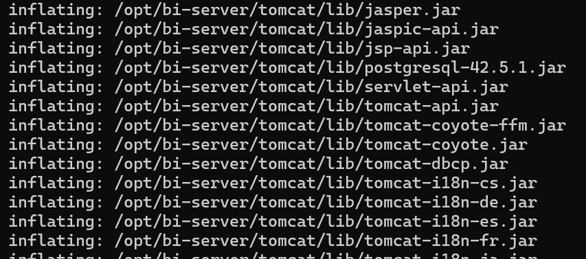
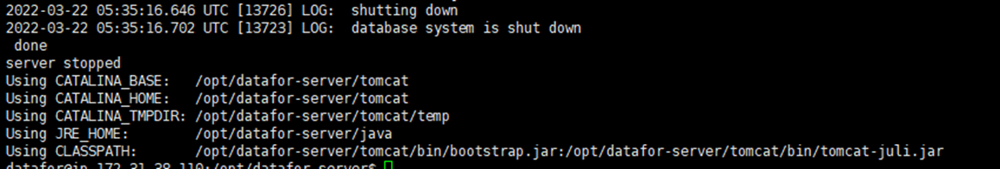
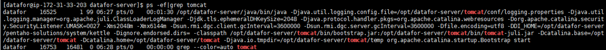

# Datafor Installation (CentOS)

**Step 1. Switch to the root user**

```
sudo su root
```

<div align="left"></div>

**Step 2. Create the 'Datafor' user group**

```
groupadd Datafor
```

<div align="left"></div>

**Step 3. Create the 'Datafor' user, add it to the 'Datafor' user group, and set the user password to 'Datafor' as well.**

```
adduser Datafor -g Datafor
passwd Datafor
```

<div align="left"></div>

**Step 4. Navigate to the directory containing the installation package and extract the package to the /opt directory.**

```
unzip -o Datafor-server_202203240605.zip -d /opt/
```

<div align="left"></div>

**Step 5. After extracting, go to the /opt/ directory and modify permissions.**

```
cd /opt/
chmod -R 700 Datafor-server
chown -R Datafor Datafor-server
chgrp -R Datafor Datafor-server
```

<div align="left"></div>

**Installation completed.**


## Start Datafor

**Please operate as the 'Datafor' user**

```
su Datafor
cd /opt/Datafor-server/
```

**Start the service**

```
./start-Datafor.sh
```

<div align="left"></div>

**Stop Service**

```
./stop-Datafor.sh
```

<div align="left"></div>

**Check Service Start/Stop Status**

```
ps -ef|grep tomcat
```

<div align="left"></div>

If the command produces the above output, it indicates that the service is in a running state.


## Login

URL:  `http://localhost:28080/`

username  /  password

- `admin` / `password`
- `demo` / `demo`

## Update the System

Place the update package `Datafor-upload.jar` in the `Datafor-server\update` folder and restart the system.