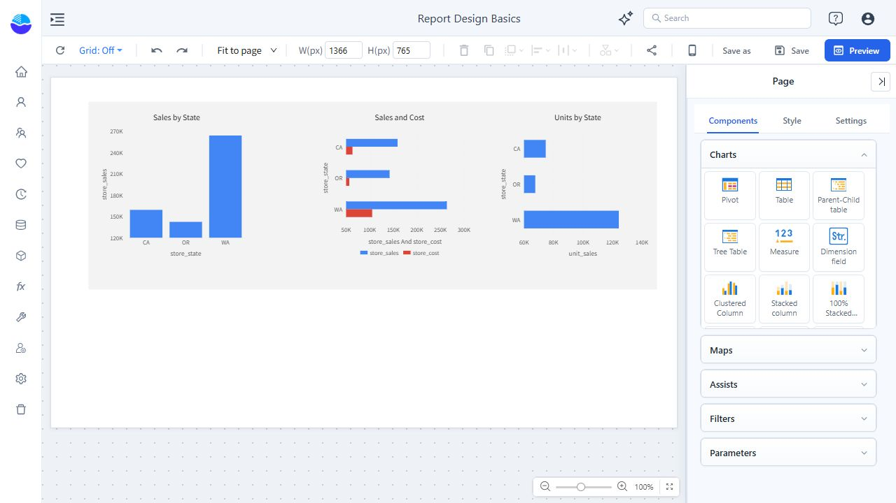
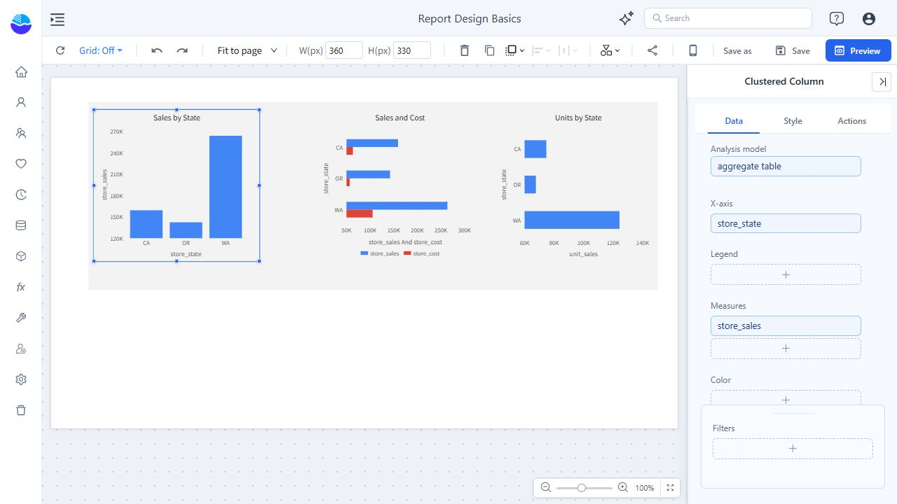
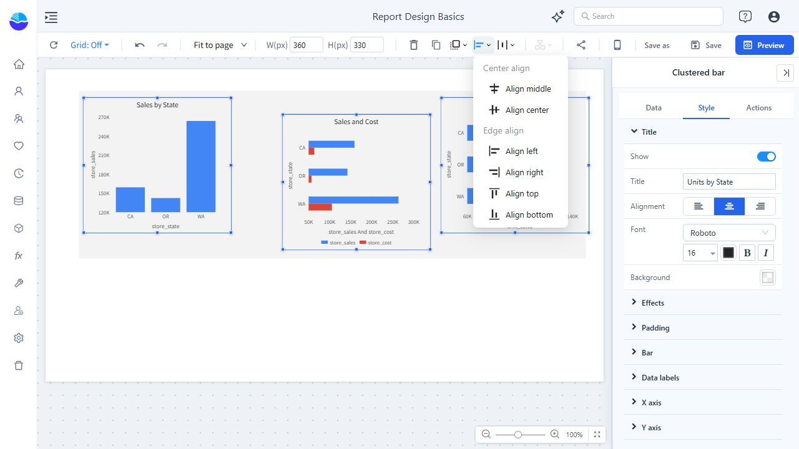
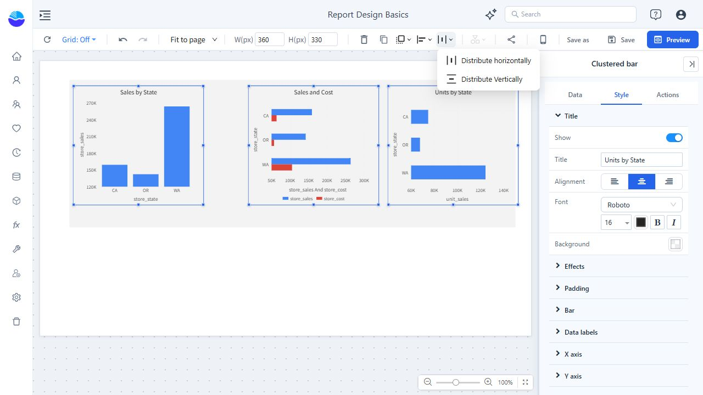
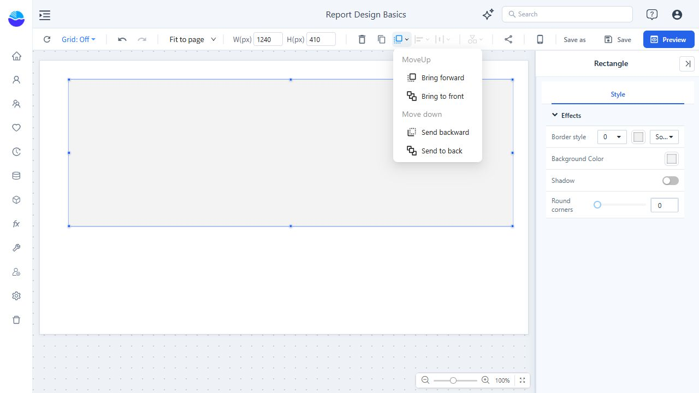
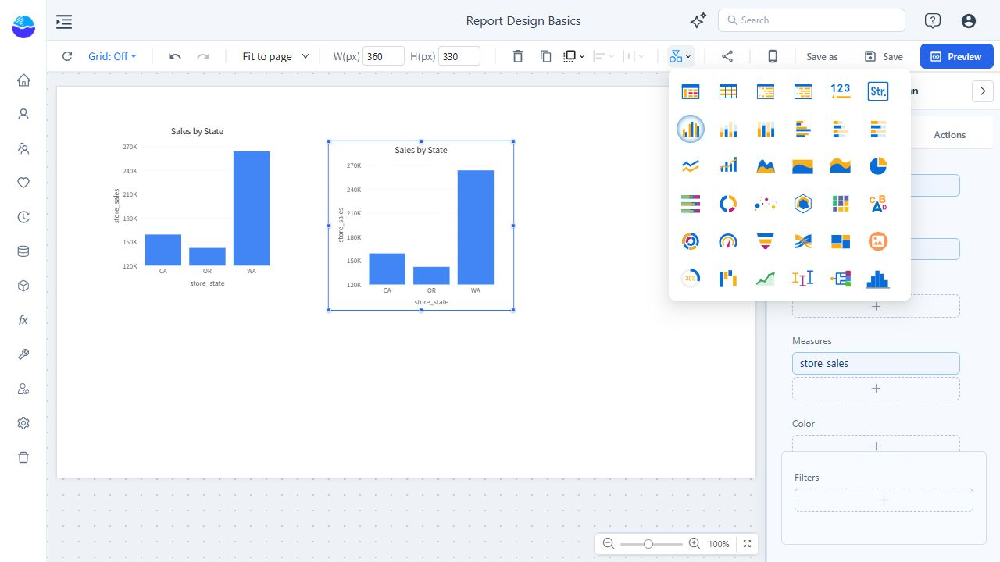

# Basic Operations for Report Design

Use this guide to arrange components on a report page, reuse a configured chart, and check your work before saving. A **component** is an item on the canvas, such as a chart, filter, text box, or rectangle.

You need a report you can edit. To populate a chart, you also need access to an analysis model with category fields and measures. If you have not prepared a model yet, start with [Create Your First Analysis Report](/documentation/Start/Create-Your-First-Analysis-Report/).

## Open the designer and understand selection

From **Home**, click **Create Report** to start a blank report. For an existing report, open it from **Personal** or **Public**, then click **Edit**.

The designer has three main working areas:

| Area | What you use it for |
| --- | --- |
| Canvas | Place components and select the items you want to change. |
| Top toolbar | Set dimensions, copy or delete components, arrange them, and access **Save** and **Preview**. Hover over an icon to see its name. |
| Right panel | Add components when the page is selected, or configure the selected component's data and appearance. |

**Selection determines what you are editing.** Click a component to select it; its outline and resize handles appear. Hold **Ctrl** and click additional components to select several. Click an empty area of the canvas to return to the page.

Check the heading at the top of the right panel before changing anything:

- **Page** means you are editing the page. The toolbar's **W(px)** and **H(px)** values are the page dimensions.
- A component type, such as **Clustered Column**, means you are editing that component. **W(px)** and **H(px)** now refer to its width and height.

## Add a chart and give it data

1. Click an empty area of the canvas to show **Components** in the right panel.
2. Expand **Charts** and click **Clustered Column**.
3. Click on the canvas to place the chart. Select it if its **Data** panel is not already open.
4. Under **Analysis model**, click **+**. Expand the model entry, select the analysis model beneath it, and click **Back**.
5. Under **X-axis**, click **+**, expand the field group, select a category field, and click **Back**.
6. Under **Measures**, click **+**, select a numeric measure, and click **Back**.

The example below uses the existing `aggregate table` model, `store_state` as the category, and `store_sales` as the measure. Use equivalent fields from your own model; these sample names are not required.

Check that the chart shows the expected categories and values before adjusting its layout. A newly placed chart still needs field assignments; placing it on the canvas does not configure its data.

To give the chart a readable title, open **Style**, expand **Title**, and edit the title text. For other chart types and field arrangements, see [Adding Charts](/documentation/Visualization/Adding-Charts/).

## Move and resize components

Select a component, then drag it to a new position. For charts, the title area is a convenient place to start dragging. To move several components together, select them with **Ctrl** first.

To resize a selected component:

- Drag a corner or edge handle for a visual adjustment.
- For an exact size, enter **W(px)** and **H(px)** in the top toolbar and press **Enter** after each value. For example, the charts in this guide are **360 × 330 px**.

Check the resulting title, axis labels, and legend. A component can fit the available space while leaving too little room for its contents.

For page dimensions and display modes, see [Report Page Size and Display Settings](/documentation/Visualization/Size-Display/).

## Copy a component and adapt it

Use a copy when another chart needs the same model, fields, size, or styling.

1. Select the component.
2. Click **Create copy** in the top toolbar, shown as two overlapping sheets.
3. Move the new copy away from the original. It initially appears slightly offset and can overlap the original.
4. Select the copy and review **Data**. Change its fields as needed, then update **Style → Title**.

For example, copy **Sales by State**, keep `store_state`, and use `unit_sales` to make **Units by State**. In the field picker, selected fields have a check mark. Deselect the old measure if you want to replace it; adding another measure can leave both measures in the chart.

Changing only the title does not change what the chart calculates. Always check the field assignments in the copy.

## Align a row and make its spacing even

**Alignment** puts component edges or centers on the same line. **Distribution** makes the spacing between components even. For a row of charts, use both operations.

1. Give the charts a consistent size.
2. Position the first and last charts where you want the row to start and end.
3. Hold **Ctrl** and select each chart in the row.
4. Open the alignment menu in the top toolbar and choose **Align top**.

5. With at least three components selected, open the distribution menu beside the alignment menu and choose **Distribute horizontally**.

The charts should now have a shared top edge and even gaps. For a column, use **Align left** and **Distribute Vertically**. If the controls are disabled, check that you have selected multiple components. Select the charts themselves, excluding any background shape.

## Control which component appears in front

Layer order matters when components overlap. For example, a rectangle used as a background should sit behind the charts.

Select the component and open the layer-order menu in the top toolbar, shown as overlapping squares:

| Command | Result |
| --- | --- |
| **Bring forward** | Move the component one step toward the front. |
| **Bring to front** | Place it in front of the other components. |
| **Send backward** | Move it one step toward the back. |
| **Send to back** | Place it behind the other components. |

To create a background, add **Components → Assists → Rectangle**, size and position it, then choose **Send to back**. Set its color under **Style → Effects → Background Color**.

Layer order changes what covers what; it does not align or reposition components. If an overlapping shape prevents you from selecting a chart, select the shape and send it behind the chart.

## Switch a chart to another type

1. Select one chart.
2. Open the chart-type menu in the top toolbar, shown as a circle, triangle, and square.
3. Choose the target type. For example, change **Clustered Column** to **Clustered bar**.
4. Review **Data** and the rendered chart after the change.

For the column-to-bar example, the model and measure remain assigned, and `store_state` moves from **X-axis** to **Y-axis**. Check the field slots required by the target type, as well as its title, labels, and legend, before continuing. Do not assume every chart type uses the same field arrangement.

## Delete, recover, preview, and save

To remove components, select them and press **Delete**, or use the trash icon in the top toolbar. If you remove the wrong component, click **Undo** while the action is still available in the current editing session. Undo also lets you reverse a recent move or resize.

Before finishing:

1. Click **Preview** to inspect the report without the editing panels. Check for overlap, clipped titles or labels, and unexpected data.
2. Click **Edit** to return to the designer and make any adjustments.
3. Click **Save**. For a new report, choose **Personal** or the intended destination folder, enter a **File name**, and click **Save** in the dialog.
4. Reopen the report from its saved location and check that the layout and field assignments are present.

Preview is a viewing step; use **Save** to keep your edits. For a separate layout designed for phones, continue with [Mobile Layout View](/documentation/Visualization/Mobile-Layout-View/).
