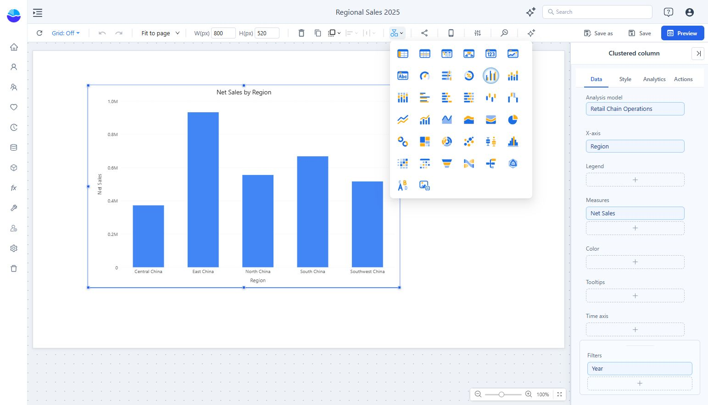

# Basic Operations for Report Design

Select an item before editing it. The heading above the right panel tells you whether you are changing the **Page** or a component.

## Select and configure

- Click empty canvas space to edit the page or add a component.
- Choose a component in **Components**, then click the canvas to place it.
- Click a component to show its settings. Charts provide **Data**, **Style**, and **Actions**; supported charts also provide **Analytics**.
- Hold **Ctrl** while clicking to select several components.

Use **Data** to select the model, fields, and component filters. Use **Style** for appearance, **Analytics** for reference lines and bands, and **Actions** for interactions.

## Move, resize, and arrange

Drag a selected component to move it; drag a handle to resize it. For precise dimensions, enter **W(px)** and **H(px)** in the toolbar and press **Enter**. With the page selected, these fields change the page dimensions instead.

The toolbar also provides copy, layer order, alignment, and distribution. Align selected components to share an edge or center. Use distribution for even spacing across three or more components. Put background shapes behind charts with **Send to back**.

Hover an icon to identify its command. A disabled command usually requires a different selection.

## Reuse or change a chart

Use the copy icon to duplicate a component, then review the copy's model, fields, filters, and title.

To change type, select one chart and open the toolbar's chart-type menu (circle, triangle, and square). Choose the target, then review its **Data** panel. For example, a column chart's category and measure become **Fields** when converted to **Table**.

Conversion can change which settings and field slots apply. Check the result before saving.

## Preview and save

Use **Preview** to test readability and interactions; use **Edit** to return. **Save** persists the report. **Save as** creates a separate report.

Undo and redo are editing-session tools. Save a separate copy before making extensive changes to a report you need to keep.

For a complete worked example, follow [Create Your First Analysis Report](/documentation/Start/Create-Your-First-Analysis-Report/).
