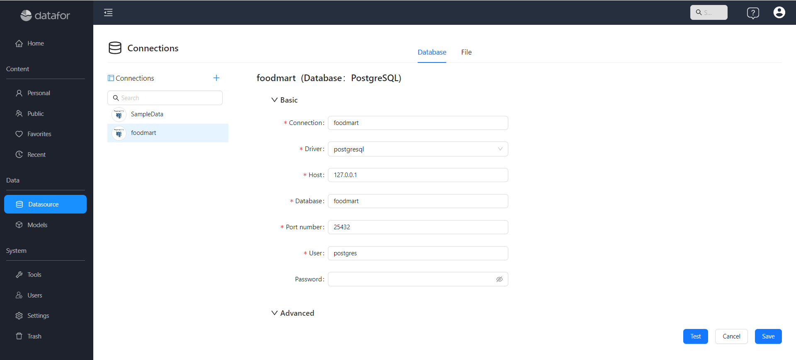
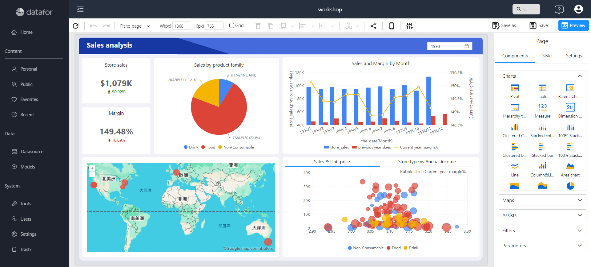

# **Create Your First Analysis Report**

Creating an analysis report in **Datafor** requires just **3** simple steps.

---

## **Step 1: Connect to a Data Source**
Before creating an analysis report, you need to connect a data source. Datafor supports various databases and file-based data sources.

1. Navigate to **Data Source** in the main menu.
2. Click **Add Data Source** and select the appropriate database.
3. Enter the required connection details such as host, port, username, and password.
4. Test the connection to ensure the data source is accessible.
5. Click **Save** to add the data source to Datafor.

## **Step 2: Create an Analysis Model**
The analysis model defines the structure and relationships of your data for report generation.

1. Navigate to **Models**.
2. Click **New** to open the model designer.
3. Select the datasource and schema, then add the required tables.
4. Define and verify relationships, Dimensions, Attributes, Hierarchies, and Measures.
5. Review **Model diagnostics**, then click **Save**.

See [Creating an Analysis Model](/documentation/Model/Creating-an-Analysis-Model/) for the current designer workflow.

## **Step 3: Create an Analysis Report**
Once the data model is ready, you can use Datafor’s visualization tools to build a report.

1. Navigate to the **Reports** section and click **Create New Report**.
2. Select the dataset or model you created earlier.
3. Choose the appropriate visualization type (e.g., table, bar chart, pie chart, etc.).
4. Drag and drop fields to customize the report layout.
5. Apply filters and sorting options to refine the analysis.
6. Click **Save** and give your report a meaningful name.

---

## **Summary**
By following these three steps, you can quickly create an analysis report in **Datafor**.  

- **Connecting to a data source** ensures that your analysis is based on accurate and updated data.  
- **Creating an analysis model** allows you to structure and manage data relationships for better insights.  
- **Building an analysis report** enables you to visualize and interpret data effectively.  
