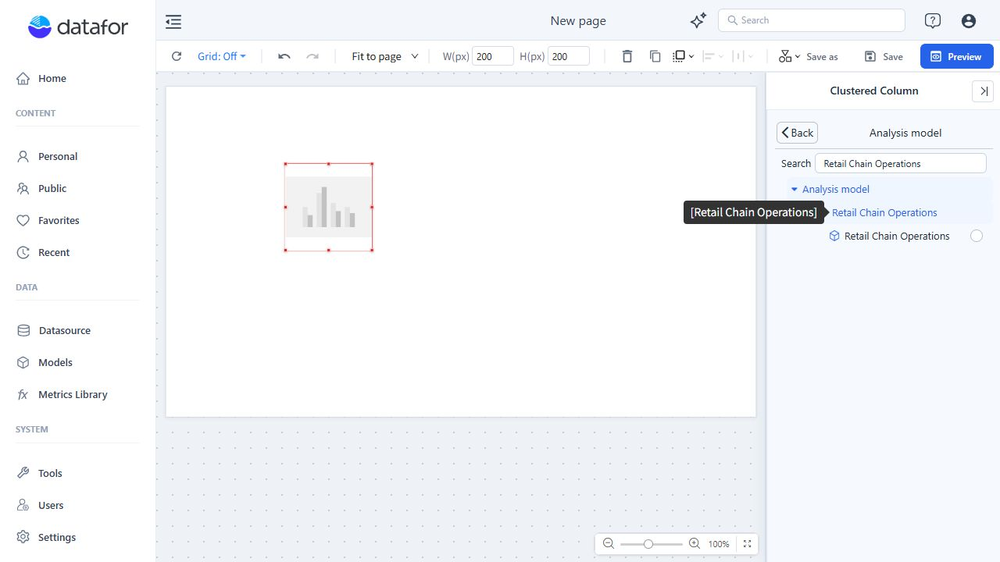
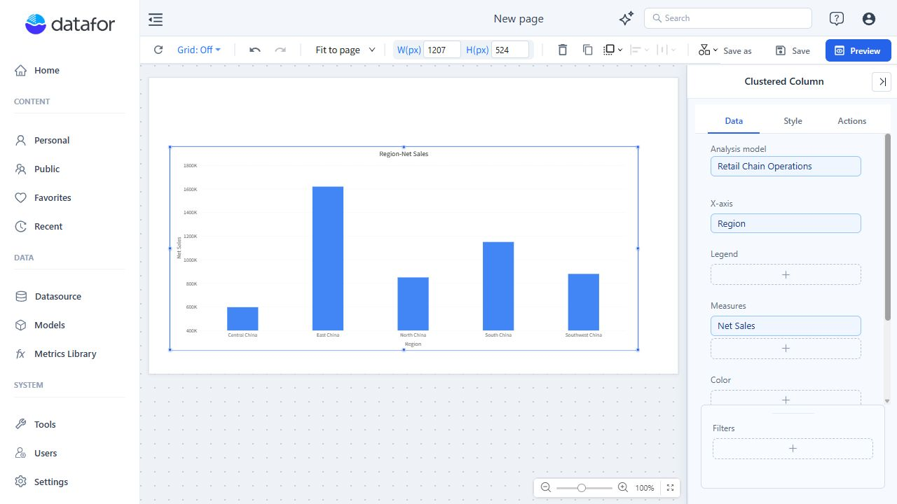
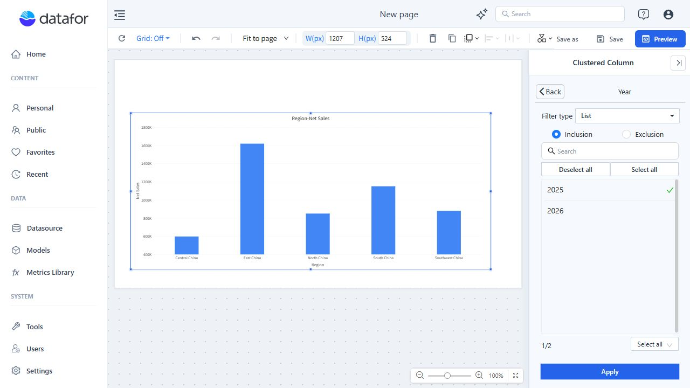
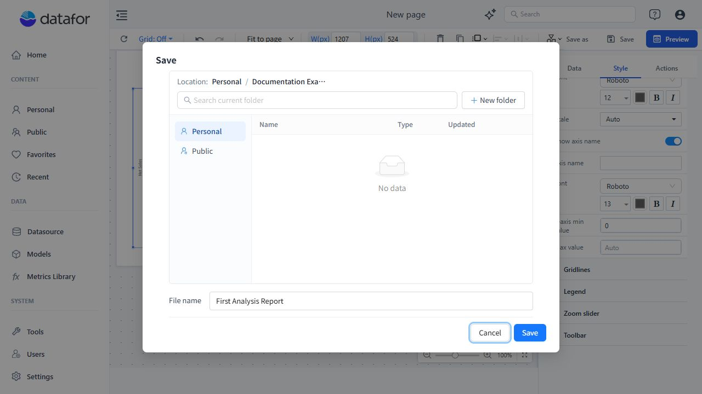
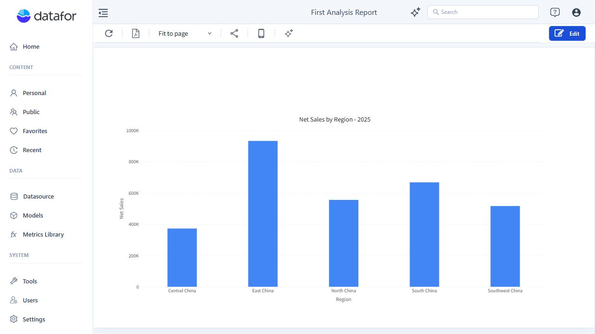

# Create Your First Analysis Report

Build a column chart that answers **"How much net sales did each region generate in 2025?"** You will select an analysis model, assign fields, apply a year filter, and save a report that you can reopen.

The screenshots use the **Retail Chain Operations** example model. This model is not guaranteed to be present in every installation. You can follow the same workflow with your own model using an equivalent region field, sales measure, and year field.

## Before you start

You need:

- An account that can create reports and save them in the intended folder.
- Access to a saved analysis model whose underlying datasource is available.
- A grouping field, a numeric measure, and a year containing data. For this walkthrough, use **Region**, **Net Sales**, and **Year = 2025**.

If a model is already available, go straight to step 1. You do not need a new database connection or a new model for every report.

If you are starting from source data:

1. Open **Datasource** and connect a [supported database](/documentation/Datasource/Supported-Databases/) or import a [file dataset](/documentation/Datasource/File-Dataset/). For a worked database connection example, see [Configuring MySQL Data Source](/documentation/Datasource/Configuring-MySQL-Data-Source/).
2. Open **Models → New** and follow [Creating an Analysis Model](/documentation/Model/Creating-an-Analysis-Model/). Define the required relationships, grouping fields, and measures; review diagnostics and save.
3. Check a representative total against a trusted source before using the model in a report. A successful connection test alone does not validate joins or calculations.

## 1. Open the designer and place a chart

1. Open **Home** and click **Create Report**. A blank **New page** opens in the report designer.
2. In the right-hand **Components** panel, expand **Charts** if needed and click **Clustered Column**.
3. Click an empty position on the white page to place the component. Choosing a component type alone does not place it on the page.
4. Select the component. The right panel changes from page settings to the chart's **Data**, **Style**, and **Actions** tabs.

The initial chart is a placeholder. It needs an analysis model and fields before it can display your data. Drag its border handles to give it enough room; you can refine the size after the data appears.

## 2. Choose the analysis model

1. On the chart's **Data** tab, click **+** under **Analysis model**.
2. Find your model. To search, enter the model name and press **Enter**.
3. Expand the model entry, then select the specific model beneath it using its selection circle. In this example, both the parent entry and the selectable model are named **Retail Chain Operations**.
4. Click **Back**. Confirm that **Retail Chain Operations** now appears under **Analysis model**.

Select the model for the component you are configuring. A model being listed in the picker does not mean it has been assigned to the chart.

## 3. Assign a dimension and a measure

For this chart, the dimension determines the categories and the measure determines each column's height.

| Data slot | Example selection | Purpose |
| --- | --- | --- |
| **X-axis** | **Store → Region** | One category for each region |
| **Measures** | **Sales → Net Sales** | The model's net-sales measure for each region |
| **Legend** | Leave empty | A second grouping is unnecessary for this first chart |

1. Click **+** under **X-axis**. Expand **Store**, select **Region**, and click **Back**.
2. Click **+** under **Measures**. Expand **Sales**, select **Net Sales**, and click **Back**.
3. Wait for the query to finish. Confirm that the Data panel shows the intended model and fields, and that columns appear on the page.

At this point, no year filter has been added. The chart can include data from multiple years. Use the existing **Net Sales** measure rather than substituting a similarly named raw field: the selected measure carries the model's aggregation and calculation logic.

## 4. Limit the chart to one year

1. Keep the chart selected. At the bottom of **Data**, click **+** in **Filters**.
2. Expand **Date** and select **Year**.
3. Keep **Filter type** set to **List** and choose **Inclusion**.
4. Select **2025** only. If other values are already selected, use **Deselect all** first. The example shows **1/2**, meaning one of the two available years is selected.
5. Click **Apply**, then **Back**. Confirm that **Year** appears in the chart's **Filters** area and that the chart has refreshed.

If your data does not include 2025, choose a year that does and use that year in the report title. This is a **component-level filter**: it applies to this chart, not automatically to every component on the page. It is also not a substitute for data-access permissions.

## 5. Make the result readable

1. Resize the selected chart using its border handles so the region labels and values have enough space.
2. Open **Style → Title** and enter `Net Sales by Region - 2025`, using the year you actually selected.
3. Open **Style → Y axis** and set **Y-axis min value** to `0` for this non-negative sales column chart. This keeps the column lengths comparable from a common zero baseline; leave **Max value** on **Auto**.

The title describes the chart; changing the title does not change the filter. Check both whenever you change the reporting period.

## 6. Save, preview, and reopen

1. Click **Save** in the top toolbar.
2. Choose **Personal** for your first draft, then open a folder. You can use **New folder** to create one; the example uses **Documentation Examples**.
3. Enter `First Analysis Report` in **File name** and click **Save**. Wait for saving to finish and for the page header to show the report name.

4. Click **Preview** to see the report without the designer panels. Hover over columns to inspect values.
5. Open **Personal**, navigate to the folder you chose, and reopen **First Analysis Report**. Confirm that the chart and its year filter were saved. Use **Edit** when you need to return to the designer, and save again after making changes.

### Check your result

- The example model returns columns for Central China, East China, North China, South China, and Southwest China. Your categories and amounts may differ with your data and permissions.
- The measure is **Net Sales**, not a count of sales records or a different sales measure.
- **Year** contains only the intended year, and the title agrees with it.
- At least one value has been checked against a trusted query or report using the same metric definition and filters. A chart rendering successfully does not prove that its business calculation is correct.
- Reopening the saved report preserves the configuration. Before sharing, also test as an intended reader; an administrator's view does not demonstrate that the reader's permissions are correct.

## If something does not work

| Symptom | What to check |
| --- | --- |
| You cannot find the report-creation entry | Start from **Home → Create Report** and confirm that your account can create reports. |
| The chart remains a placeholder | Select the chart and check **Analysis model**, **X-axis**, and **Measures** on **Data**. |
| Your model or fields are missing | Confirm model access, saved model changes, the selected model, and the field's role as a grouping field or measure. |
| The chart becomes empty after filtering | Check that the chosen year contains data visible to you. Reopen **Year**, review the selected values, and click **Apply**. |
| Numbers look wrong | Check the measure, year filter, aggregation, model relationships, and the comparison query's scope. |
| You cannot save or find the report | Confirm the selected folder, file name, write permission, and completion of the save operation. Look in the same folder afterward. |

## Next steps

- [Basic Operations for Report Design](/documentation/Start/Basic-Operations-for-Report-Design/) for layout and component editing.
- [Component-Level Filtering](/documentation/Analysis/Component-Level-Filtering/) for more filtering options.
- [Data Security](/documentation/Datasource/Data-Security/) before giving different audiences access to the report.
