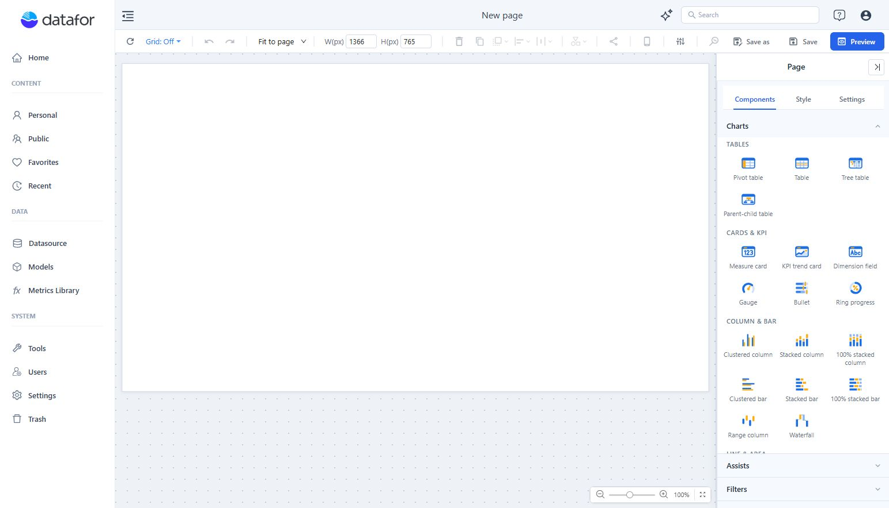
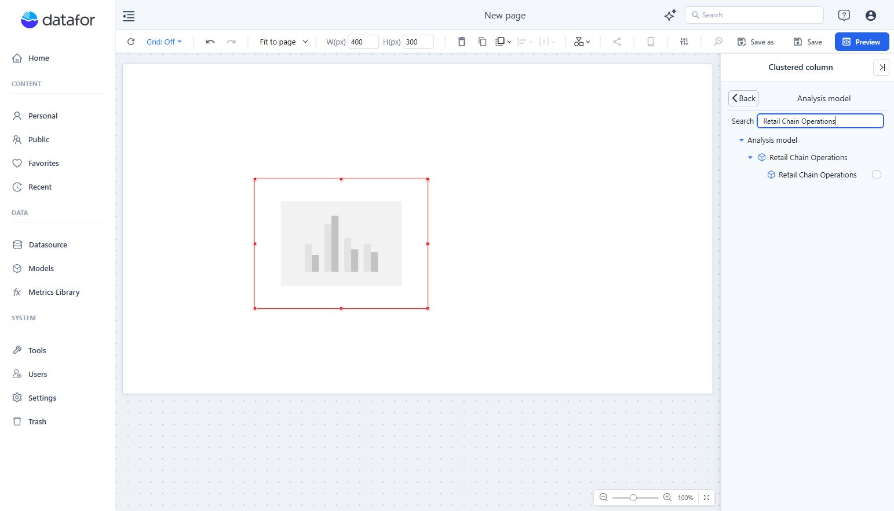
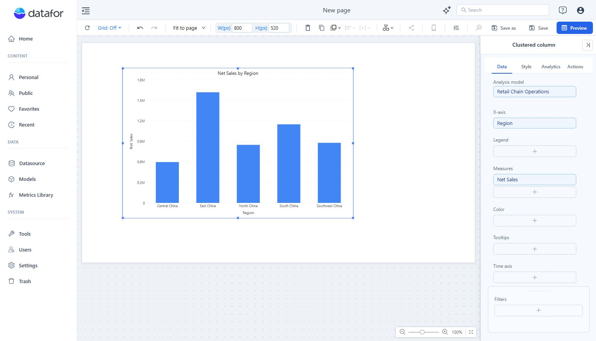
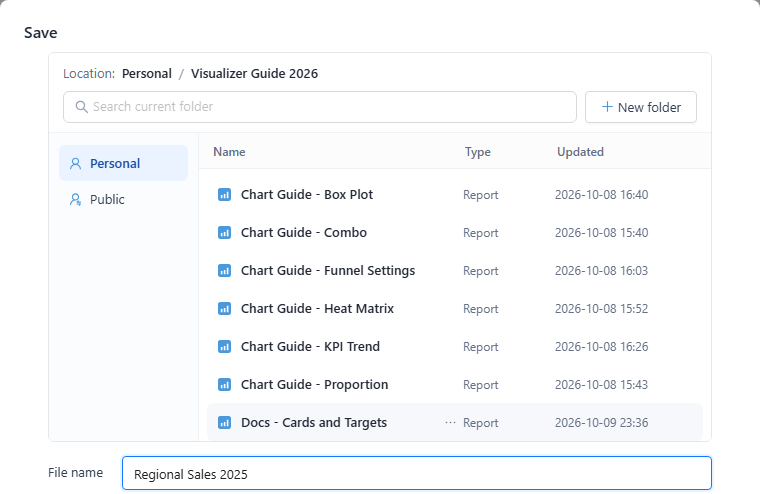

# Create Your First Analysis Report

Build a column chart of **Net Sales by Region**, filter it to **2025**, and save it for later use.

You need permission to create reports and access to an analysis model. This example uses **Retail Chain Operations**. If it is not installed, use your own category, sales measure, and year field.

## 1. Add a chart

1. From **Home**, click **Create Report**.
2. In **Components → Charts → Column & bar**, click **Clustered column**.
3. Click the canvas to place it, or double-click the tile instead. Select the chart to show its **Data** panel.

## 2. Connect the data

1. Click **+** under **Analysis model**.
2. Find your model and expand it. The upper entry is the analysis model and the entries beneath it are its cubes; here the only cube is also called **Retail Chain Operations**. Select the circle beside the cube, then click **Back**.
3. Click **+** under **X-axis**, expand the dimension group, select **Region**, and click **Back**.
4. Click **+** under **Measures**, expand **Sales**, select **Net Sales**, and click **Back**.

The chart now groups sales by region, and its title fills in as **Net Sales by Region**. Field names and folders come from your model.

## 3. Filter to one year

1. At the bottom of **Data**, click **+** in **Filters**.
2. Find and select **Year**.
3. Keep **Filter type → List** and **Inclusion**. Select **2025**.
4. Click **Apply**, then **Back**.

Check that the values change and **Year** appears under Filters. This condition belongs to this chart; it does not create a filter control for readers.

## 4. Arrange and check

Drag the chart to position it. Use its resize handles or the toolbar's **W(px)** and **H(px)** fields to change its size. Press **Enter** after entering a size.

Open **Style** to adjust the title, data labels, axes and colours; turned-on data labels show compact values such as *1.04M* (see [Display Units and Decimal Places](/documentation/Visualization/Display-Units/)). Click **Preview** to check the report without the editing panels, then **Edit** to return. A report that has never been saved asks you to save it first; see the next step.

## 5. Save

1. Click **Save**.
2. The dialog opens in **Personal** for a report created from Home. Open a subfolder, click **New folder**, or choose **Public** if you can write there. The example below saves into *Personal / Visualizer Guide 2026*.
3. Enter **Regional Sales 2025** as the **File name**, then click **Save** in the dialog. Names cannot contain `\ / : * ? " < > | [ ] + % # & = '`; the message lists the characters to remove.
4. Open the saved report and confirm that its chart and year filter remain present.

## Next steps

- Let readers choose the year or region with a [filter component](/documentation/Visualization/Filters/).
- Add a second chart and click a bar to [cross-filter](/documentation/Analysis/Cross-Filtering/) it.
- Let people open the report without signing in through a [share link](/documentation/Embedded/Share-link/).
- Arrange the report for phones in the [mobile layout](/documentation/Visualization/Mobile-Layout-View/).
