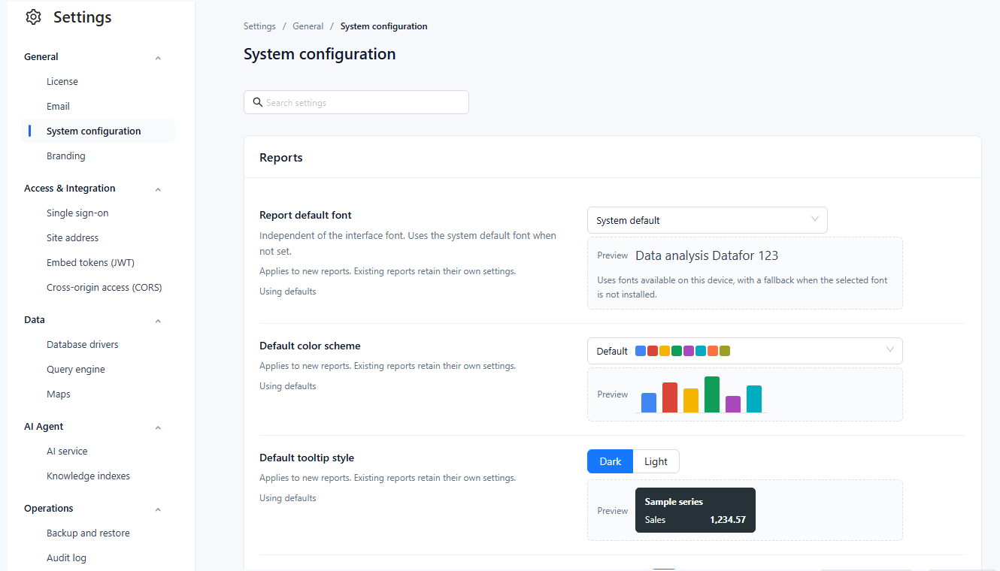

# System Configuration

**Settings › General › System configuration** holds tenant-wide defaults. Only administrators see it.

## Settings

Some settings only seed **new** reports or models; others apply to **all** reports after they are reopened.

| Group | Setting | Default | Applies to |
| --- | --- | --- | --- |
| **Reports** | **Report default font** | System default | New reports. Independent of the interface font. |
| | **Default color scheme**: Default, Classic, Color-blind friendly, Pastel, Paired, Dark | Default | New reports |
| | **Default tooltip style**: Dark, Light | Dark | New reports |
| | **Empty data message**: **Show** and **Text** (up to 100 characters) | Show on, text empty | New reports. Empty text shows *No data* in each viewer's language. |
| **Modeling** | **Default measure format**: **Number** (`#,##0`, `#,##0.0`, `#,##0.00`) and **Percentage** (`0%`, `0.0%`, `#,##0.00%`) | `#,##0.00` and `#,##0.00%` | New measures, after reopening the modeler. **Number** is used for new measures and calculated measures; **Percentage** only for a calculated measure created from a Metrics Library metric whose unit is %. |
| | **Default model cache expiration** (seconds, 0 = never) | 0 | New models, after reopening the modeler |
| | **First day of the week**: Monday, Sunday | Monday | All reports after reopening: "this week", "last week", date pickers, calendar chart. Match the model's week definition. |
| **Queries and refresh** | **Default chart query row limit** (100–200,000 rows) | 5,000 | All reports after reopening, unless the page sets its own **Max query records** |
| | **Minimum auto-refresh interval** (1–86,400 s) | 2 | All reports, including shared and embedded ones: shorter refresh intervals run at this value |
| **AI Agent** | **Auto-build knowledge index** | On | Later model saves and uploads (see below) |

New reports store the Reports values on their first **Save** or **Save as**; changing them here later does not change those reports. New reports also start with the table style **Minimal**, which is not configurable here.

Query timeout and concurrency are on the [Query engine](/documentation/System/Query-Engine/) page, linked from **Queries and refresh**. Reports wait for a query for the engine's query timeout plus 10 seconds.

## Auto-build knowledge index

With the switch on, saving a model in the modeler (also **Save as**), copying a model or importing a new model in a ZIP builds or updates its AI knowledge index in the background, as the user who saved. Failures do not block the save; follow progress in **Settings › AI Agent › Knowledge indexes**. Renaming a model does not trigger a build, and switching the option on does not rebuild existing indexes.

## Working on the page

- **Search settings** filters the rows by name and description.
- Each row shows **Using defaults** or **Custom**; a changed row shows its default and **Restore default**.
- **Save** sends only the changed settings; **Discard changes** drops them. Leaving the page with unsaved changes asks **Keep editing**, **Discard changes** or **Save and leave**.
- If another administrator saved in the meantime, nothing is overwritten: the latest values are loaded with your edits kept, and you review them before saving again.
- With **Settings › Operations › Audit log** recording **System settings changes**, every saved change is logged with its old and new value.

Settings are stored per tenant.

Related: [Settings Overview](/documentation/System/Settings-Overview/) · [Page Settings](/documentation/Visualization/Size-Display/) · [Fonts](/documentation/Console/Fonts/)
