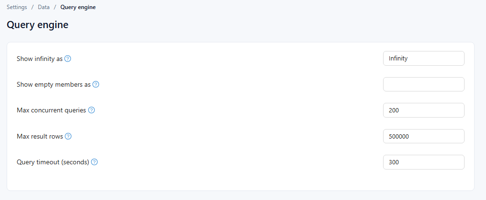

# Query Engine

**Settings › Data › Query engine** sets limits for the analysis engine that runs every report and AI query.

| Setting | Meaning |
| --- | --- |
| **Show infinity as** | Text shown for a division by zero or another infinite result, for example `Infinity` or `-` |
| **Show empty members as** | Text shown for members without a name |
| **Max concurrent queries** | Queries that may run at the same time; further queries wait |
| **Max result rows** | The most rows one query may return; 0 = no limit |
| **Query timeout (seconds)** | A query running longer is stopped; 0 = no timeout. Reports wait this long plus 10 seconds before showing *The query timed out*. |

**Reset to default** returns every engine setting to its factory value, including settings this page does not show. **Save** applies the changes.

A report page can lower the rows per component with **Page → Settings → Performance → Max query records**; the default for that is in [System Configuration](/documentation/System/System-Configuration/).

Related: [Empty Data and Error Messages](/documentation/Visualization/Empty-Data-and-Errors/)
