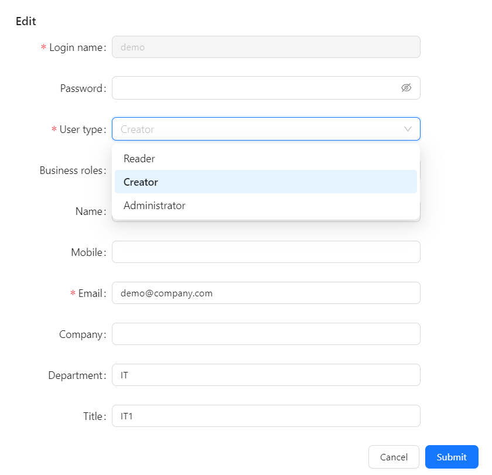

Administrators create users and assign each one a **User type**. The user type sets the account's basic capabilities, not its complete access to resources or data.

For how User Types, Business Roles, file/folder ACLs, RLS, and OLS combine, including conflict rules and audit guidance, see [Permission Evaluation Overview](/documentation/System/Permission-Evaluation-Overview/).

---

## 1. Opening the user form

1. In the left navigation, click **Users**.
2. On the **Users** tab, click **+** (**New**) to create a user. To edit an existing user, click the login name in the list.

---

## 2. Filling in the user form

The form has three sections.

**Account information**

- **Login name**: the unique sign-in name. It cannot be changed after the user is created.
- **Password**: required when creating a user. When editing, the field shows "Leave blank to keep the current password"; enter a value only to reset it.
- **User type**: required. See [Selecting a user type](#_3-selecting-a-user-type).
- **Email**: required; used for system notifications.
- **Active**: on by default. Turn it off to deactivate the account without deleting it.

**Permissions**

- **Business roles**: optional. See [Assigning business roles](#_4-assigning-business-roles-optional).
- **Enable AI Agent**: gives the user access to the AI Agent. The number of active users with this switch on is limited by the **AI users** capacity in your license; enabling one more than the license allows fails with "AI user limit exceeded".

**Profile**

- **Name**, **Mobile**, **Company**, **Department**, **Title**: optional.

---

## 3. Selecting a user type

Choose the user type from the **User type** dropdown:

| User type | Permission scope | Typical users |
|---|---|---|
| **Reader** | Can view granted content: reports, dashboards, files and models shared with the user. Cannot create or edit content. | Business users, executives |
| **Creator** | Can create content and edit content they own or have been granted edit access to; shared-resource ACLs and Data Security still apply. | Data analysts, report designers |
| **Administrator** | Has full system administration permissions, including users, permissions and settings. | IT admins, system operators |

The **User Type** tab on the **Users** page lists the same types with their permission scope. An administrator can change a user's type at any time by editing the user.

---

## 4. Assigning business roles (optional)

- **Business roles** group users into business audiences. Reference those roles in resource ACLs and Data Security policies to define access.
- All relevant memberships participate in evaluation. Adding a role can broaden access; a restrictive role is not automatically a denial of another role's grants. See the [conflict reference](/documentation/System/Permission-Evaluation-Overview/#_5-conflict-reference).

---

## 5. Saving

Click **Submit** to save.
