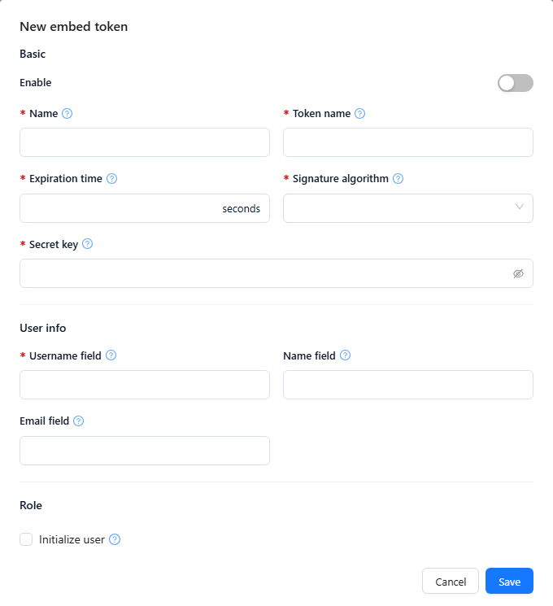

# JSON Web Token (JWT)

Embed tokens let an external system, such as an ERP or CRM, pass a signed JSON Web Token to Datafor so that its users are signed in without entering a Datafor password. Each embed token configuration defines how Datafor reads and verifies the token and which Datafor user it maps to.

## 1. Open the embed token list

Go to **Settings › Access & Integration › Embed tokens (JWT)**. The list shows:

| Column | Meaning |
| --- | --- |
| **Name** | Name of the configuration. Click it to edit the configuration. |
| **Enabled** | **Yes** or **No**. |
| **Last modified date** | Time of the last save. |
| **Creator** | User who created the configuration. |

Use the search box above the list to filter it.

## 2. Create or edit an embed token

1. Click **New embed token** at the left of the table toolbar, or click a configuration's **Name** to edit it (the dialog title is then **Edit** followed by the name).
2. Fill in the fields below. Fields marked * are required.
3. Click **Save**. A name that is already used shows "Name already exists".

**Basic**

| Field | What to enter | Notes |
| --- | --- | --- |
| **Enable** | Turn on to accept tokens for this configuration. | While it is off, the dialog shows "Token access is disabled. Enable token authentication before configuring this setting." |
| **Name** * | Unique name of the configuration, e.g. `ERP`. | |
| **Token name** * | Name of the field that carries the JWT in requests, such as an HTTP header or URL parameter, e.g. `token`. | |
| **Expiration time** * | Validity period of the token, in **seconds**, e.g. `86400` (24 hours). | |
| **Signature algorithm** * | Algorithm used to sign and verify the token: **HS256**, **HS384**, **HS512**, **RS256**, **RS384**, **RS512**, **ES256**, **ES384** or **ES512**. | Must match the external system. |
| **Secret key** * | Key used to sign and verify the token. | Keep it secret. |

**User info**

| Field | What to enter | Notes |
| --- | --- | --- |
| **Username field** * | Token field that holds the Datafor username, e.g. `loginname`. | |
| **Name field** | Token field that holds the user's full name, e.g. `name`. | |
| **Email field** | Token field that holds the email address, e.g. `email`. | |

**Role**

| Field | What to enter | Notes |
| --- | --- | --- |
| **Initialize user** | Select to create user accounts automatically from the token. | **User type** and **Initialization role** appear only while this is selected. |
| **User type** | User type given to users created this way, e.g. `Reader`. | |
| **Initialization role** | One or more roles given to users created this way. | |

When you edit an existing configuration and **Enable** is off, **Save** stores it without checking the required fields.

## 3. Delete an embed token

Select one or more configurations and click **Delete** in the toolbar, or choose **Delete** in a row's action menu. Confirm the deletion; it cannot be undone.

## 4. Troubleshooting

| Problem | Likely cause | What to do |
| --- | --- | --- |
| Tokens are rejected | **Secret key** or **Signature algorithm** differs from the external system, or **Enable** is off | Use the same key and algorithm on both sides and turn on **Enable**. |
| The user is not recognized | **Username field** does not match the field in the token payload | Set **Username field** to the payload field that holds the username. |
| Tokens expire too soon | **Expiration time** is too short | Increase the value (in seconds). |
| Users are not created on first access | **Initialize user** is off | Select it and set **User type** and **Initialization role**. |
