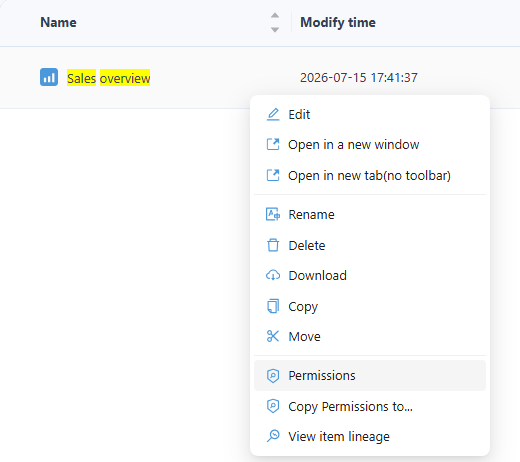
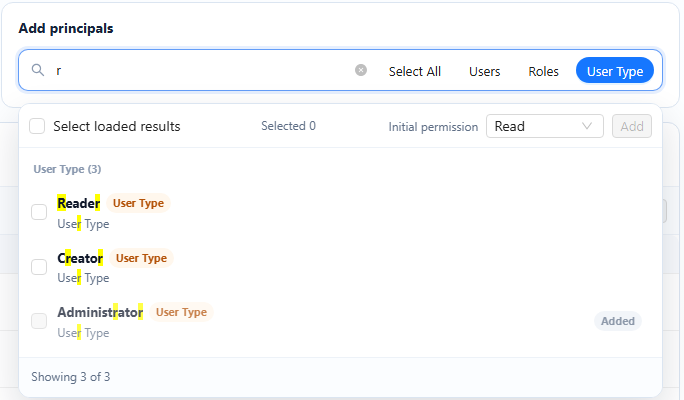
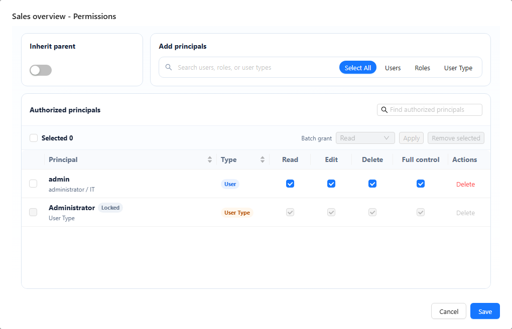
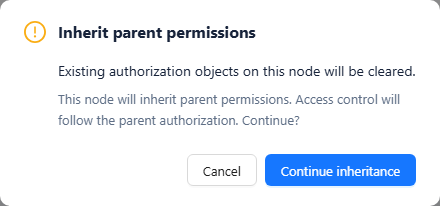
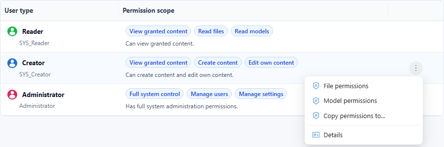
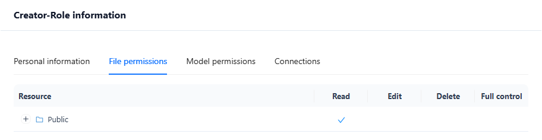

# Access Control List

An **ACL (Access Control List)** controls which users, roles and user types can read, edit or delete reports, data sources, models and folders.

For the complete relationship between User Types, Business Roles, ACLs, RLS, and OLS, see [Permission Evaluation Overview](/documentation/System/Permission-Evaluation-Overview/). An ACL grant does not replace data policies, and an unchecked permission is not an explicit deny that cancels another matching grant.

## 1. What is ACL?

ACL is a permission control mechanism used to define access rights for resources. In Datafor, resources include data sources, models, report files, and folders. ACL allows administrators to set permissions for these resources. The available permission levels are:

- **Read**: The user can view the resource content.
- **Edit**: The user can modify the resource. Edit does not allow deleting it.
- **Delete**: The user can delete the resource (move it to the Trash), in addition to Read and Edit.
- **Full control**: Grants the user complete control over the resource, including the ability to manage permissions for other users or roles.

Deleting a report, folder, or analysis model requires **Delete** or **Full control**, granted to the user, one of their roles, their user type, or Authenticated, directly or inherited from the folder. **Edit** on a folder does not let a user delete the reports in it. When several reports or folders are deleted at once and one of them lacks Delete, none of them is deleted. See [Deleting requires Delete or Full control](/documentation/System/Permission-Evaluation-Overview/#deleting-requires-delete-or-full-control).

## 2. User and Role Authorization

You can grant access to individual users, to business roles (every member receives the grant), and to user types.

### 2.1 Assigning Permissions

Permissions must be explicitly granted to users, roles, or user types for each resource (such as reports, data sources, or models). Follow these steps to assign permissions:

1. In **Public** (or another folder you manage), open the row menu of the report or folder and click **Permissions**.

   

2. In **Add principals**, search for users, roles or user types; narrow the results with **Users**, **Roles** or **User Type**. Tick the principals, choose the **Initial permission** and click **Add**. Principals that already have entries show **Added**.

   

3. In **Authorized principals**, set **Read**, **Edit**, **Delete** and **Full control** for each row. To change several rows at once, select them, choose a level in **Batch grant** and click **Apply**. **Delete** in a row, or **Remove selected**, removes the grant. **Locked** rows, such as the Administrator user type, cannot be changed.

   

4. Click **Save**.

5. If the notice **Permissions saved** appears, some of the users or roles you granted lack **Read** on what the content depends on: the data source of a granted model, or the models and data sources used by a granted report or folder. Grant that access in the **Models** and **Datasource** lists, then click **Got it**. The notice does not change any permissions. The same check runs after **Model permissions** and **File permissions** on the **Users** and **Roles** pages. See [Check what grantees still need](/documentation/System/Permission-Evaluation-Overview/#check-what-grantees-still-need).

### 2.2 User-Type-Based Authorization

Datafor provides three user types (see [User Creation and User Types](/documentation/System/Users/)):

- **Reader**: Can view granted content but cannot create or modify it.
- **Creator**: Can create reports, models and other content, and edit content they own or are granted.
- **Administrator**: Has full control over all resources, including permission management.

A grant to a user type applies to every user of that type. For example, granting **Read** on a folder to **Reader** lets all Reader users open it. For the **Reader** user type and for Reader users, only **Read** can be granted.

## 3. Folder and Report Authorization

Folder and report authorization in Datafor has certain restrictions:

- **Private Folders**: Reports and folders within private directories cannot be shared with other users or roles.
- **Public Folders**: Only reports and subfolders in public folders can be authorized for access by other users or roles.

## 4. Permission Inheritance

Reports and subfolders with **Inherit parent** enabled use their parent's effective ACL. If the parent also inherits, follow the chain to the nearest non-inheriting ACL. Disabling inheritance selects the resource's own entries; it does not add a local deny on top of the parent grants. Parent changes affect descendants that continue to inherit, not descendants with their own ACLs.

Turning **Inherit parent** on clears the item's own entries. Datafor asks for confirmation first, in the **Inherit parent permissions** dialog: "Existing authorization objects on this node will be cleared." Click **Continue inheritance**, then **Save**; the item is saved with no entries of its own. To give it its own permissions again later, turn **Inherit parent** off and add the entries again.

For grant combination, folder-operation checks, and owner/administrator exceptions, see [File and folder ACLs](/documentation/System/Permission-Evaluation-Overview/#_2-file-and-folder-acls-grants-and-inheritance).

## 5. Viewing Permissions

On the **Users** page (**Users**, **Roles** or **User Type** tab), open a row's menu and click **Details** to see what that user, role or user type can access. **Details** has the tabs **Personal information**, **File permissions**, **Model permissions** and **Connections**.

Each permissions tab lists the granted items with their rights (Read, Edit, Delete, Full control).

