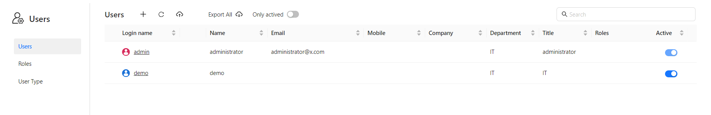
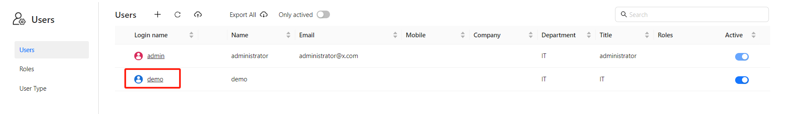
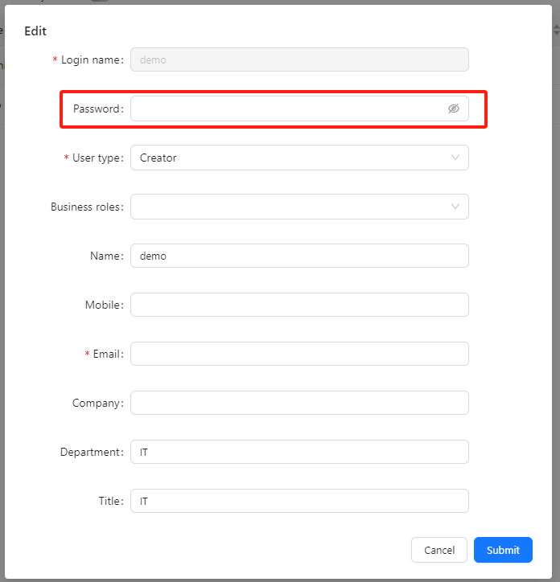

# Modify Password

To change your own password, use **Change password** on the [My Account](/documentation/Console/My-Account/) page.

## Resetting a user's password (administrators)

1. In the left navigation, click **Users**.

   

2. On the **Users** tab, click the login name of the user whose password you want to reset.

   

3. In the **Edit** form, enter the new password in **Password**. The field is empty and shows "Leave blank to keep the current password"; leave it empty if you are changing other fields only.

   

4. Click **Submit**.
