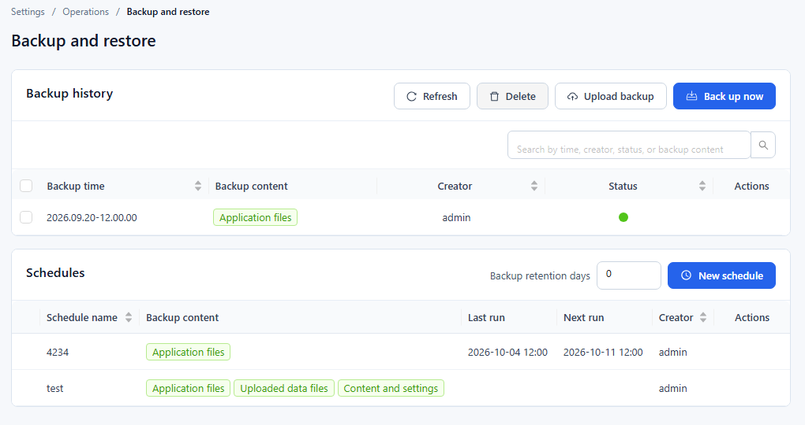

# Backup and Restore

Go to **Settings › Operations › Backup and restore**. The page has two panels: **Backup history** (all backups, manual, scheduled and uploaded) and **Schedules** (automatic backups and the retention period).

## 1. Backup content

Each backup contains one or more of these parts:

| Backup content | What it holds |
| --- | --- |
| **Content and settings** | Reports, models, users and system settings. |
| **Uploaded data files** | Data files uploaded to Datafor, such as Excel and CSV datasets. |
| **Application files** | Only the program and its plugins. |

When **Content and settings** is not selected, the backup dialog warns "This backup leaves out reports, models and users."

## 2. Back up now

1. In **Backup history**, click **Back up now**.
2. In the **New backup** dialog, select the **Backup content**. **Content and settings** is selected by default.
3. Click **OK**. "Backup task has been successfully created." appears and the backup is added to the list.

The **Status** column shows a green dot when a backup succeeded, a red dot when it failed (hover over it for the error), and a spinner while it is running; the list refreshes itself while a backup runs. Use **Refresh** to reload the list, and the search box to find backups by time, creator, status or backup content.

## 3. Upload a backup package

Click **Upload backup** and select a backup package (`.zip`), for example one downloaded from another Datafor server. The upload starts as soon as you select the file; the package then appears in **Backup history** and can be restored. If the server refuses the upload, for example because the package is already there, "The file already exists" appears.

## 4. Row actions: restore, delete, download

Hover over a row in **Backup history** to show its actions in the **Actions** column:

| Action | What it does |
| --- | --- |
| **Restore** | Restores the system from this backup. Available only for successful backups. See below. |
| **Delete** | Deletes the backup permanently. |
| **Download** | Downloads the backup package. |

To delete several backups at once, select their check boxes and click **Delete** in the panel header.

### Restore a backup

1. Click **Restore** on the backup row.
2. Read the message: restoring deletes all changes made to the system after this backup.
3. Type `RESTORE` in the box ("Type RESTORE to confirm.").
4. Click **Restore and restart the system**. Datafor restores the backup and restarts.

::: warning
Restoring overwrites everything made after the backup was taken. Back up the current state first if you may need it again.
:::

## 5. Schedules

The **Schedules** panel lists automatic backups with **Schedule name**, **Backup content**, **Last run**, **Next run** and **Creator**. Hover over a row to **Edit** or **Delete** a schedule.

To add a schedule:

1. Click **New schedule**.
2. Enter a **Schedule name** and select the **Backup content**.
3. Choose **Repeat**: **Run once**, **Daily**, **Weekly**, **Monthly**, **Yearly** or **Cron** (then enter a **Cron string**).
4. Set the **Start time** (not for **Cron**) and the **Start date**. For repeating schedules, choose **No end date** or **Ending** with an end date.
5. Click **Save**.

Backups created by a schedule appear in **Backup history**.

### Backup retention days

**Backup retention days** in the panel header sets how long backups are kept. The value is saved automatically about a second after you change it.

- `0` keeps all backups.
- A value above 0 deletes backups older than that number of days, together with their files. The clean-up runs once a day and applies to all backups in **Backup history**, not only those created by schedules.

## 6. Recommendations

- Back up **Content and settings** at least weekly, and always before an upgrade or a major change.
- Download important backups and keep them outside the Datafor server.
- Set **Backup retention days** so that old backups do not fill the disk, and download any backup you must keep longer.
